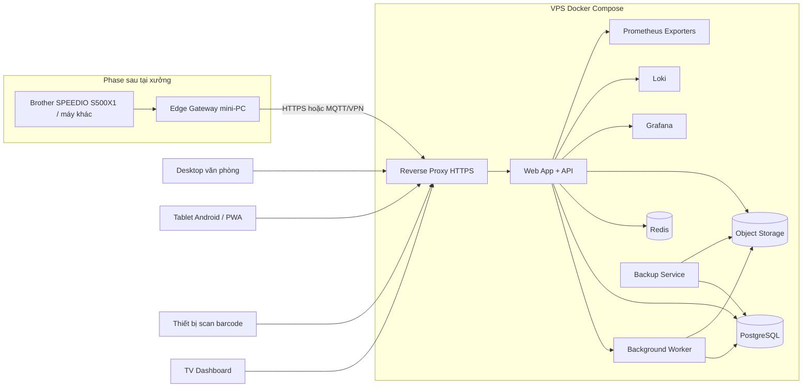
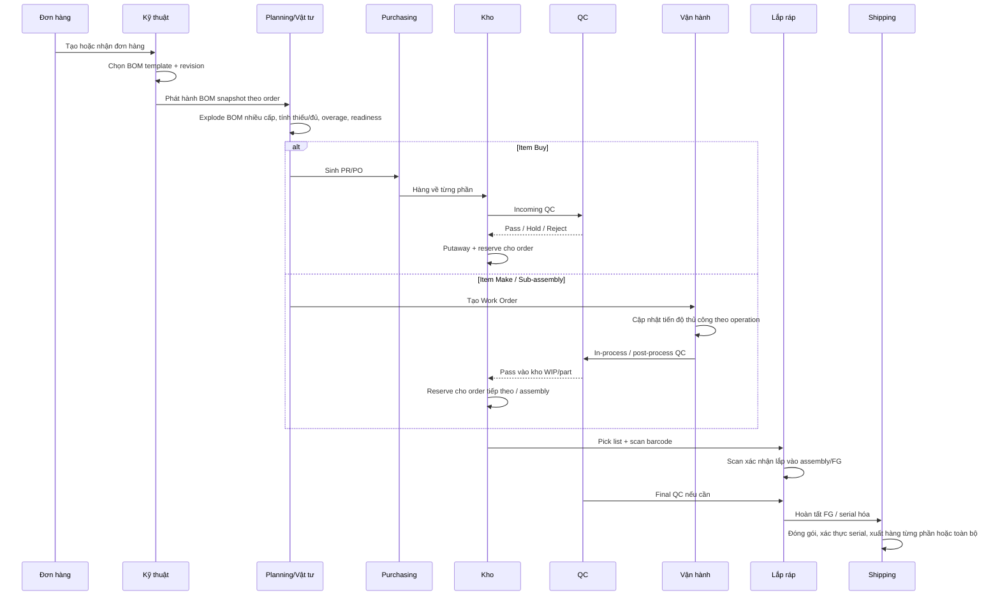
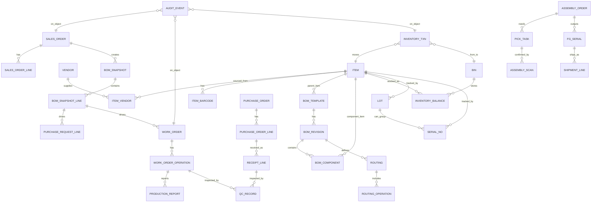
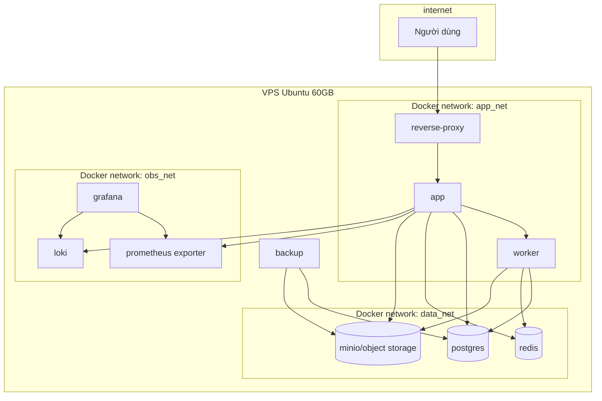
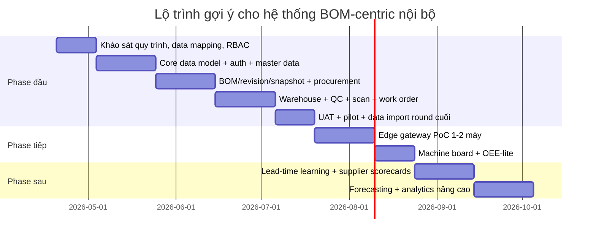

# Báo cáo kỹ thuật về hệ thống BOM thống nhất cho sản xuất và quản lý kho

## Tóm tắt điều hành

Mục tiêu phù hợp nhất cho nhà máy của bạn không phải là “số hóa file Excel BOM”, mà là xây một **ứng dụng web tự host, BOM-centric**, nơi **BOM revision** và **BOM snapshot theo từng đơn hàng** trở thành nguồn dữ liệu chuẩn nối kỹ thuật, planning, mua hàng, kho, QC, gia công, lắp ráp và giao hàng. Với quy mô hiện tại — **một nhà máy, khoảng 12 máy, chưa có ERP, khoảng 10.000 mã vật tư, dữ liệu hiện ở Excel/OneDrive, cần scan barcode, cần lot/serial/location/bin, cần audit log, cần bảo mật tốt, và chưa cần CNC telemetry ngay** — kiến trúc phù hợp nhất cho V1 là **modular monolith** dùng **PostgreSQL** làm database giao dịch chính, triển khai bằng **Docker Compose**, để một **reverse proxy** duy nhất ra Internet, còn app, DB, worker, object storage và monitoring nằm hoàn toàn trong mạng nội bộ của Docker. Docker Compose được thiết kế để định nghĩa và chạy ứng dụng nhiều container trong một file YAML; Docker cũng khuyến nghị dùng **user-defined bridge networks** thay cho bridge mặc định trong môi trường production để có DNS nội bộ theo tên service và cô lập tốt hơn. PostgreSQL có **recursive CTE** rất hợp cho BOM nhiều cấp, **Row-Level Security** cho data-scope theo vai trò và phạm vi kho/xưởng, `jsonb` cho metadata linh hoạt, và **table partitioning** cho các bảng log/transaction lớn. MySQL vẫn là lựa chọn thay thế chấp nhận được vì có **roles** và **recursive CTE**, nhưng PostgreSQL “trúng bài” hơn với bài toán BOM nhiều cấp + traceability + data access control phức tạp. citeturn10view7turn10view6turn10view0turn10view1turn10view3turn10view4turn16search0turn16search1

Khuyến nghị chiến lược là chia dự án thành ba lớp giá trị. **V1** phải giải quyết trục vận hành lõi: item master, BOM template/revision, BOM snapshot theo đơn hàng, PR/PO/ETA, nhận hàng và incoming QC, multi-location/bin, lot/serial, reservation, work order, cập nhật tiến độ thủ công, pick/scan cho lắp ráp, shipping, costing cơ bản, audit log, backup và monitoring. **V2** mới nên bổ sung gateway cạnh xưởng để thử tích hợp máy CNC/OEE; **V3** mới đẩy mạnh analytics/ML cho lead time và forecasting. Cách đi này phù hợp với xu hướng chung của MES/MOM hiện đại: các hệ như Siemens Opcenter, SAP Digital Manufacturing, Epicor Kinetic, Oracle Fusion, Plex và Odoo đều nhấn mạnh quản trị BOM/revision, execution tracking, traceability, barcode/mobile, quality và luồng dữ liệu xuyên suốt shop floor–top floor; nhưng với một xưởng đơn lẻ đang ở giai đoạn greenfield, dùng trọn bộ suite enterprise thường quá nặng, quá dài và quá đắt nếu mục tiêu trước mắt là “đưa vận hành vào khuôn chuẩn”. citeturn18view1turn7view3turn8view4turn21search7turn8view7turn7view5

Kết luận quản trị cho lãnh đạo là: **nên xây phần mềm nội bộ**, nhưng **không nên thiết kế kiểu “app nhập liệu đơn giản”**. Hệ phải được thiết kế như một nền tảng vận hành nhỏ nhưng chuẩn: có revision discipline, snapshot discipline, transaction discipline, role discipline, backup discipline, và security discipline. Nếu làm đúng từ đầu, hệ thống này không chỉ thay Excel mà còn có thể trở thành **nền phần mềm nội bộ** dùng lâu dài cho nhiều line, nhiều kho, và sau này nhiều xưởng. citeturn4search0turn4search1turn4search2turn4search3

## Bức tranh thị trường và các bài học cần áp dụng

### Bảng so sánh các nền tảng tham chiếu

Bảng dưới đây không nhằm khuyến nghị mua một hệ thống enterprise ngay bây giờ. Mục đích chính là rút ra **pattern chuẩn** để đội kỹ sư của bạn thiết kế V1 đúng hướng. Ở cột “chi phí”, tôi phân biệt giữa **giá công khai/self-serve** và **mô hình báo giá enterprise** theo những gì tài liệu công khai thể hiện; nơi nhà cung cấp không công khai bảng giá chuẩn, tôi ghi rõ là **sales-led / quote-based** thay vì suy đoán mức giá cụ thể.

| Nền tảng | BOM nhiều cấp / revision | Procurement | Routing / Work orders | Barcode / scan | Tích hợp máy và giao thức công khai | Triển khai | Bảo mật công khai | Khả năng mở rộng | Mô hình chi phí công khai | Ghi chú độ phù hợp | Nguồn |
|---|---|---|---|---|---|---|---|---|---|---|---|
| Siemens Opcenter / Opcenter X | Rất mạnh cho discrete execution, track & trace, dependency giữa đơn, visibility và “digital twin to factory floor”; Opcenter X là mô hình modular cho SMB | Thường đi cùng MES/MOM/ERP integration hơn là app mua hàng độc lập | Mạnh về execution, sequencing, resource control | Có terminal/operator workflows; public pages nhấn mạnh tracking hơn barcode chi tiết | Public pages nhấn mạnh kết nối enterprise systems với automated equipment; Siemens ecosystem công khai mạnh về OPC UA/MQTT ở lớp connector/gateway, nhưng ma trận giao thức phụ thuộc edition | Opcenter family có on-prem/distributed; Opcenter X là SaaS/cloud-first và có thông tin tiếng Việt cho thị trường SMB | Tài liệu marketing nói đến privacy/security; chi tiết hardening tùy edition/contract | Enterprise-grade; Opcenter X nhấn mạnh scale theo module | Chủ yếu sales-led; Opcenter X công khai là SaaS và có liên hệ sales/pricing | Rất giàu bài học về traceability, sequencing, change discipline; quá nặng nếu mua full suite cho một xưởng đơn | citeturn18view1turn19search1turn19search5 |
| Rockwell FactoryTalk ProductionCentre | Mạnh execution MES, materials, quality, analytics; public page không nhấn mạnh revision authoring như PLM | Thường tích hợp ERP/material systems | Mạnh | Barcode không phải điểm nhấn chính trên landing page MES công khai | Rockwell công khai “deep machine integration”; FactoryTalk Linx Gateway công khai OPC UA và truy cập third-party OPC; MQTT xuất hiện mạnh ở FactoryTalk Optix/communications ecosystem | Enterprise, on-prem/hybrid/cloud tùy stack | Có FactoryTalk security/communications stack; không có pricing công khai đơn giản | Cao | Sales-led / demo-driven | Hợp khi trọng tâm là OT integration sâu; V1 của bạn chưa cần tới mức này | citeturn0search1turn6search0turn6search8turn6search17 |
| SAP Digital Manufacturing + EWM | Digital Manufacturing quản lý execution; BOM/routing có thể transfer từ ERP; EWM quản lý kho tới mức storage bin | Rất mạnh nếu đi cùng SAP procurement/logistics | Rất mạnh, có app manage routings, Production Connector | EWM RF framework hỗ trợ barcode; EWM quản lý tới storage bin | SAP có edge computing, Production Connector, OPC UA server/source systems; public docs nêu secure OPC UA connections | Cloud trên SAP BTP, có edge computing | Tài liệu công khai rất sâu về edge, connector, secure OPC UA | Rất cao | SAP công khai pricing theo metric “Cost of Goods” và add-on edge | Rất mạnh nhưng footprint, chi phí và độ phức tạp cao so với xưởng đơn greenfield | citeturn7view3turn7view0turn0search6turn17search1turn17search16turn17search17turn17search19turn17search23 |
| Oracle Fusion Manufacturing + Inventory/Receiving/Quality | Item structures + work definitions; work definition kết hợp structure + routing; có change visibility | Mạnh | Mạnh; work definitions, work orders, operations, resources | Mobile inventory/receiving/shipping, scan barcode, lot/serial, inspect goods trên handheld | Public docs nhấn mạnh mobile/IoT/cloud execution; không công khai mạnh MTConnect/RS232 ở public docs | Cloud SaaS | Có execution/costing/quality trên một platform; chi tiết security nằm sâu trong docs cloud | Rất cao | Enterprise cloud subscription / sales-led | Rất đầy đủ về kho + quality + costing + mobile; vẫn quá lớn cho V1 nội bộ | citeturn8view4turn22search0turn8view5turn22search1turn22search3turn22search15 |
| Epicor Kinetic | CAD/BOM revisions, costing rollup, manufacturing modes đa dạng | Có | Rất mạnh, jobs/method of manufacturing/routing/BOM | Kinetic Warehouse hỗ trợ mobile scan rất rõ, có lot/location | Epicor IoT dùng Azure IoT Hub; public docs cho cloud/hybrid/on-prem, warehouse mobile | Cloud, hybrid, on-prem | Azure-backed secure/manageable operations | Cao | Chủ yếu sales-led; không có self-serve pricing rõ như Odoo | Là benchmark rất gần bài toán của bạn nếu xét quy mô mid-market manufacturing | citeturn8view3turn21search7turn21search10turn21search1turn21search8turn1search13 |
| Odoo MRP + Inventory + PLM | Có BOM, operations, work orders; PLM quản revision/BoM versions, có variant BoM | Có Purchase | Có operations/work centers/work orders | Barcode app rất rõ: product/location/lot/serial, transfer, receipt, delivery | Có IoT/shop floor, nhưng không phải public OT protocol-first như SAP/Rockwell | Odoo Online, Odoo.sh, on-prem; source code và on-prem được công khai | 2FA và access groups/record rules trong ecosystem; no vendor lock-in, PostgreSQL backend | Từ SMB đến mid-market | Công khai giá self-serve theo user/tháng; custom plan cho multi-company/custom/API | Rất đáng học về UX/process; nếu tự build, nên học pattern chứ không sao chép nguyên ERP rộng | citeturn1search0turn8view7turn8view8turn15view0turn7view1 |
| Fishbowl | Có BOM, work orders, MRP, purchasing, vendor cost/lead time, multi-location | Có | Có work orders/manufacturing | Công khai barcode scanning, multi-location và real-time inventory | Public docs không cho thấy OT/machine integration là điểm mạnh | Cloud-native / hosted services tùy sản phẩm hiện hành | Hosted/cloud messaging công khai, security docs ở mức marketing nhiều hơn kỹ thuật | SMB-focused | Public pages cho thấy tiers/quote-based không công khai bảng giá đầy đủ dạng per-user | Phù hợp hơn với inventory/manufacturing SMB; yếu hơn nếu cần discipline snapshot/audit sâu và edge-ready | citeturn7view2turn5search15turn1search10turn1search14turn5search3 |
| Manhattan Active WM | WMS rất mạnh; BOM/routing không phải lõi MES | Không phải trọng tâm | Không phải trọng tâm MES | Rất mạnh warehouse execution, automation, labor, visibility | Công khai microservice APIs, TLS, IP allowlist; automation/WES mạnh, nhưng không phải platform MES/CNC | Cloud-native microservices trên Google Cloud | TLS, IP whitelisting, encrypted at rest, service accounts | Rất cao | Enterprise sales-led | Quá mạnh cho warehouse/distribution; không phù hợp làm trung tâm BOM production cho 1 xưởng | citeturn8view0turn8view1turn8view2 |
| Infor Factory Track | Public docs nhấn mạnh versions, lot/serial visibility, shop-floor automation | Có inventory/labor/warehouse flows, không phải procurement suite độc lập | Có scheduling work center ops và labor reporting | Rất mạnh mobile scanner transactions cho receiving, putaway, production, picking, shipping; support label printing | Public docs thiên về warehouse mobility/shop-floor reporting; không công khai ma trận OT protocols như SAP/Rockwell | Web/browser + mobile scanner + general-purpose shop-floor PC; cloud license modules cũng xuất hiện trong guide | Role/group-based access cho scanner transactions; enterprise extension platform | Cao | Chủ yếu sales-led | Rất đáng học cho mobile scanner flows và site/warehouse transactions | citeturn7view4turn20view1turn20view3turn6search3 |
| Plex | Cloud MES thống nhất, real-time production tracking và monitoring | Có trong platform rộng hơn | Có work centers, production planning/scheduling | Public pages nhấn mạnh connected worker và production visibility hơn barcode chi tiết | Public pages nhấn mạnh machine connectivity và production monitoring; Plex production monitoring cung cấp closed-loop plant-floor visibility; Rockwell ecosystem thường đi cùng Kepware | Cloud | Private cloud, HA/scalability, Rockwell platform | Cao | Enterprise sales-led | Hợp cho phase machine monitoring/OEE hơn là làm core V1 cho BOM + inventory nội bộ | citeturn5search0turn7view5turn8view9turn5search16 |

### Các bài học thiết kế nên áp dụng ngay

Bài học quan trọng nhất từ các nền tảng tham chiếu là **phải tách dữ liệu thành các lớp rõ ràng**. Một BOM dùng để thiết kế không thể đồng nhất hoàn toàn với dữ liệu execution đã phát hành cho đơn hàng. Odoo PLM quản BoM version theo thời gian; Epicor nhấn mạnh BOM revision và cost rollup; Siemens và SAP đều nhấn mạnh track & trace và phản ánh dữ liệu thiết kế xuống execution. Vì vậy, trong hệ của bạn, **BOM Template**, **BOM Revision** và **BOM Snapshot theo Order** phải là ba thực thể khác nhau. citeturn1search0turn8view3turn18view1turn7view3

Bài học thứ hai là **traceability phải dựa trên transaction log chứ không dựa trên “con số tồn hiện tại”**. Oracle, Infor, Odoo và Manhattan cùng nhấn mạnh scan/mobile flows, lot/serial, receiving–inspect–putaway, pick confirmation và visibility theo transaction. Vì vậy, hệ của bạn phải lưu từng receipt, putaway, transfer, reserve, issue, assembly scan, QC result và shipment như các giao dịch có dấu thời gian, actor và object liên quan. citeturn8view5turn22search1turn20view1turn8view0

Bài học thứ ba là **đừng khóa phạm vi V1 vào machine telemetry**. SAP, Plex, Rockwell và Brother đều cho thấy đường đi chuẩn là qua **connector/gateway/edge** thay vì để tablet hay web app nói chuyện trực tiếp với CNC. Vì vậy, V1 nên manual-first, còn schema và deployment chuẩn bị sẵn đường mở rộng cho telemetry phase sau. citeturn17search23turn8view9turn6search17turn14view0

## Thiết kế hệ thống V1 đề xuất cho nhà máy

### Phạm vi, giả định và quyết định công nghệ

Phạm vi V1 được giả định là **một nhà máy đơn**, số **line lắp ráp và work center có thể cấu hình**, tablet **Android giá rẻ hoặc bất kỳ thiết bị trình duyệt chuẩn** đều chấp nhận được, LAN ổn định, chưa có ERP cần tích hợp, và operator cập nhật tiến độ thủ công. Các giả định chưa xác định như số line cụ thể, ca làm việc, danh sách máy/work center cuối cùng, chính sách valuation cuối cùng hay định nghĩa “quyền duyệt” nên được thiết kế thành **configurable master data**, không hard-code.

Quyết định công nghệ cho V1 là:

| Thành phần | Khuyến nghị | Ghi chú |
|---|---|---|
| Database | PostgreSQL | Ưu tiên cho BOM nhiều cấp, RLS, jsonb, partitioning citeturn10view0turn10view1turn10view3turn10view4 |
| Alternative DB | MySQL 8.4+ | Chấp nhận được nếu team quá mạnh MySQL; vẫn có roles và recursive CTE citeturn16search0turn16search1 |
| Triển khai | Docker Compose | Đơn giản, phù hợp greenfield trên 1 VPS, dễ quản lý stack nhiều dịch vụ citeturn10view7 |
| Networking | user-defined bridge networks | Chỉ reverse proxy public, còn lại private network nội bộ container citeturn10view6 |
| Secrets | Compose secrets | Mount vào `/run/secrets/...`, cấp theo từng service citeturn10view5 |
| Proxy | Reverse proxy HTTPS | Có thể dùng Caddy/Nginx; nguyên tắc là chỉ public lớp này |
| Storage file | Object storage nội bộ | PDF/CAD/ảnh/chứng từ tách khỏi DB giao dịch |
| Frontend | Web app responsive + PWA | Desktop + tablet + TV |
| Backend | Modular monolith | Giảm rủi ro so với microservices giai đoạn đầu |

### Kiến trúc tổng thể



Kiến trúc này bám rất sát best practice về segmentation: reverse proxy nằm ở “public edge”; app, DB, queue, storage, monitoring ở nội bộ; Docker user-defined bridge giới hạn giao tiếp giữa các group container; còn OWASP cũng khuyến nghị segmentation để tình huống web bị compromise không kéo theo truy cập trực tiếp vào DB hoặc hạ tầng khác. citeturn10view6turn4search3

### Workflow đầu cuối



Luồng này phản ánh đúng bài toán nhà máy của bạn: BOM nhiều cấp, hàng mua ngoài và hàng gia công cùng xuất hiện trong cùng one source of truth, giao từng phần, QC ở nhận hàng và sau gia công, rồi cấp phát sang assembly bằng scan barcode.

### Danh mục module của V1

| Module | Phạm vi V1 | Mục tiêu |
|---|---|---|
| Identity & Access | Có | User, role, MFA policy, session, device login, audit |
| Master Data | Có | Item, supplier, warehouse, bin/location, work center, machine, UoM, barcode |
| Engineering | Có | BOM template, BOM revision, routing, attachments, ECO-lite |
| Order & Snapshot | Có | Sales order, deliverable plan, BOM snapshot per order |
| Planning / MRP-lite | Có | Explode BOM, shortage, ready-to-build, reserve, PR/WO generation |
| Procurement | Có | PR, PO, ETA, partial receipt, vendor lead time history |
| Warehouse | Có | Receipt, inspect, putaway, transfer, reserve, issue, count, lot/serial |
| QC | Có | Incoming QC, process QC, final QC, hold/reject/rework |
| Manufacturing | Có | Work order, operations, operator report, output, scrap |
| Assembly | Có | Pick list, scan confirmation, missing parts, assembly completion, FG serial |
| Shipping | Có | Packing, serial verification, shipment line, delivery statuses |
| Costing | Có | Standard cost, moving average, last purchase reference, variance report |
| Dashboard | Có | Order readiness, shortages, ETA board, WIP, receipts due, assembly readiness |
| CNC Gateway | Chưa | Đặt chỗ cho phase sau |

## Mô hình dữ liệu, giao diện và phân quyền

### Mô hình dữ liệu cốt lõi



Các bảng chính tôi khuyến nghị cho V1:

| Nhóm | Bảng | Trường khóa / đáng chú ý |
|---|---|---|
| Danh mục | `item` | `item_id`, `item_code`, `legacy_code`, `name`, `item_type`, `uom`, `tracking_mode`, `default_overage_pct`, `status` |
| Danh mục | `item_vendor` | `item_vendor_id`, `item_id`, `vendor_id`, `lead_time_days_current`, `lead_time_days_p90`, `std_price`, `moq`, `preferred_flag` |
| Danh mục | `warehouse`, `location`, `bin` | `warehouse_code`, `location_code`, `bin_code`, `bin_type`, `is_qc_hold`, `pick_priority` |
| Kỹ thuật | `bom_template` | `template_id`, `template_code`, `parent_item_id`, `bom_type`, `owner_team` |
| Kỹ thuật | `bom_revision` | `revision_id`, `template_id`, `revision_code`, `effective_from`, `effective_to`, `approval_status`, `approved_by` |
| Kỹ thuật | `bom_component` | `component_id`, `revision_id`, `parent_line_ref`, `component_item_id`, `find_no`, `qty_per`, `scrap_pct`, `supply_type`, `phantom_flag`, `substitute_group` |
| Routing | `routing`, `routing_operation` | `routing_id`, `operation_seq`, `work_center_id`, `std_setup_time`, `std_run_time`, `min_transfer_qty` |
| Đơn hàng | `sales_order`, `sales_order_line` | `order_id`, `order_no`, `customer_name`, `due_date`, `priority`, `partial_delivery_allowed` |
| Snapshot | `bom_snapshot`, `bom_snapshot_line` | `snapshot_id`, `snapshot_no`, `source_revision_id`, `required_qty`, `ordered_qty`, `received_qty`, `reserved_qty`, `issued_qty`, `eta_date`, `readiness_status` |
| Purchasing | `purchase_request`, `purchase_order`, `purchase_order_line` | `po_no`, `buyer_id`, `supplier_id`, `ordered_qty`, `expected_date`, `actual_lead_time_days` |
| Warehouse | `receipt`, `receipt_line`, `inventory_txn`, `inventory_balance` | `txn_type`, `txn_ts`, `from_bin_id`, `to_bin_id`, `lot_id`, `serial_id`, `quantity` |
| QC | `qc_plan`, `qc_record`, `nonconformance` | `qc_type`, `inspection_result`, `accept_qty`, `reject_qty`, `hold_qty`, `disposition` |
| Production | `work_order`, `work_order_operation`, `production_report` | `wo_no`, `planned_qty`, `overage_pct`, `good_qty`, `scrap_qty`, `status`, `reported_by` |
| Assembly | `assembly_order`, `pick_task`, `assembly_scan`, `fg_serial` | `assembly_no`, `pick_status`, `assembly_status`, `fg_serial_no` |
| Shipping | `shipment`, `shipment_line` | `shipment_no`, `packed_qty`, `serial_verified`, `ship_status` |
| Audit | `audit_event`, `security_event`, `attachment` | `event_type`, `object_type`, `object_id`, `before_json`, `after_json`, `actor_id`, `request_id` |

### Quy ước mã và ID

Khuyến nghị quan trọng là **khóa hệ thống** và **mã nghiệp vụ** phải tách nhau. Dùng UUIDv7 hoặc bigint sequence làm khóa nội bộ; giữ mã nghiệp vụ để người dùng đọc và scan.

| Đối tượng | Quy ước gợi ý |
|---|---|
| Item | Giữ mã chuẩn toàn công ty hiện có; nếu cần thêm `legacy_code` |
| BOM template | `BOMT-<FGCODE>` |
| BOM revision | `R<nn>` hoặc `REV-<nn>` |
| BOM snapshot | `BOMS-<SO>-<seq>` |
| Sales order | `SO-YYMM-####` |
| Purchase order | `PO-YYMM-####` |
| Work order | `WO-YYMM-####` |
| Assembly order | `AO-YYMM-####` |
| Receipt | `RCV-YYMM-####` |
| Lot | `LOT-<ITEM>-<YYYYMMDD>-<run>` |
| Serial | `SN-<ITEM>-<YYYY>-<seq>` |
| Bin | `WH-A01-B02-C03` |

### Logic BOM nhiều cấp, giao từng phần, reservation, QC, ETA và costing

**BOM nhiều cấp** phải được xử lý bằng recursive query hoặc service recursion có cycle check. PostgreSQL recursive `WITH` được thiết kế cho các bài toán dạng cây/đệ quy; đây là lý do chính khiến PostgreSQL phù hợp cho BOM explosion và pegging. citeturn10view0

**BOM snapshot theo đơn hàng** phải được tạo ngay sau khi release order. Snapshot đó bất biến với mọi giao dịch execution; nếu kỹ thuật ra revision mới, revision mới chỉ áp dụng cho order mới hoặc qua quy trình change order có kiểm soát. Odoo PLM cho phép trace version BoM theo thời gian và rollback; Epicor nhấn mạnh revisions; đây là pattern nên sao chép vào hệ của bạn. citeturn1search0turn8view3

**Partial delivery và partial receipt** phải được mô hình hóa bằng số lượng, không phải trạng thái yes/no. Mỗi `bom_snapshot_line` nên có ít nhất: `required_qty`, `gross_required_qty`, `open_purchase_qty`, `received_qty`, `qc_pass_qty`, `reserved_qty`, `issued_qty`, `assembled_qty`, `remaining_short_qty`. Oracle receipt routing công khai quy trình **receive → inspect → put away** và cho phép chấp nhận/từ chối trong bước inspection; điều này rất khớp với nhu cầu nhận hàng từng phần và QC đầu vào của bạn. citeturn22search1turn22search13

**Reservation** nên theo các quy tắc sau:

| Quy tắc | Đề xuất |
|---|---|
| Chỉ reserve hàng QC pass | Có |
| FEFO cho hàng có expiry | Có |
| FIFO/bin priority cho hàng thường | Có |
| Serial-controlled reserve theo serial | Có |
| Pick tạo task, chưa giảm issued ngay | Có |
| Issue chỉ được xác nhận khi scan | Có |
| Không cho âm kho | Có |
| Shortage được ghi ở snapshot line và dashboard | Có |

**QC workflows** nên có ba luồng: incoming QC, process QC, final QC. Oracle Receiving và Mobile Inventory hỗ trợ inspect goods và handheld inspection; Odoo có app Quality tích hợp vào manufacturing/inventory; Oracle còn cho phép mobile inspect goods bằng handheld. Đây là cơ sở rất tốt để thiết kế QC ở tablet/PWA. citeturn22search3turn22search7turn8view5

**Lead time và ETA** nên bắt đầu bằng công thức rõ ràng, rồi học dần theo lịch sử:

```text
eta_baseline = po_order_date + lead_time_days_current + transport_buffer_days
eta_safe     = po_order_date + lead_time_days_p90 + transport_buffer_days
```

Sau mỗi receipt hoàn tất, tính:

```text
actual_lead_time = receipt_date - po_order_date
on_time_flag     = receipt_date <= expected_date
```

Rồi cập nhật rolling metrics theo cặp `item_vendor`: average, median, p90, on-time rate. Đây là “lead-time learning” mức vừa phải, đủ hữu ích cho V1 mà chưa cần ML phức tạp.

Hình dưới là **biểu đồ minh họa** cho dashboard xu hướng lead time lịch sử nhà cung cấp.


**Stock valuation** cho V1 nên đơn giản nhưng có nguyên tắc:

| Loại item | Phương pháp khuyến nghị | Lý do |
|---|---|---|
| Raw/Buy | Moving Average | Giá mua biến động, receipt nhiều đợt |
| Make/Sub-assembly/FG | Standard Cost | Quản variance rõ, dễ kiểm soát BOM/routing |
| Spare | Last purchase price hoặc Moving Average | Tùy mức độ cần chính xác |
| Báo giá nhanh | Last purchase chỉ để tham khảo | Không dùng làm valuation chính |

Odoo công khai hỗ trợ costing/valuation và cost theo manufacturing order; Epicor có costing workbench và cost rollups. Vì vậy, kết hợp **moving average cho hàng mua** và **standard cost cho hàng gia công/FG** là cân bằng nhất cho V1. citeturn5search22turn8view3

### Giao diện cần có

Giao diện nên được thiết kế theo ba bề mặt: desktop, tablet/PWA và TV dashboard.

| Loại giao diện | Màn hình bắt buộc |
|---|---|
| Desktop | Item master, Vendor master, Warehouse/bin master, BOM template, BOM revision, Order entry/import, BOM snapshot board, Shortage board, PR/PO, Receiving console, QC console, WO board, Cost board, Audit viewer, Admin |
| Tablet/PWA | Receiving scan, Inspect goods, Putaway, Internal move, Pick confirm, Assembly confirm, WO progress update, Scrap report, Cycle count, Quick item/serial lookup |
| TV | Orders due this week, Shortage board, PO ETA board, WO progress board, Assembly readiness board, Receipt vs delay board, phase sau: machine board/OEE-lite |

Hình dưới là **wireframe minh họa** cho màn hình BOM snapshot / tiến độ đơn hàng mà planning, purchasing, warehouse và assembly đều có thể nhìn từ các góc khác nhau.


### Ma trận RBAC

RBAC nên được thi hành qua ba lớp: **quyền chức năng ở app**, **data scope ở app/API**, và **GRANT/RLS ở PostgreSQL**. PostgreSQL cho phép kết hợp **GRANT** ở cấp table/column với **RLS** ở cấp row, và nếu bật RLS mà không có policy thì mặc định là **default deny**. citeturn10view1turn10view2turn9search17

| Vai trò | Master data | BOM/Revision | Snapshot order | Planning | Purchasing | Warehouse | QC | Production report | Assembly | Cost/price | Audit logs | User/RBAC |
|---|---|---|---|---|---|---|---|---|---|---|---|---|
| Admin | A | A | A | A | A | A | A | A | A | A | A | A |
| System engineer | V |  |  |  |  |  |  |  |  |  | V | A hạ tầng |
| Security officer |  |  |  |  |  |  |  |  |  |  | A | A chính sách |
| Design engineer | E | E | V | V |  |  | V |  |  |  | V |  |
| Material/planning | V | V | E | E | V | V | V | V | V |  | V |  |
| Purchasing | V | V | V | V | E/P | V | V |  |  | Giá mua | V |  |
| Accountant | V |  | V | V | V | V | V |  |  | A chi phí | V |  |
| QC | V | V | V | V | V | V | E/P | V | V |  | V |  |
| Warehouse | V |  | V | V | V | E/P | V |  | P |  | V |  |
| Operator |  |  | V |  |  | V | V | E/P |  |  | V |  |
| Assembler |  |  | V |  |  | V | V |  | E/P |  | V |  |
| Manager | V | V | V | V | V | V | V | V | V | V | A |  |

Giải thích ký hiệu: **A** là quản trị/duyệt/chính sách; **E** là tạo/sửa; **P** là post/confirm giao dịch; **V** là xem. Phần “User/RBAC” nên tách khỏi “Admin dữ liệu” để tránh một người có toàn quyền cả hạ tầng lẫn nghiệp vụ nếu không thực sự cần thiết.

## Hạ tầng, bảo mật, sao lưu và tích hợp CNC

### Kế hoạch triển khai bằng Docker Compose



Compose phù hợp cho V1 vì nó quản được nhiều service, network và volume trong một file YAML duy nhất; user-defined bridge network cho DNS nội bộ và isolation tốt hơn default bridge; secrets có thể granted theo từng service; còn reverse proxy chỉ publish đúng các cổng cần thiết. citeturn10view7turn10view6turn10view5

### Backup, restore và monitoring

PostgreSQL không khuyến khích production chỉ dựa vào một kiểu backup. Tài liệu chính thức nêu ba hướng chính: logical dumps, file-system backups và continuous archiving/PITR. `pg_dump` là công cụ tiện để export logic nhất quán, nhưng bản thân tài liệu PostgreSQL cũng lưu ý rằng trong đa số trường hợp **không nên chỉ dựa vào `pg_dump` cho backup định kỳ production**. citeturn2search3turn9search0

Khuyến nghị cho hệ thống của bạn:

| Cơ chế | Tần suất | Mục đích |
|---|---:|---|
| WAL archiving + PITR | liên tục | Khôi phục gần thời điểm lỗi |
| Base backup | hàng đêm | Nền cho PITR |
| `pg_dump` logical | hàng ngày | Khôi phục từng schema/table, kiểm tra dữ liệu |
| Object storage snapshot | hàng ngày | Files, ảnh, PDF, CAD |
| Restore drill | hàng tuần | Kiểm tra backup thật sự dùng được |

Prometheus, Alertmanager, Grafana, Loki là stack quan sát self-hosted cân bằng nhất cho V1: Prometheus/Alertmanager chuyên metrics và alerting; Grafana công khai hỗ trợ provisioning dashboards/datasources; Loki lưu log hiệu quả hơn so với các stack index nặng. Đây là stack de facto tốt cho self-hosted nội bộ, dù lựa chọn cụ thể cuối cùng vẫn là quyết định triển khai của đội kỹ sư. citeturn10view7turn4search1

### Danh sách kiểm tra bảo mật bắt buộc

| Hạng mục | Việc phải làm | Cơ sở |
|---|---|---|
| Segmentation | Chỉ reverse proxy được public; DB/Redis/Obj/Obs không publish cổng | Docker bridge docs và OWASP segmentation đều khuyến nghị cô lập mạng dịch vụ citeturn10view6turn4search3 |
| HTTPS | Bắt buộc HTTPS; HSTS; không cho login qua HTTP plain | OWASP TLS cheat sheet citeturn4search2 |
| MFA | Bắt buộc cho admin, manager, purchasing, accountant, system engineer, security officer | OWASP MFA cheat sheet citeturn4search16 |
| Authorization | Deny-by-default; RBAC + data scope + RLS; không tin frontend | OWASP Authorization + PostgreSQL RLS citeturn4search0turn10view1 |
| Secrets | Không commit `.env` nhạy cảm; dùng Compose secrets; xoay vòng key | Docker secrets docs citeturn10view5 |
| Logging | Audit log ở lớp ứng dụng, không chỉ log hạ tầng | OWASP Logging cheat sheet citeturn4search1 |
| File uploads | Whitelist extension/MIME, kiểm signature, giới hạn size, malware scan, lưu ngoài web root | OWASP File Upload cheat sheet citeturn3search2 |
| Firewall | UFW: chỉ mở 80/443, SSH qua allowlist/VPN; deny all inbound khác | Ubuntu UFW docs citeturn9search3 |
| Reverse proxy only | Grafana/admin route qua VPN hoặc IP allowlist | OWASP segmentation và nguyên tắc least exposure citeturn4search3turn4search0 |
| Restore test | Test restore định kỳ; backup off-host/off-site | PostgreSQL backup docs citeturn2search3 |
| Offline/failover | PWA cache + queue scan cục bộ; phase sau có edge node ở xưởng | Khuyến nghị thiết kế của báo cáo này |

### Kế hoạch tích hợp Brother SPEEDIO S500X1 về sau

Brother công khai rằng dòng **S500X1/S500X1N** dùng **CNC-C00**; spec của S500X1 nêu **external communication** gồm **USB, Ethernet, RS232C**, đồng thời có `computer remote` và `built-in PLC`. Trang tính năng của X1 cũng nêu có **simple production monitor** để hiển thị màn hình sản xuất của máy lên PC, và dữ liệu chương trình có thể truyền nhanh qua Ethernet. Ngoài ra, Brother còn có **remote support** cho cả dòng CNC-C00, trong đó S500X1/S500X1N nằm trong danh sách model hỗ trợ. Trong khi đó, trang **CNC-D00** đời mới công khai rõ hơn về **OPC UA**, **自発通知** và nhiều bus công nghiệp khác. Suy ra, với máy C00 hiện tại của bạn, **Ethernet/RS232/computer remote/PC monitor là các hướng khả thi và chính thống hơn để PoC**, còn việc giả định có sẵn OPC UA hoặc một API machine telemetry mở như D00 là **không nên** nếu chưa xác minh với manual hoặc distributor. citeturn12view0turn14view0turn3search3turn13view0

Kế hoạch phase sau nên là:

| Hạng mục | Khuyến nghị |
|---|---|
| Edge hardware | Mini-PC công nghiệp hoặc NUC trong LAN xưởng |
| Vai trò | Polling/adapter/protocol conversion/buffer/forward |
| Giao thức ưu tiên | Ethernet qua con đường Brother chính thức hoặc adapter riêng cho C00 |
| Giao thức fallback | RS232 nếu Ethernet không khả thi |
| Giao thức không nên mặc định | OPC UA native trên C00 |
| Mode truyền | Polling trước, push sau nếu Brother/distributor xác nhận |
| Dữ liệu nên lấy | machine state, program no, part count, cycle start/end, alarm, runtime/idle/alarm time, optional spindle/load nếu có |
| Phương thức đồng bộ | HTTPS hoặc MQTT qua VPN từ edge về VPS |
| Chính sách khi lỗi mạng | Edge buffer store-and-forward |

## Di trú dữ liệu, lộ trình và checklist triển khai

### Kế hoạch di trú từ Excel BOM hiện tại

Di trú không nên là “đưa nguyên file Excel lên cơ sở dữ liệu”. Nó nên là **tái mô hình hóa cấu trúc dữ liệu**, rồi xây import pipeline có kiểm tra.

| Pipeline | Nguồn hiện tại | Đích trong hệ mới |
|---|---|---|
| Item master import | Danh mục mã vật tư chuẩn | `item`, `item_barcode`, `item_vendor` |
| BOM import | Excel BOM template | `bom_template`, `bom_revision`, `bom_component` |
| Open stock import | Kiểm kê kho hiện hành | `inventory_balance`, `lot`, `serial_no` |
| Open PO import | Danh sách hàng đang mua | `purchase_order`, `purchase_order_line`, `receipt_line` |
| Open WO import | Việc đang gia công dở | `work_order`, `work_order_operation`, `production_report` |
| Attachment import | PDF/CAD/ảnh/chứng từ | `attachment` + object storage |

Bốn bước kiểm tra dữ liệu trước khi go-live:

| Lớp kiểm tra | Ví dụ |
|---|---|
| Cú pháp | mã trùng, UoM trống, ngày sai định dạng, barcode trùng |
| Nghiệp vụ | item Make nhưng không có routing/work center; item serial-controlled thiếu tracking mode |
| BOM structure | vòng lặp BOM, component chưa có item master, duplicate line không chủ ý |
| Vận hành | stock có nhưng chưa gắn bin, PO mở nhưng supplier chưa chuẩn, WO mở nhưng chưa linked snapshot |

Khuyến nghị rollout là **pilot một nhóm sản phẩm/đơn hàng**, không big bang toàn bộ. Sau pilot ổn định mới mở rộng dần ra sản phẩm và kho còn lại. Đây là mô hình rollout an toàn và phù hợp nhất cho đội kỹ sư lẫn người dùng.

### Roadmap triển khai



Tóm tắt bằng bảng:

| Pha | Thời lượng gợi ý | Kết quả |
|---|---:|---|
| Phase đầu | 8–10 tuần | V1 chạy được end-to-end: BOM snapshot, mua hàng, kho, QC, WO, assembly, shipping, audit, backup |
| Phase tiếp | 4–6 tuần | Edge gateway PoC, machine board, telemetry mức cơ bản, OEE-lite |
| Phase sau | 6–8 tuần | Lead-time learning, supplier analytics, demand forecasting, variance analytics |

### Ước tính nguồn lực triển khai

| Vai trò | Cường độ gợi ý | Nhiệm vụ |
|---|---:|---|
| Product owner nội bộ | 0.3–0.5 FTE | chốt rule nghiệp vụ, ưu tiên tính năng |
| BA / Manufacturing SME | 0.5 FTE | bóc tách quy trình, mapping Excel sang dữ liệu chuẩn |
| Solution architect / Tech lead | 1 FTE | kiến trúc, data model, bảo mật, quyết định nền |
| Full-stack engineer | 1–2 FTE | web app, API, PWA, import tools |
| QA / UAT coordinator | 0.5 FTE | test nghiệp vụ và import validation |
| DevOps / Platform engineer | 0.2–0.3 FTE | Compose, backup, monitoring, TLS, firewall |
| OT / Edge engineer | phase sau | CNC adapter, gateway, telemetry PoC |

### Các khía cạnh dễ bị bỏ sót nhưng nên đưa vào backlog ngay

Đây là những điểm thường bị thiếu ở các dự án “thay Excel” và rất nên đưa vào backlog từ đầu, dù không nhất thiết làm hết trong MVP:

| Hạng mục | Vì sao quan trọng |
|---|---|
| ECO / change approval | tránh BOM revision sửa trực tiếp làm hỏng order đang chạy |
| Substitute parts | xử lý vật tư thay thế khi thiếu hàng |
| Quarantine / hold stock | tách hàng QC hold khỏi available |
| Calendar / shift / holiday | ETA và work order scheduling sát thực tế |
| Label templates | tem lot/serial/bin/FG thống nhất |
| Cycle counting | giữ độ tin cậy tồn kho mà không cần kiểm kê đại trà |
| Training matrix / operator certification | giao việc đúng người đúng máy |
| Rework flow | xử lý part fail QC mà không phá traceability |
| Warranty traceability | truy ngược FG serial → part/lot/operator/order |
| API-first integration | để sau này nối accounting, e-invoice, supplier portal |

### Checklist hành động cho đội kỹ sư

| Việc cần chốt | Chủ sở hữu gợi ý | Kết quả đầu ra |
|---|---|---|
| Chốt glossary nghiệp vụ | PO + BA | Từ điển thuật ngữ: order, BOM, revision, snapshot, WO, AO, receipt, QC, bin, lot, serial |
| Chốt item taxonomy | Kỹ thuật + Planning | Make/Buy/Sub-assembly/Raw/FG/Spare + tracking mode |
| Chốt mô hình BOM | Kỹ thuật + Architect | multi-level, phantom, substitute, revision policy |
| Chốt scope RBAC | PO + Security officer | role matrix và data scope matrix |
| Chốt quy tắc reservation | Warehouse + Planning | FIFO/FEFO, pick priority, no negative stock |
| Chốt QC plans | QC + Kỹ thuật | incoming/process/final criteria |
| Chốt valuation V1 | Accountant + PO | moving average vs standard cost |
| Thiết kế schema PostgreSQL | Architect + Backend | ERD + migrations đầu tiên |
| Thiết kế import mapping Excel | BA + Backend | template import, validator, cleansing rules |
| Thiết kế barcode standards | Warehouse + Assembly | chuẩn cho item/bin/lot/serial/FG |
| Thiết kế wireframes chính | Product + Frontend | desktop/tablet/TV prototypes |
| Thiết lập hạ tầng | DevOps | Ubuntu + Docker Compose + TLS + UFW + backup + monitoring |
| Viết chính sách security nền | Security officer + DevOps | MFA, password/key rotation, upload policy, audit retention |
| Pilot sản phẩm đầu tiên | PO + toàn bộ key users | UAT checklist và go/no-go |
| Lập PoC Brother phase sau | System engineer + OT | test Ethernet/computer remote/edge gateway trên 1 máy |

Khuyến nghị chốt cuối cùng cho đội kỹ sư là: **xây V1 trên PostgreSQL + Docker Compose**, design theo **BOM Template → Revision → Snapshot**, chọn **transaction-first** cho mọi biến động kho/sản xuất/lắp ráp, thực thi quyền bằng **RBAC + data-scope + PostgreSQL RLS**, và để **machine integration** sang một pha PoC độc lập sau khi core transaction đã ổn định. Đó là con đường ngắn nhất để vừa giải quyết pain point hiện tại của nhà máy, vừa tránh tạo ra một “Excel online phức tạp hơn” nhưng không đủ chuẩn để vận hành lâu dài. citeturn10view0turn10view1turn10view6turn10view7