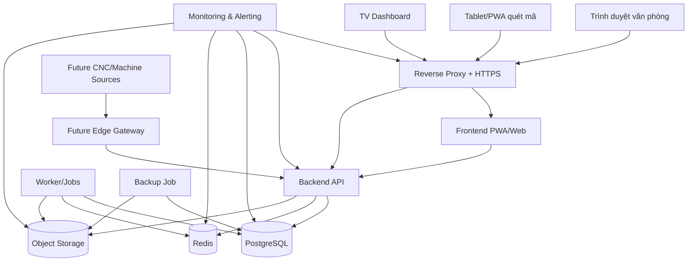
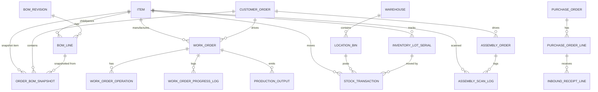

# Báo cáo thiết kế hệ thống BOM-trung tâm cho quản lý sản xuất và kho

## Tóm tắt điều hành

Doanh nghiệp hiện vận hành một nhà xưởng đơn, khoảng 12 máy, BOM đang được quản lý chủ yếu bằng Excel template và đồng bộ thủ công qua OneDrive. Với mô hình đó, BOM đang bị dùng đồng thời như “nguồn định nghĩa kỹ thuật”, “danh sách mua hàng”, “bảng theo dõi tiến độ gia công”, “bảng tồn kho tạm”, và “checklist lắp ráp”. Điều này thuận tiện ở giai đoạn đầu nhưng dẫn tới các vấn đề cố hữu: khó khóa phiên bản BOM, khó truy vết ai sửa gì, không có reservation tồn kho theo đơn, khó quản lý serial/lot một cách nhất quán, và rất khó mở rộng sang quét barcode, QC, ETA, audit, dashboard hay tích hợp máy móc. Đây là dấu hiệu rõ ràng cho thấy doanh nghiệp cần chuyển từ “file làm việc chung” sang một hệ thống thực thi có mô hình dữ liệu và workflow nhất quán.  

Bản thiết kế này đề xuất một **hệ thống BOM-centric thống nhất** cho quản lý **kỹ thuật, mua hàng, QC, sản xuất, kho, lắp ráp và giao hàng nhiều đợt**, triển khai theo hướng **modular monolith** trên **PostgreSQL + Docker Compose**, với **frontend web/PWA** dùng được cho PC, tablet và TV dashboard. PostgreSQL phù hợp với bài toán này vì tài liệu chính thức hỗ trợ **recursive CTE** cho dữ liệu phân cấp kiểu BOM, **Row-Level Security** với hành vi mặc định chặn truy cập nếu chưa có policy, **`jsonb`** cho metadata linh hoạt, và **declarative partitioning** cho log/audit/transaction lớn. Docker Compose phù hợp với giai đoạn đầu vì được thiết kế để định nghĩa và vận hành ứng dụng nhiều container bằng một file YAML chứa services, networks, volumes và secrets; đây là mô hình phù hợp hơn Kubernetes cho bối cảnh **một VPS, một nhà máy, một hệ thống nội bộ**. citeturn16view1turn12view1turn12view3turn12view4turn19view4turn19view5turn19view3turn19view9

Mẫu hình này cũng phù hợp với những gì các hệ thống lớn đang làm. Tài liệu chính thức của SAP cho thấy execution nên dùng **order-specific BOM/routing** hoặc BOM/routing theo production order; SAP cũng hỗ trợ tạo **shop-order specific BOM** khi có khác biệt với master. Oracle mô hình hóa **work definitions, work centers, resources, operations** để chạy work order. Odoo mô tả BOM không chỉ có component mà còn có **operations** và **step-by-step guidelines**. Microsoft Dynamics 365 gắn traceability bằng **serial capture**, **tracked components**, **quality orders** và **quarantine orders**. Bài học rút ra là: **master BOM không nên bị sửa trong quá trình thực thi; execution phải chạy trên snapshot/order-specific copy; chất lượng và traceability phải là thành phần lõi từ đầu, không phải add-on về sau**. citeturn18search1turn18search13turn2search17turn2search5turn15view4turn15view5turn14view12turn14view13turn14view16turn14view17

Khuyến nghị trọng tâm là triển khai theo ba pha. **Phase 1** xây “xương sống vận hành”: item master, BOM revision, BOM snapshot theo đơn, mua hàng, ETA, kho theo location/lot/serial, QC, work order, barcode scan, lắp ráp và audit. **Phase 2** bổ sung edge gateway cho máy và telemetry theo chuẩn nội bộ. **Phase 3** thêm analytics, OEE, ETA chất lượng hơn, dashboard quản trị và tối ưu hóa năng lực xưởng. Với cách làm này, hệ thống hoàn toàn có thể phát triển thành **phần mềm nội bộ dùng lâu dài**, không chỉ là công cụ thay Excel.  

## Bối cảnh, phạm vi và nguyên tắc thiết kế

Phạm vi của hệ thống trong báo cáo này là một **nhà máy đơn**, một hoặc nhiều kho nội bộ, nhiều workstation/lắp ráp có thể cấu hình, và khoảng 12 máy gia công. Hệ thống phải coi **BOM là hạt nhân điều phối**, nhưng không đồng nhất BOM với một bảng phẳng duy nhất. Dữ liệu cần được tách thành ba lớp: **master data**, **BOM/revision/snapshot**, và **execution data**. Cách tách này là điều mà các hệ thống lớn ngầm tuân theo: SAP dùng BOM/routing theo order cho execution; Oracle tách work definition khỏi work order; Odoo cho BOM chứa operation nhưng execution vẫn đi qua manufacturing/work orders; Dynamics lại tách quality, quarantine và traceability thành các thực thể riêng chứ không nhồi vào một sheet. citeturn18search1turn18search13turn2search17turn15view4turn14view12turn14view13

Về hiện trạng, theo mô tả nghiệp vụ của doanh nghiệp, mỗi đơn hàng có BOM riêng nhưng đang dựa trên cùng một mẫu Excel; số mã vật tư đã ở mức gần chục nghìn; item có loại mua ngoài và gia công nội bộ; lắp ráp dùng scan barcode; cần multi-level BOM, giao nhiều đợt, QC khi nhận hàng và sau gia công, ETA và lead time cho hàng mua, tiến độ thủ công theo linh kiện gia công, audit minh bạch và phân quyền chi tiết. Đây là một phạm vi đáng kể, đủ lớn để cần một mô hình thống nhất nhưng vẫn đủ nhỏ để không nên bắt đầu bằng kiến trúc phân tán phức tạp.

Một nguyên tắc thiết kế then chốt là **đơn hàng phải chạy trên BOM snapshot bất biến**. Tài liệu SAP cho thấy execution có thể dùng order-specific BOM/routing từ ERP; khi khác master, hệ thống tạo ra BOM shop-order specific. Đây là cơ sở rất mạnh để áp dụng nguyên tắc tương tự cho dự án này: **khi đơn hàng được phát hành, BOM của đơn phải được snapshot và khóa revision**, mọi thay đổi sau đó đi qua cơ chế ECO/change request hoặc revision mới, không đổi trực tiếp master hay sheet gốc. citeturn18search1turn18search13turn18search5

Một nguyên tắc thứ hai là **make/buy phải là thuộc tính của dòng BOM theo đơn, không chỉ là thuộc tính của item master**. Cùng một item có thể được tự gia công trong đơn này nhưng mua ngoài trong đơn khác, do năng lực xưởng, tải máy, lead time hoặc điều kiện mua hàng thay đổi. Oracle mô tả routing/operations, resources và quantity completed/remaining ở cấp work in process; Odoo cho phép gắn operation trực tiếp vào BOM; điều đó ủng hộ cách thiết kế mà ở đó execution rule sống ở cấp order/snapshot/work order, không chỉ ở master. citeturn2search5turn15view4

Một nguyên tắc thứ ba là **quality và traceability là luồng chính, không phải luồng phụ**. Dynamics 365 có quality orders và quarantine orders; SAP có inspection lot; Oracle Receiving có inspection receipt routing; Odoo có quality control points cho operation cụ thể và scan lot/serial bằng barcode. Vì doanh nghiệp cần QC ở hàng mua ngoài và hàng gia công, đồng thời scan khi lấy hàng và xác nhận lắp ráp, mô hình dữ liệu phải đặt `qc_inspection`, `inventory_lot_serial`, `assembly_scan_log`, `finished_goods_serial` và `stock_transaction` vào lõi, chứ không thêm sau. citeturn14view12turn14view13turn4search5turn4search6turn15view3turn15view1

Bài học từ các hệ thống lớn có thể tóm lược như sau:

| Hệ thống | Mẫu hình đáng học | Áp dụng cho dự án |
|---|---|---|
| SAP Digital Manufacturing / SAP ME | Execution dùng order-specific BOM/routing; có thể tạo shop-order-specific BOM khi khác master. citeturn18search1turn18search13 | Luôn snapshot BOM theo đơn và khóa revision khi phát hành. |
| Oracle Manufacturing / WIP / Receiving | Work definition gồm work areas, work centers, resources, operations; receiving có receipt routing gồm direct/standard/inspection. citeturn2search17turn2search5turn4search6 | Tách rõ work order/routing và thiết kế receipt-QC-putaway thành luồng chuẩn. |
| Microsoft Dynamics 365 SCM | Có quality orders, quarantine orders, serial capture và tracked components cho sản xuất. citeturn14view12turn14view13turn14view16turn14view17 | Xây track & trace theo lot/serial và gắn QC vào inbound + production + assembly. |
| Odoo MRP/Inventory/Quality | BOM có thể chứa operations/guidelines; QCP tạo quality check theo work order operation; barcode có thể bắt buộc scan lot/serial. citeturn15view4turn15view3turn15view1 | Tạo BOM-centric UI nhưng điều khiển bằng operation, quality control point và scan rule. |
| Brother SPEEDIO S500X1 / CNC-C00 | Có Ethernet, RS232C, computer remote, built-in PLC và simple production monitor hiển thị trên PC. citeturn13view1turn13view2turn13view3turn12view10 | Phase 2 có thể đưa telemetry qua edge gateway thay vì buộc tablet kết nối trực tiếp máy. |

## Yêu cầu chức năng và phi chức năng

Các yêu cầu chức năng nên được chốt theo mô hình dưới đây. Đây là bản scope để handoff cho kỹ sư và để trao đổi với quản lý về biên dự án.

| Miền | Yêu cầu bắt buộc của hệ thống |
|---|---|
| BOM & kỹ thuật | Multi-level BOM; BOM template; BOM revision; copy thành BOM snapshot theo từng đơn; mỗi dòng BOM có thể là make/buy/sub-assembly; ghi nhận scrap/dư 5%; đính kèm bản vẽ, tài liệu, CAD/CAM tham chiếu. |
| Master data | Quản lý mã vật tư chuẩn toàn công ty; phân loại item; UOM; default lead time; supplier mapping; serial/lot rule; barcode/QR; trạng thái active/inactive; substitute item. |
| Đơn hàng | Tạo đơn hàng; gắn BOM snapshot; chia kế hoạch giao nhiều đợt; theo dõi phần nào đã đủ vật tư, phần nào đã lắp, phần nào đã giao. |
| Mua hàng | Purchase request, purchase order, ngày đặt, ETA, lead time, vendor, partial receipt, người nhận, người kiểm, incoming QC, trả hàng/sai lệch, log giá mua. |
| Sản xuất nội bộ | Routing/work order, machine/work center, operator update thủ công, progress log, completed/scrap/rework, QC sau gia công, nhập kho thành phẩm/bán thành phẩm. |
| Kho | Multi-warehouse nếu cần; location/bin; lot/serial; barcode scan; putaway; transfer; issue; reservation theo đơn; cycle count; on-hand và available tách biệt. |
| Lắp ráp | Pick list theo đơn/đợt; quét barcode khi lấy hàng; xác nhận lắp; truy vết “linh kiện nào vào máy nào”; serial thành phẩm; đóng gói/giao nhiều đợt. |
| Audit & quản trị | Ghi ai làm gì, lúc nào, từ giá trị nào sang giá trị nào; duyệt các bước quan trọng; phân quyền theo role và data scope; báo cáo tiến độ, thiếu vật tư, PO trễ, WO trễ, lắp ráp tắc nghẽn. |

Các yêu cầu phi chức năng cần được coi là điều kiện thiết kế chứ không phải “nice to have”. Docker Compose phù hợp để tổ chức services, networks, volumes và secrets trong một file chuẩn; volumes là cơ chế được Docker khuyến nghị để persist dữ liệu; Redis phù hợp làm cache hoặc queue tạm, với eviction phục vụ cache và RDB/AOF nếu cần persistence. PostgreSQL yêu cầu backup định kỳ; tài liệu chính thức nêu ba nhóm chiến lược là logical dump, file-system backup và continuous archiving/PITR. PWA có thể chạy offline phần giao diện nhờ service worker cache và lưu queue ở IndexedDB, rồi dùng Background Sync để đồng bộ khi mạng trở lại. citeturn19view5turn19view6turn19view7turn19view8turn12view5turn17view0turn17view9turn17view10turn17view11

| Nhóm NFR | Yêu cầu thiết kế |
|---|---|
| Bảo mật | HTTPS bắt buộc; MFA cho tài khoản nhạy cảm; secrets ngoài source code; database không public Internet; phân quyền server-side và RLS ở bảng nhạy cảm; audit log ở tầng ứng dụng; file upload kiểm soát chặt. |
| Hiệu năng | P95 đọc BOM snapshot < 800ms; scan xác nhận kho/lắp ráp < 300ms trong LAN tốt; dashboard công việc refresh 5–15s; batch import 10k item không khóa hệ thống giờ làm việc. |
| Sẵn sàng | Một VPS vẫn chấp nhận cho Phase 1 nhưng phải có backup/restore drill, health checks, alert disk/memory, queue retry, và chế độ làm việc suy giảm khi mạng chập chờn. |
| Mở rộng | Thiết kế schema và API để sau này thêm edge gateway, machine telemetry, nhiều kho, nhiều line, analytics/OEE mà không đập lại lõi. |
| Ràng buộc hạ tầng | 60GB disk đủ cho MVP nếu file nhị phân tách khỏi DB, backup off-box, log rotation chặt, và object storage có quota/lifecycle. |
| Offline/edge | PWA cache shell + master data tối thiểu; scan event được xếp hàng cục bộ trong IndexedDB; đồng bộ nền bằng Background Sync khi có mạng. |

Về lựa chọn công nghệ lõi, bảng sau là khuyến nghị chính thức cho dự án.

| Tiêu chí | PostgreSQL | MySQL | Kết luận cho dự án |
|---|---|---|---|
| BOM nhiều cấp | Hỗ trợ recursive CTE; tài liệu chính thức còn đưa ví dụ “direct and indirect sub-parts of a product”. citeturn16view1 | Hỗ trợ CTE và recursive CTE. citeturn14view10 | Cả hai đều làm được BOM explosion. |
| Data-scope ở DB | Có RLS ở mức bảng/role/lệnh; nếu bật mà không có policy thì mặc định deny. citeturn12view1turn20view1 | Có roles/privileges trong tài liệu chính thức đã kiểm tra. citeturn14view9 | Với kho, giá vốn, mua hàng và scope theo warehouse/order, PostgreSQL rõ ràng và mạnh hơn. |
| Metadata linh hoạt | Có `jsonb` tối ưu hơn `json` về xử lý. citeturn12view3 | Có JSON, nhưng bộ tài liệu được kiểm tra trong nghiên cứu này không cho thấy lợi thế rõ hơn PostgreSQL cho bài toán này. citeturn14view10turn14view9 | PostgreSQL phù hợp hơn cho checklist QC, metadata linh hoạt. |
| Dữ liệu lớn theo thời gian | Có declarative partitioning, partition pruning và partial index. citeturn12view4turn20view2turn17view1 | Có partitioning, nhưng đây không phải lợi thế trọng tâm trong bộ tài liệu đã xét. | PostgreSQL tốt hơn cho audit/log/scan tables tăng nhanh. |
| Khuyến nghị |  |  | **Chọn PostgreSQL**. |

| Tiêu chí | Docker Compose | Kubernetes | Kết luận cho dự án |
|---|---|---|---|
| Bản chất | Công cụ định nghĩa và chạy multi-container apps; stack mô tả bằng YAML. citeturn19view4turn17view5 | Nền tảng orchestration cho distributed systems, scaling, failover và building blocks mở rộng. citeturn19view9turn14view8 | Với 1 VPS và 1 nhà máy, Compose hợp lý hơn. |
| Độ phức tạp vận hành | Thấp hơn; phù hợp single-host hoặc môi trường nhỏ. citeturn19view4turn19view5 | Cao hơn; hướng tới cluster và resilience ở quy mô lớn. citeturn19view9turn14view8 | Chưa nên dùng K8s cho MVP. |
| Networking & data | Có services, networks, volumes, secrets. citeturn19view5turn19view6turn19view3 | Mạnh hơn ở scale-out đa node. citeturn19view9 | Giai đoạn đầu dùng Compose; khi có nhiều node mới cân nhắc K8s. |

## Kiến trúc đề xuất

Kiến trúc khuyến nghị là **web app nội bộ self-hosted** theo kiểu **modular monolith**: một backend API thống nhất, một worker xử lý nền, một frontend PWA, một reverse proxy ở ngoài cùng, PostgreSQL làm system-of-record, Redis làm cache/queue ngắn hạn, object storage cho file đính kèm, và monitoring/backup tách riêng. Docker Compose quản lý stack nhiều container; Compose networking mặc định tạo network chung và các service có thể gọi nhau theo tên service; user-defined bridge network giúp cô lập tốt hơn; secrets không nên nằm trong source code hay Dockerfile mà phải tách riêng qua secrets mount. citeturn19view4turn19view2turn14view2turn19view3



Trong deployment thực tế, chỉ **reverse proxy** được public ra Internet. API, PostgreSQL, Redis và object storage phải nằm ở network nội bộ, không public cổng trực tiếp. OWASP coi network segmentation là lớp phòng thủ chiều sâu cốt lõi; họ nêu rõ phân đoạn mạng giúp làm chậm lateral movement và tránh trường hợp web server public bị compromise rồi vào thẳng database. HTTPS là bắt buộc; OWASP coi TLS là cơ chế chuẩn để bảo vệ web/app traffic. MFA nên bắt buộc cho tài khoản nhạy cảm như admin, kế toán, mua hàng và quản lý. citeturn12view7turn12view8turn12view9

Vai trò của từng thành phần nên được chốt như sau:

| Thành phần | Vai trò |
|---|---|
| Reverse proxy | TLS termination, rate limit cơ bản, headers bảo mật, route `/api`, `/app`, `/files` |
| Frontend PWA | UI cho văn phòng, tablet scan, TV dashboard; cache shell; offline queue tối thiểu |
| Backend API | AuthN/AuthZ, nghiệp vụ BOM/procurement/warehouse/assembly, session context cho RLS |
| Worker | Tính MRP nhẹ, ETA rollup, tạo alert, import/export, gửi mail, đồng bộ nền |
| PostgreSQL | Nguồn dữ liệu chuẩn cho giao dịch, snapshot, traceability, cost, audit |
| Redis | Cache đọc nhanh, distributed lock nhẹ, queue nền, session/rate limit nếu cần |
| Object storage | Bản vẽ, PDF, hình QC, scan chứng từ, tệp export/import |
| Monitoring | Metrics, logs, uptime, disk/CPU/memory/latency alerts |
| Backup | Logical dump, physical backup tùy pha, kiểm tra restore |

Chiến lược lưu trữ nên chia thành bốn tầng. **Tầng giao dịch lõi** nằm ở PostgreSQL. **Tầng metadata mềm** dùng `jsonb` cho checklist QC, payload mở rộng hay machine metadata chưa ổn định. **Tầng file/object** lưu bản vẽ, hình ảnh, tài liệu. **Tầng cache/queue** nằm ở Redis, nơi eviction là chấp nhận được vì dữ liệu cache chỉ là bản sao; Redis docs mô tả đây là pattern phổ biến. Docker khuyến nghị dùng volumes để persist data container; object storage S3-compatible có thể dùng MinIO hoặc dịch vụ tương đương, với bucket/object/key và metadata lưu trong database. citeturn12view3turn19view6turn19view8turn7search0turn7search18

Một quyết định quan trọng là **không để machine telemetry trở thành phụ thuộc cứng của core workflow ở Phase 1**. Dựa trên tài liệu chính thức của Brother cho dòng S500X1/CNC-C00, controller có Ethernet, RS232C, computer remote, built-in PLC và simple production monitor hiển thị màn hình theo dõi sản xuất lên PC. Điều này cho thấy hướng **edge gateway** là khả thi: gateway đọc dữ liệu máy, chuẩn hóa thành event nội bộ rồi đẩy vào API. Tuy nhiên, vì bộ tài liệu công khai chưa đủ để kết luận giao thức mở/telemetry sâu ở mức API hiện đại, machine integration nên là **Phase 2**, và core BOM/WMS/MES không được phụ thuộc vào nó để vận hành hằng ngày. citeturn13view1turn13view2turn13view3turn12view10

## Mô hình dữ liệu và DDL

Mô hình dữ liệu nên tổ chức theo schema nghiệp vụ để cô lập quyền, giảm rủi ro đặt table lẫn lộn và đơn giản hóa `GRANT`. PostgreSQL `GRANT` hỗ trợ cấp quyền ở mức schema, table, column, sequence và role membership; tài liệu cũng cho thấy mặc định bảng mới **không cấp quyền cho `PUBLIC`**. Đây là cơ sở tốt để tách schema như `auth`, `master`, `engineering`, `sales`, `procurement`, `production`, `inventory`, `assembly`, `quality`, `costing`, `audit`. citeturn12view2turn20view0

Bộ bảng lõi khuyến nghị:

| Schema | Bảng lõi | Vai trò |
|---|---|---|
| `auth` | `user_account`, `role`, `permission`, `role_permission`, `user_role` | Người dùng, vai trò, quyền |
| `master` | `item`, `item_supplier`, `warehouse`, `location_bin`, `machine`, `work_center` | Dữ liệu gốc |
| `engineering` | `bom_revision`, `bom_line`, `drawing_link`, `eco_request` | Master BOM và revision |
| `sales` | `customer_order`, `shipment_plan`, `order_bom_snapshot` | Đơn hàng và snapshot BOM theo đơn |
| `procurement` | `purchase_request`, `purchase_order`, `purchase_order_line`, `inbound_receipt`, `inbound_receipt_line` | Luồng mua hàng |
| `quality` | `qc_plan`, `qc_inspection`, `qc_result`, `qc_nonconformance` | QC nhận hàng, QC gia công, QC lắp |
| `production` | `work_order`, `work_order_operation`, `work_order_progress_log`, `production_output`, `scrap_log` | Gia công nội bộ |
| `inventory` | `inventory_lot_serial`, `stock_balance`, `stock_transaction`, `stock_reservation`, `stock_count`, `stock_transfer` | Tồn kho và giao dịch kho |
| `assembly` | `assembly_order`, `assembly_component_requirement`, `assembly_scan_log`, `assembly_completion`, `finished_goods_serial` | Pick/scan/lắp ráp/completion |
| `costing` | `item_standard_cost`, `purchase_cost`, `order_cost_rollup` | Giá mua, giá chuẩn, giá vốn theo đơn |
| `audit` | `audit_event`, `security_event`, `integration_event` | Audit và bảo mật |

Về mặt mô hình hoá BOM nhiều cấp, PostgreSQL rất phù hợp vì recursive CTE được thiết kế cho dữ liệu phân cấp; ví dụ trong docs chính thức minh họa truy vấn toàn bộ direct/indirect sub-parts và nhân lượng theo cấp. Vì vậy, schema nên lưu BOM theo quan hệ cha-con chuẩn, không flatten sẵn toàn bộ nhiều cấp vào một bảng Excel-style. citeturn16view1turn16view2



Mẫu DDL dưới đây là khung kỹ thuật đủ gần production để đội phát triển bắt đầu. Cú pháp dùng PostgreSQL, khóa chính kiểu UUID, số lượng kiểu `numeric`, và chọn data type theo hướng an toàn cho traceability, cost và audit.

```sql
CREATE EXTENSION IF NOT EXISTS pgcrypto;

CREATE SCHEMA IF NOT EXISTS master;
CREATE SCHEMA IF NOT EXISTS engineering;
CREATE SCHEMA IF NOT EXISTS sales;
CREATE SCHEMA IF NOT EXISTS production;
CREATE SCHEMA IF NOT EXISTS inventory;
CREATE SCHEMA IF NOT EXISTS assembly;
```

```sql
CREATE TABLE master.item (
    id                      uuid PRIMARY KEY DEFAULT gen_random_uuid(),
    item_code               varchar(64) NOT NULL UNIQUE,
    item_name               text NOT NULL,
    item_name_en            text,
    item_type               varchar(32) NOT NULL,   -- RAW, PURCHASED, FABRICATED, SUB_ASSEMBLY, FG, CONSUMABLE
    source_type_default     varchar(16) NOT NULL,   -- MAKE, BUY, BOTH
    uom                     varchar(16) NOT NULL,
    tracking_type           varchar(16) NOT NULL DEFAULT 'NONE',   -- NONE, LOT, SERIAL
    barcode_value           varchar(128),
    is_active               boolean NOT NULL DEFAULT true,
    revision_controlled     boolean NOT NULL DEFAULT false,
    default_lead_time_days  integer NOT NULL DEFAULT 0,
    default_scrap_rate      numeric(7,4) NOT NULL DEFAULT 0,
    safety_over_pct         numeric(7,4) NOT NULL DEFAULT 0.0500,
    preferred_supplier_id   uuid,
    attributes_json         jsonb NOT NULL DEFAULT '{}'::jsonb,
    created_at              timestamptz NOT NULL DEFAULT now(),
    updated_at              timestamptz NOT NULL DEFAULT now(),
    created_by              uuid,
    updated_by              uuid,
    CONSTRAINT ck_item_type CHECK (item_type IN ('RAW','PURCHASED','FABRICATED','SUB_ASSEMBLY','FG','CONSUMABLE')),
    CONSTRAINT ck_source_type_default CHECK (source_type_default IN ('MAKE','BUY','BOTH')),
    CONSTRAINT ck_tracking_type CHECK (tracking_type IN ('NONE','LOT','SERIAL'))
);

CREATE INDEX idx_item_type_active ON master.item (item_type, is_active);
CREATE INDEX idx_item_barcode ON master.item (barcode_value);
CREATE INDEX idx_item_attr_gin ON master.item USING gin (attributes_json);
```

```sql
CREATE TABLE engineering.bom_revision (
    id                      uuid PRIMARY KEY DEFAULT gen_random_uuid(),
    bom_code                varchar(64) NOT NULL,
    product_item_id         uuid NOT NULL REFERENCES master.item(id),
    revision_no             varchar(32) NOT NULL,
    revision_status         varchar(16) NOT NULL DEFAULT 'DRAFT', -- DRAFT, RELEASED, OBSOLETE
    effective_from          timestamptz,
    effective_to            timestamptz,
    notes                   text,
    created_at              timestamptz NOT NULL DEFAULT now(),
    created_by              uuid,
    UNIQUE (bom_code, revision_no)
);

CREATE TABLE engineering.bom_line (
    id                      uuid PRIMARY KEY DEFAULT gen_random_uuid(),
    bom_revision_id         uuid NOT NULL REFERENCES engineering.bom_revision(id) ON DELETE CASCADE,
    parent_item_id          uuid NOT NULL REFERENCES master.item(id),
    child_item_id           uuid NOT NULL REFERENCES master.item(id),
    line_no                 integer NOT NULL,
    component_role          varchar(32), -- MAIN, FASTENER, CONSUMABLE, PACKING...
    source_type             varchar(16) NOT NULL, -- MAKE, BUY
    qty_per                 numeric(18,6) NOT NULL,
    scrap_rate              numeric(7,4) NOT NULL DEFAULT 0,
    operation_seq           integer,
    qc_plan_code            varchar(64),
    is_phantom              boolean NOT NULL DEFAULT false,
    is_optional             boolean NOT NULL DEFAULT false,
    substitute_group_code   varchar(64),
    drawing_ref             text,
    notes                   text,
    created_at              timestamptz NOT NULL DEFAULT now(),
    created_by              uuid,
    CONSTRAINT ck_bom_line_source CHECK (source_type IN ('MAKE','BUY')),
    CONSTRAINT ck_bom_line_qty CHECK (qty_per > 0)
);

CREATE UNIQUE INDEX uq_bom_line_order ON engineering.bom_line (bom_revision_id, line_no);
CREATE INDEX idx_bom_line_parent ON engineering.bom_line (parent_item_id);
CREATE INDEX idx_bom_line_child ON engineering.bom_line (child_item_id);
CREATE INDEX idx_bom_line_bom_parent ON engineering.bom_line (bom_revision_id, parent_item_id);
```

```sql
CREATE TABLE sales.order_bom_snapshot (
    id                          uuid PRIMARY KEY DEFAULT gen_random_uuid(),
    snapshot_group_id           uuid NOT NULL,
    customer_order_id           uuid NOT NULL,
    order_no                    varchar(64) NOT NULL,
    root_product_item_id        uuid NOT NULL REFERENCES master.item(id),
    source_bom_revision_id      uuid NOT NULL REFERENCES engineering.bom_revision(id),
    source_bom_line_id          uuid REFERENCES engineering.bom_line(id),
    parent_item_id              uuid REFERENCES master.item(id),
    item_id                     uuid NOT NULL REFERENCES master.item(id),
    depth                       integer NOT NULL DEFAULT 0,
    line_path                   text NOT NULL,        -- e.g. 001/003/002
    line_no                     integer NOT NULL,
    source_type                 varchar(16) NOT NULL, -- MAKE, BUY
    qty_per_parent              numeric(18,6) NOT NULL,
    net_required_qty            numeric(18,6) NOT NULL,
    scrap_rate                  numeric(7,4) NOT NULL DEFAULT 0,
    gross_required_qty          numeric(18,6) NOT NULL,
    reserved_qty                numeric(18,6) NOT NULL DEFAULT 0,
    issued_qty                  numeric(18,6) NOT NULL DEFAULT 0,
    received_qty                numeric(18,6) NOT NULL DEFAULT 0,
    completed_qty               numeric(18,6) NOT NULL DEFAULT 0,
    eta_date                    date,
    line_status                 varchar(24) NOT NULL DEFAULT 'PLANNED',
    allocation_state            varchar(24) NOT NULL DEFAULT 'UNALLOCATED',
    created_at                  timestamptz NOT NULL DEFAULT now(),
    created_by                  uuid,
    CONSTRAINT ck_snapshot_source_type CHECK (source_type IN ('MAKE','BUY')),
    CONSTRAINT ck_snapshot_line_status CHECK (
        line_status IN (
            'PLANNED','PURCHASING','INBOUND_QC','AVAILABLE',
            'IN_PRODUCTION','PROD_QC','RESERVED','ISSUED','ASSEMBLED','CLOSED'
        )
    )
);

CREATE INDEX idx_order_bom_snapshot_order ON sales.order_bom_snapshot (customer_order_id, snapshot_group_id);
CREATE INDEX idx_order_bom_snapshot_item ON sales.order_bom_snapshot (item_id, line_status);
CREATE INDEX idx_order_bom_snapshot_eta ON sales.order_bom_snapshot (eta_date);
CREATE INDEX idx_order_bom_snapshot_path ON sales.order_bom_snapshot (snapshot_group_id, line_path);
```

```sql
CREATE TABLE production.work_order (
    id                          uuid PRIMARY KEY DEFAULT gen_random_uuid(),
    wo_no                       varchar(64) NOT NULL UNIQUE,
    customer_order_id           uuid NOT NULL,
    order_no                    varchar(64) NOT NULL,
    order_bom_snapshot_id       uuid NOT NULL REFERENCES sales.order_bom_snapshot(id),
    item_id                     uuid NOT NULL REFERENCES master.item(id),
    planned_qty                 numeric(18,6) NOT NULL,
    completed_qty               numeric(18,6) NOT NULL DEFAULT 0,
    scrap_qty                   numeric(18,6) NOT NULL DEFAULT 0,
    uom                         varchar(16) NOT NULL,
    priority                    integer NOT NULL DEFAULT 100,
    work_center_id              uuid,
    machine_id                  uuid,
    routing_version             varchar(32),
    planned_start_at            timestamptz,
    planned_end_at              timestamptz,
    actual_start_at             timestamptz,
    actual_end_at               timestamptz,
    wo_status                   varchar(24) NOT NULL DEFAULT 'RELEASED',
    qc_required                 boolean NOT NULL DEFAULT true,
    notes                       text,
    created_at                  timestamptz NOT NULL DEFAULT now(),
    created_by                  uuid,
    CONSTRAINT ck_wo_status CHECK (
        wo_status IN ('DRAFT','RELEASED','READY','RUNNING','PAUSED','QC_PENDING','DONE','CANCELLED')
    )
);

CREATE INDEX idx_work_order_status ON production.work_order (wo_status, planned_start_at);
CREATE INDEX idx_work_order_machine ON production.work_order (machine_id, wo_status);
CREATE INDEX idx_work_order_order ON production.work_order (customer_order_id, order_bom_snapshot_id);
```

```sql
CREATE TABLE inventory.stock_transaction (
    id                          uuid NOT NULL DEFAULT gen_random_uuid(),
    posted_at                   timestamptz NOT NULL DEFAULT now(),
    tx_type                     varchar(24) NOT NULL, -- RECEIPT, ISSUE, TRANSFER, ADJUST, RESERVE, UNRESERVE, PROD_IN, PROD_OUT, ASM_ISSUE, ASM_RETURN
    reference_type              varchar(32) NOT NULL, -- PO, GRN, WO, SO, ASM, COUNT...
    reference_id                uuid,
    customer_order_id           uuid,
    item_id                     uuid NOT NULL REFERENCES master.item(id),
    warehouse_id                uuid NOT NULL,
    location_bin_id             uuid,
    lot_serial_id               uuid,
    qty_in                      numeric(18,6) NOT NULL DEFAULT 0,
    qty_out                     numeric(18,6) NOT NULL DEFAULT 0,
    uom                         varchar(16) NOT NULL,
    unit_cost                   numeric(18,6),
    currency_code               varchar(8),
    actor_user_id               uuid,
    reason_code                 varchar(64),
    remarks                     text,
    created_at                  timestamptz NOT NULL DEFAULT now(),
    PRIMARY KEY (id, posted_at),
    CONSTRAINT ck_stock_tx_type CHECK (
        tx_type IN ('RECEIPT','ISSUE','TRANSFER','ADJUST','RESERVE','UNRESERVE','PROD_IN','PROD_OUT','ASM_ISSUE','ASM_RETURN')
    ),
    CONSTRAINT ck_stock_tx_qty CHECK (qty_in >= 0 AND qty_out >= 0 AND NOT (qty_in > 0 AND qty_out > 0))
) PARTITION BY RANGE (posted_at);

CREATE INDEX idx_stock_tx_item_time ON inventory.stock_transaction (item_id, posted_at DESC);
CREATE INDEX idx_stock_tx_order_time ON inventory.stock_transaction (customer_order_id, posted_at DESC);
CREATE INDEX idx_stock_tx_ref ON inventory.stock_transaction (reference_type, reference_id);
```

```sql
CREATE TABLE assembly.assembly_scan_log (
    id                          uuid PRIMARY KEY DEFAULT gen_random_uuid(),
    event_at                    timestamptz NOT NULL DEFAULT now(),
    assembly_order_id           uuid NOT NULL,
    customer_order_id           uuid NOT NULL,
    fg_serial_id                uuid,
    scan_stage                  varchar(24) NOT NULL, -- PICK, VERIFY, CONSUME, RETURN, COMPLETE
    item_id                     uuid NOT NULL REFERENCES master.item(id),
    lot_serial_id               uuid,
    barcode_raw                 text NOT NULL,
    qty                         numeric(18,6) NOT NULL DEFAULT 1,
    warehouse_id                uuid,
    location_bin_id             uuid,
    station_code                varchar(64),
    device_id                   varchar(128),
    operator_user_id            uuid,
    offline_queue_id            uuid,
    sync_status                 varchar(16) NOT NULL DEFAULT 'SYNCED',
    validation_result           varchar(16) NOT NULL DEFAULT 'OK',
    message                     text,
    created_at                  timestamptz NOT NULL DEFAULT now(),
    CONSTRAINT ck_scan_stage CHECK (scan_stage IN ('PICK','VERIFY','CONSUME','RETURN','COMPLETE')),
    CONSTRAINT ck_sync_status CHECK (sync_status IN ('PENDING','SYNCED','FAILED')),
    CONSTRAINT ck_validation_result CHECK (validation_result IN ('OK','WARN','REJECT'))
);

CREATE INDEX idx_assembly_scan_order_time ON assembly.assembly_scan_log (assembly_order_id, event_at DESC);
CREATE INDEX idx_assembly_scan_fg ON assembly.assembly_scan_log (fg_serial_id, event_at DESC);
CREATE INDEX idx_assembly_scan_offline ON assembly.assembly_scan_log (sync_status, event_at);
```

Các bảng lớn như `inventory.stock_transaction`, `audit.audit_event`, `assembly.assembly_scan_log`, `production.work_order_progress_log` nên được partition theo tháng hoặc quý. PostgreSQL partitioning và partition pruning giúp giảm lượng dữ liệu/quy mô index cho các truy vấn chỉ đụng một tập partition liên quan; partial index lại hữu ích để index chỉ những subset như `status='PENDING'` hay `sync_status='FAILED'`, thay vì index mọi hàng. Đồng thời PostgreSQL docs cũng nhấn mạnh index tăng tốc truy vấn nhưng có chi phí ghi, nên chỉ tạo index bám đúng access pattern. citeturn12view4turn6search0turn20view2turn17view1turn17view2

Đối với truy vấn BOM explosion, câu lệnh chuẩn nên dùng `WITH RECURSIVE`, gần đúng với ví dụ parts/sub-parts trong tài liệu PostgreSQL. Ví dụ thiết kế cho dự án có thể như sau:

```sql
WITH RECURSIVE exploded AS (
    SELECT
        br.product_item_id AS root_item_id,
        bl.parent_item_id,
        bl.child_item_id,
        1 AS depth,
        bl.qty_per::numeric(18,6) AS required_qty,
        LPAD(bl.line_no::text, 3, '0') AS path
    FROM engineering.bom_revision br
    JOIN engineering.bom_line bl
      ON bl.bom_revision_id = br.id
    WHERE br.id = :bom_revision_id
      AND bl.parent_item_id = br.product_item_id

    UNION ALL

    SELECT
        e.root_item_id,
        bl.parent_item_id,
        bl.child_item_id,
        e.depth + 1,
        (e.required_qty * bl.qty_per)::numeric(18,6) AS required_qty,
        e.path || '/' || LPAD(bl.line_no::text, 3, '0') AS path
    FROM exploded e
    JOIN engineering.bom_line bl
      ON bl.parent_item_id = e.child_item_id
    JOIN engineering.bom_revision br
      ON br.id = bl.bom_revision_id
     AND br.product_item_id = e.root_item_id
)
SELECT
    child_item_id AS item_id,
    SUM(required_qty) AS total_required_qty
FROM exploded
GROUP BY child_item_id
ORDER BY item_id;
```

Phần file storage nên đi theo mô hình **DB giữ metadata, object storage giữ nhị phân**. OWASP khuyến nghị file upload phải allow-list extension, kiểm type, không tin `Content-Type`, đổi tên file, giới hạn kích thước, chỉ cho user có quyền upload và lưu file ngoài webroot hoặc qua handler trung gian. Vì vậy, nên có bảng metadata tương tự `doc.file_object` với các cột: `id`, `bucket`, `object_key`, `original_name`, `safe_name`, `sha256`, `byte_size`, `media_type`, `av_status`, `linked_entity_type`, `linked_entity_id`, `uploaded_by`, `created_at`, `deleted_at`. Object store có thể là S3-compatible như MinIO hoặc dịch vụ tương đương; MinIO docs mô tả object store dùng bucket và chuẩn API S3-compatible. citeturn22view1turn7search18turn7search0

## Quy trình, trạng thái và phân quyền

Luồng nghiệp vụ end-to-end được đề xuất như sau.

```mermaid
flowchart LR
    A[Nhận đơn hàng] --> B[Chọn BOM revision]
    B --> C[Tạo BOM snapshot theo đơn]
    C --> D{Dòng BOM}
    D -->|BUY| E[Tạo PR/PO]
    E --> F[ETA + receipt routing]
    F --> G[Incoming QC]
    G --> H[Nhập kho + reserve]
    D -->|MAKE| I[Tạo work order]
    I --> J[Operator cập nhật tiến độ]
    J --> K[Production QC]
    K --> H
    H --> L[Pick list]
    L --> M[Scan lấy hàng]
    M --> N[Lắp ráp]
    N --> O[Scan xác nhận tiêu hao]
    O --> P[Tạo serial thành phẩm]
    P --> Q[Giao từng đợt / hoàn tất đơn]
```



Mô hình trạng thái nên được chuẩn hóa ngay từ đầu, thay vì để mỗi màn hình tự diễn giải theo cách riêng.

| Đối tượng | Trạng thái đề xuất |
|---|---|
| Dòng BOM snapshot | `PLANNED` → `PURCHASING` / `IN_PRODUCTION` → `INBOUND_QC` / `PROD_QC` → `AVAILABLE` → `RESERVED` → `ISSUED` → `ASSEMBLED` → `CLOSED` |
| PO line | `DRAFT` → `SENT` → `CONFIRMED` → `PARTIAL_RECEIVED` → `RECEIVED` → `QC_HOLD` / `QC_PASS` / `QC_FAIL` → `CLOSED` |
| Work order | `DRAFT` → `RELEASED` → `READY` → `RUNNING` → `PAUSED` → `QC_PENDING` → `DONE` / `CANCELLED` |
| Assembly order | `PLANNED` → `PICKING` → `READY_TO_ASSEMBLE` → `ASSEMBLING` → `VERIFYING` → `COMPLETED` / `PARTIAL_SHIPPED` / `CLOSED` |

Với barcode/QR scanning, dự án nên sử dụng **PWA-first**. MDN mô tả service worker như lớp proxy giữa app và network, có thể cache asset/data tối thiểu để chạy offline; IndexedDB là lựa chọn phù hợp cho structured client-side storage khối lượng đáng kể; Microsoft Edge docs mô tả Background Sync cho phép defer việc đồng bộ tới khi thiết bị có mạng trở lại. Vì vậy, tablet scan giá rẻ không cần native app ở Phase 1: chỉ cần PWA có camera scanning, cache shell, preload master data nhỏ, và queue event cục bộ. citeturn17view9turn17view10turn17view11

Thiết kế offline queue cho quét mã nên theo nguyên tắc sau:

| Bước | Cơ chế |
|---|---|
| Nạp dữ liệu tối thiểu | Cache app shell, user profile, permissions, warehouse/location được cấp, danh sách pick hiện hành |
| Tạo event offline | Mỗi scan sinh `offline_queue_id`, lưu vào IndexedDB với payload chuẩn hóa |
| Xác thực cục bộ | Kiểm tra cú pháp barcode, item tồn tại trong pick list, stage hợp lệ, không duplicate trong phạm vi session |
| Đồng bộ | Service worker/Background Sync gửi queue theo FIFO khi có mạng |
| Hợp nhất phía server | API idempotent theo `offline_queue_id`; duplicate trả kết quả đã xử lý thay vì tạo thêm giao dịch |
| Phản hồi | PWA hiển thị `SYNCED`/`FAILED`/`REQUIRES_REVIEW`; event thất bại không bị mất |

Về phân quyền, dự án nên dùng **RBAC + data scope + RLS**. OWASP khuyến nghị deny-by-default, kiểm tra quyền ở mọi request, và khi data scope phức tạp thì nên kết hợp logic thuộc tính/quan hệ thay vì chỉ dựa vào RBAC thuần. PostgreSQL hỗ trợ `GRANT` ở mức object/column và RLS theo row/role/command; nếu bật RLS mà chưa có policy áp dụng thì mặc định deny. Đây là nền tảng rất phù hợp cho dữ liệu như giá vốn, đơn mua, tồn kho theo kho hay đơn hàng theo nhóm phụ trách. citeturn22view0turn12view1turn12view2turn20view1

Ma trận vai trò đề xuất:

| Vai trò | Chức năng chính | Data scope mặc định |
|---|---|---|
| `system_admin` | người dùng, role, cấu hình, secrets ref, tham số hệ thống, audit | toàn hệ thống |
| `security_engineer` | IAM, hardening, logs bảo mật, chính sách truy cập | toàn hệ thống, không tự động có quyền nghiệp vụ |
| `design_engineer` | item mới, BOM draft, revision, bản vẽ, ECO | engineering scope |
| `material_planner` | explode BOM, nhu cầu, reservation, tạo PR/WO | theo xưởng/đơn được phân công |
| `purchasing` | vendor, PR/PO, ETA, theo dõi hàng về | mua hàng, không xem cost nhạy cảm ngoài phạm vi được cấp |
| `accountant` | hóa đơn, giá mua, cost rollup, đối soát | cost scope, không sửa BOM/release WO |
| `qc_inspector` | incoming QC, production QC, nonconformance | theo kho/xưởng được cấp |
| `warehouse_staff` | receipt, putaway, issue, transfer, count | theo warehouse/location được cấp |
| `machine_operator` | start/pause/finish WO, output/scrap | theo work center/machine được gán |
| `assembly_staff` | pick, scan, consume, complete assembly | theo assembly station hoặc order scope |
| `manager` | dashboard, duyệt, xem tiến độ, xem cost khi được cấp | scope theo bộ phận hoặc toàn hệ thống |

Quy tắc data scope khuyến nghị:

- **Kho**: chỉ nhìn/ghi transaction thuộc warehouse hoặc location được gán.
- **Mua hàng**: thấy PO/vendor/ETA; chỉ kế toán và manager được xem giá mua chi tiết nếu bật quyền cost.
- **Kỹ thuật**: thấy bản vẽ/BOM; không tự động thấy giá mua.
- **Lắp ráp**: thấy pick/consume và traceability; không thấy cost.
- **QC**: thấy thông tin cần thiết để kiểm và quyết định pass/fail; không thấy toàn bộ chi phí nếu không cần.

Mẫu `GRANT` và RLS nên được áp dụng như sau:

```sql
-- roles
CREATE ROLE app_base NOINHERIT;
CREATE ROLE warehouse_staff NOINHERIT;
CREATE ROLE accountant NOINHERIT;
CREATE ROLE manager NOINHERIT;

-- schema usage
GRANT USAGE ON SCHEMA inventory TO warehouse_staff, manager;
GRANT USAGE ON SCHEMA costing TO accountant, manager;

-- object grants
GRANT SELECT, INSERT ON inventory.stock_transaction TO warehouse_staff, manager;
REVOKE ALL ON ALL TABLES IN SCHEMA costing FROM PUBLIC;
GRANT SELECT ON costing.order_cost_rollup TO accountant, manager;
```

```sql
-- inventory RLS by warehouse
ALTER TABLE inventory.stock_transaction ENABLE ROW LEVEL SECURITY;
ALTER TABLE inventory.stock_transaction FORCE ROW LEVEL SECURITY;

CREATE POLICY stock_tx_select_by_warehouse
ON inventory.stock_transaction
FOR SELECT
TO warehouse_staff, manager
USING (
    current_setting('app.is_admin', true) = 'true'
    OR warehouse_id = current_setting('app.current_warehouse_id', true)::uuid
);

CREATE POLICY stock_tx_insert_by_warehouse
ON inventory.stock_transaction
FOR INSERT
TO warehouse_staff, manager
WITH CHECK (
    current_setting('app.is_admin', true) = 'true'
    OR warehouse_id = current_setting('app.current_warehouse_id', true)::uuid
);
```

```sql
-- costing RLS by permission flag
ALTER TABLE costing.order_cost_rollup ENABLE ROW LEVEL SECURITY;
ALTER TABLE costing.order_cost_rollup FORCE ROW LEVEL SECURITY;

CREATE POLICY cost_read_policy
ON costing.order_cost_rollup
FOR SELECT
TO accountant, manager
USING (
    current_setting('app.can_view_cost', true) = 'true'
);
```

```sql
-- order scope for assembly staff
ALTER TABLE assembly.assembly_scan_log ENABLE ROW LEVEL SECURITY;

CREATE POLICY assembly_scan_by_order_scope
ON assembly.assembly_scan_log
FOR SELECT
TO assembly_staff, manager
USING (
    current_setting('app.is_admin', true) = 'true'
    OR customer_order_id = ANY (
        string_to_array(current_setting('app.order_scope_ids', true), ',')::uuid[]
    )
);
```

Cần lưu ý rằng RLS chỉ là lớp cuối cùng. OWASP khuyến nghị tiếp tục kiểm tra quyền ở mọi request phía ứng dụng, và xây dựng test matrix cho authorization để tránh hồi quy khi thêm tính năng. Vì vậy API phải set session context như `app.current_warehouse_id`, `app.can_view_cost`, `app.order_scope_ids` theo user đã xác thực, và toàn bộ service layer vẫn phải xác minh hành động trước khi chạm DB. citeturn22view0turn21search8

## Triển khai, vận hành và lộ trình

Với một VPS 60GB, **Docker Compose** là lựa chọn hợp lý nhất cho MVP. Docker docs mô tả Compose là mô hình chuẩn để định nghĩa và chạy multi-container application bằng YAML; Compose specification là định dạng khuyến nghị hiện hành; network mặc định giúp service gọi nhau bằng tên; volumes là cơ chế persist được khuyến nghị; secrets là nơi chứa password/certificate/API key không nên nằm trong source code. citeturn19view4turn19view5turn19view2turn19view6turn19view3

Mẫu `compose.yaml` nên bắt đầu theo khung sau:

```yaml
services:
  reverse-proxy:
    image: caddy:2
    ports:
      - "80:80"
      - "443:443"
    networks: [public_net, app_net]
    volumes:
      - caddy_data:/data
      - caddy_config:/config
    secrets:
      - tls_email

  frontend:
    image: registry.local/bom-frontend:latest
    networks: [app_net]
    depends_on: [api]

  api:
    image: registry.local/bom-api:latest
    networks: [app_net, db_net]
    depends_on: [postgres, redis, objectstore]
    volumes:
      - app_tmp:/app/tmp
    secrets:
      - db_password
      - jwt_secret
      - object_access_key
      - object_secret_key

  worker:
    image: registry.local/bom-api:latest
    command: ["./bin/worker"]
    networks: [app_net, db_net]
    depends_on: [postgres, redis]
    secrets:
      - db_password
      - jwt_secret

  postgres:
    image: postgres:18
    networks: [db_net]
    volumes:
      - pg_data:/var/lib/postgresql/data
    secrets:
      - db_password

  redis:
    image: redis:7
    networks: [db_net]
    volumes:
      - redis_data:/data

  objectstore:
    image: minio/minio:latest
    command: server /data
    networks: [db_net]
    volumes:
      - object_data:/data
    secrets:
      - object_access_key
      - object_secret_key

  backup:
    image: registry.local/bom-backup:latest
    networks: [db_net]
    depends_on: [postgres, objectstore]
    volumes:
      - backup_staging:/backup
    secrets:
      - db_password
      - object_access_key
      - object_secret_key

networks:
  public_net:
  app_net:
  db_net:

volumes:
  caddy_data:
  caddy_config:
  app_tmp:
  pg_data:
  redis_data:
  object_data:
  backup_staging:

secrets:
  tls_email:
    file: ./secrets/tls_email.txt
  db_password:
    file: ./secrets/db_password.txt
  jwt_secret:
    file: ./secrets/jwt_secret.txt
  object_access_key:
    file: ./secrets/object_access_key.txt
  object_secret_key:
    file: ./secrets/object_secret_key.txt
```

**Chiến lược backup/restore** cần bắt buộc ngay từ MVP. PostgreSQL nêu ba chiến lược chính: SQL dump, file-system backup và continuous archiving; PITR dùng file-system backup kết hợp WAL replay để khôi phục tới thời điểm mong muốn nhưng phức tạp hơn. Khuyến nghị thực tế cho dự án này là: hằng đêm chạy `pg_dump` logical để khôi phục cấp bảng/schema; hằng tuần chạy physical backup; object storage metadata và object file phải được backup đồng bộ; restore drill tối thiểu mỗi tháng một lần vào môi trường thử nghiệm; khi hệ thống thực sự trở thành xương sống vận hành thì cân nhắc bật continuous archiving/PITR. citeturn12view5turn17view0

**Monitoring và alerting** nên triển khai ngay từ đầu ở mức tối thiểu:
- health of reverse proxy, frontend, API, worker, PostgreSQL, Redis, object storage;
- disk usage 70/85/95%;
- Postgres slow query, lock wait, vacuum lag, backup success/failure;
- Redis memory, eviction, queue lag;
- scan offline backlog;
- spike đăng nhập lỗi, spike 403/401, spike upload fail;
- số PO trễ ETA, số WO quá hạn, số assembly blocked.
OWASP nhấn mạnh application logging cho security và operational insight có giá trị cao hơn chỉ log hạ tầng; audit trail về add/modify/delete/export và security event nên được log ở tầng ứng dụng. citeturn22view2

**Checklist bảo mật triển khai**:

| Kiểm soát | Thiết kế yêu cầu | Cơ sở |
|---|---|---|
| HTTPS | Bật TLS cho toàn bộ traffic web; tự động cấp/gia hạn cert qua ACME. | OWASP TLS và Let’s Encrypt ACME docs. citeturn12view8turn17view6 |
| MFA | Bắt buộc cho admin, security, accountant, purchasing, manager. | OWASP MFA. citeturn12view9 |
| Segmentation | Chỉ reverse proxy public; DB/Redis/object storage ở private network. | OWASP Network Segmentation. citeturn12view7 |
| Secrets | Tuyệt đối không hard-code password/API key vào repo/image. | Docker Compose secrets. citeturn19view3 |
| Authorization | Server-side check mọi request; deny-by-default; test matrix. | OWASP Authorization. citeturn22view0turn21search8 |
| File upload | Allow-list extension, validate signature/type, rename, limit size, lưu ngoài webroot/object store. | OWASP File Upload. citeturn22view1 |
| Audit | Log create/update/delete/release, xuất dữ liệu, login thất bại, thay đổi role, thay đổi giá/cost. | OWASP Logging. citeturn22view2 |
| Secure-by-design | Mặc định an toàn, không buộc người dùng tự harden hệ thống sau khi cài. | CISA Secure by Design. citeturn5search1turn5search4 |

**Chiến lược migration từ Excel/OneDrive** nên chạy theo thứ tự sau, với dual-run ngắn để giảm rủi ro:
1. **Inventory profiling**: thống kê toàn bộ file, template, sheet, cột, logic ẩn, macro, công thức.
2. **Chuẩn hóa master**: hợp nhất mã vật tư trùng/na ná, chuẩn hóa UOM, loại item, barcode, tracking rule.
3. **Import item master**: nạp vào `master.item` và bảng liên quan.
4. **Import vendor & lead time**: item-vendor mapping, lead time mặc định, supplier code.
5. **Import BOM templates & revisions**: sheet BOM hiện có được chuẩn hóa thành `bom_revision` + `bom_line`.
6. **Import open orders**: đơn hàng đang xử lý và tạo `order_bom_snapshot`.
7. **Import tồn kho đầu kỳ**: nhập `stock_transaction` mở sổ và `inventory_lot_serial`.
8. **Import PO/WO đang mở**: map về `purchase_order` và `work_order`.
9. **Reconciliation**: đối chiếu item count, total on-hand, open PO, open WO, và một số đơn mẫu với số liệu Excel cũ.
10. **Cutover**: đóng băng file sheet làm nguồn master; những cập nhật mới chỉ vào hệ thống.

Bảng mapping dữ liệu import đề xuất:

| Cột Excel hiện tại | Đích hệ thống | Ghi chú kiểm tra |
|---|---|---|
| Mã linh kiện | `master.item.item_code` | bắt buộc, duy nhất |
| Tên linh kiện | `master.item.item_name` | bắt buộc |
| Chủng loại | `master.item.item_type` | map chuẩn enum |
| Make/Buy | `engineering.bom_line.source_type` hoặc snapshot line | không lưu mơ hồ |
| Số lượng BOM | `engineering.bom_line.qty_per` | > 0 |
| Tỷ lệ dư | `master.item.safety_over_pct` hoặc override ở snapshot | mặc định 5% nếu không có |
| NCC | `item_supplier` / `purchase_order_line` | chuẩn hóa tên NCC |
| Lead time | `item_supplier.lead_time_days` | số ngày nguyên |
| Trạng thái hàng về | `sales.order_bom_snapshot.line_status` | map theo state machine |
| Người nhận / người kiểm | `inbound_receipt_line.received_by`, `qc_inspection.inspected_by` | bắt buộc với GRN/QC |
| Barcode/Serial | `barcode_value`, `inventory_lot_serial.serial_no` | validate format |

**Kế hoạch kiểm thử** nên gồm bốn lớp:
- unit test cho price/cost math, status transitions, ETA rollup, reservation logic;
- integration test cho order→snapshot→PR/WO→receipt/QC→inventory→assembly;
- authorization matrix test theo role × action × data-scope;
- UAT với mẫu đơn thật, BOM nhiều cấp, giao nhiều đợt, scan barcode ở xưởng và kịch bản mất mạng.
OWASP khuyến nghị tạo unit/integration test cho authorization logic; logging và authorization đều phải được xem là phần của design/test chứ không chỉ implementation. citeturn22view0turn22view2turn21search8

**Roadmap khuyến nghị**:

| Pha | Mục tiêu | Deliverables |
|---|---|---|
| Phase 1 | Core MVP vận hành | item master, BOM revision, order BOM snapshot, PR/PO/ETA, inbound + QC, work order thủ công, inventory + reservation, barcode pick/consume, assembly completion, audit, dashboard tiến độ |
| Phase 2 | Tích hợp máy & edge | machine registry, edge gateway, machine event raw, trạng thái run/stop/alarm cơ bản, dashboard tablet/TV theo cell/máy |
| Phase 3 | Analytics & OEE | cycle analytics, downtime reason, OEE, vendor lead-time prediction, năng lực xưởng, cost analytics |

**Ước tính hạ tầng tối thiểu cho 60GB VPS**:
- CPU/RAM nên tối thiểu **4 vCPU / 8GB RAM**, tốt hơn là **4 vCPU / 16GB RAM** nếu dự kiến nhiều session đồng thời.
- Phân bổ đĩa gợi ý: OS + Docker images 8–12GB; PostgreSQL data year 1 khoảng 10–18GB; object/file 8–15GB có quota; local backup staging 5–8GB; còn lại làm headroom.
- 60GB **đủ cho MVP** nếu: file nhị phân không nhét vào Postgres; backup off-box; log quay vòng; object storage có lifecycle; không lưu quá nhiều export/import cũ trên chính VPS.
- Khi số transaction kho/audit tăng nhanh hoặc file đính kèm nặng hơn dự kiến, cần sớm chuyển object storage sang bucket ngoài VPS hoặc tăng storage.

**Danh sách màn hình đề xuất cho MVP**:
1. Dashboard điều hành đơn hàng  
2. Item Master  
3. Supplier & Lead Time  
4. BOM Revision Editor  
5. BOM Snapshot theo đơn  
6. Shortage / ETA Board  
7. Purchase Request / Purchase Order  
8. Inbound Receipt + Incoming QC  
9. Work Order Dispatch Board  
10. Operator Progress Screen  
11. Warehouse Putaway / Transfer / Count  
12. Pick List Scan Screen  
13. Assembly Station Screen  
14. FG Serial & Shipment Screen  
15. Audit & Change History  
16. Role/Permission Admin  

**Mẫu API endpoints đề xuất**:
- `POST /api/auth/login`
- `GET /api/master/items`
- `POST /api/master/items`
- `POST /api/engineering/bom-revisions`
- `POST /api/sales/orders/{orderId}/snapshot`
- `GET /api/sales/orders/{orderId}/snapshot`
- `POST /api/procurement/purchase-orders`
- `POST /api/procurement/receipts`
- `POST /api/quality/inspections/{id}/decision`
- `POST /api/production/work-orders`
- `POST /api/production/work-orders/{id}/progress`
- `POST /api/inventory/transactions`
- `POST /api/assembly/scan-events/batch`
- `POST /api/assembly/orders/{id}/complete`
- `GET /api/dashboard/orders`
- `GET /api/dashboard/machines`
- `POST /api/integration/machine-events`

**Tài liệu tham khảo chính để đội kỹ thuật tiếp tục học và đối chiếu**:
- PostgreSQL docs về recursive CTE, RLS, `GRANT`, `jsonb`, partitioning, backup. citeturn16view1turn12view1turn12view2turn12view3turn12view4turn12view5
- Docker docs về Compose, networking, volumes, secrets. citeturn19view4turn19view2turn19view6turn19view3
- SAP docs về order-specific BOM/routing. citeturn18search1turn18search13
- Oracle docs về routing/work definitions/receiving inspection routing. citeturn2search17turn2search5turn4search6
- Microsoft Dynamics 365 docs về quality orders, quarantine, tracked components, serial capture. citeturn14view12turn14view13turn14view16turn14view17
- Odoo docs về BOM, work-order quality control points, barcode lot/serial. citeturn15view4turn15view3turn15view1
- Brother docs cho S500X1 / CNC-C00 để chuẩn bị Phase 2 telemetry. citeturn13view1turn12view10
- Infor WMS doc list là nguồn tham khảo thêm nhưng nhiều tài liệu cần portal support/login. citeturn0search11

Kết luận, hệ thống được đề xuất trong báo cáo này không phải “Excel online nâng cấp”, mà là một **nền tảng vận hành BOM-trung tâm** đủ chặt cho kỹ thuật, đủ minh bạch cho quản trị, đủ chuẩn để đội kỹ sư có thể bắt đầu thiết kế chi tiết và triển khai theo giai đoạn. Nếu bám đúng kiến trúc này, doanh nghiệp sẽ có một phần mềm nội bộ có thể sống lâu dài, hỗ trợ vận hành thật ở xưởng, và vẫn mở đường để tiến lên telemetry máy, analytics và OEE trong các pha tiếp theo.