# Hướng dẫn sử dụng — Phân hệ Tài chính

Tài liệu này dành cho **kế toán, giám đốc, cổ đông** — người dùng thao tác hằng ngày trên hệ thống, không cần biết kỹ thuật. Mọi ảnh chụp trong tài liệu là dữ liệu thật trên hệ thống (dữ liệu demo), để bạn hình dung đúng những gì mình sẽ thấy.

Địa chỉ truy cập: **https://mes.songchau.vn**

---

## Phần 1 — Bắt đầu

### 1.1 Đăng nhập

1. Mở trình duyệt, vào địa chỉ hệ thống. Nhập **Tên đăng nhập** và **Mật khẩu** được cấp.

   

2. Điền thông tin rồi bấm **Đăng nhập**.

   

   > Lưu ý: đổi mật khẩu ngay lần đăng nhập đầu tiên nếu đang dùng mật khẩu mặc định được cấp.

### 1.2 Vào phần Tài chính

Tài chính **KHÔNG phải là một mục riêng trên menu ngoài** — nó nằm **bên trong** mục **"Bộ phận Thu mua"** trên thanh menu ngang phía trên. Bấm vào **Bộ phận Thu mua**, bạn sẽ thấy 5 tab:

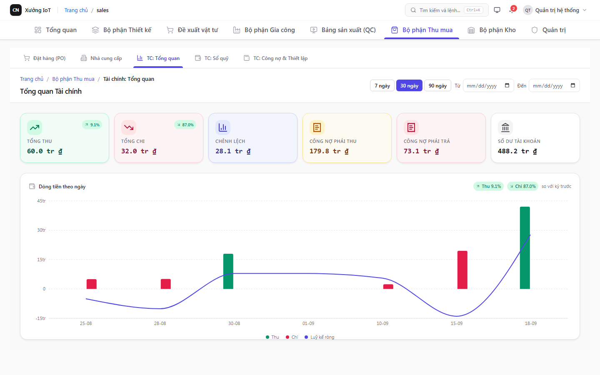

| Tab | Nội dung | Dùng để làm gì |
|---|---|---|
| **Đặt hàng (PO)** | Đơn đặt hàng với nhà cung cấp | Nghiệp vụ mua hàng (không phải tài chính) |
| **Nhà cung cấp** | Danh sách nhà cung cấp | Nghiệp vụ mua hàng (không phải tài chính) |
| **TC: Tổng quan** | Bảng số + biểu đồ dòng tiền | Xem tình hình tài chính tổng thể |
| **TC: Sổ quỹ** | 3 mục con: **Thu chi / Hoá đơn / Thanh toán** | Việc ghi sổ hằng ngày — dùng nhiều nhất |
| **TC: Công nợ & Thiết lập** | 3 mục con: **Công nợ / Tài khoản / Danh mục** | Theo dõi công nợ + cấu hình ban đầu |

Trong tab **"TC: Sổ quỹ"** và **"TC: Công nợ & Thiết lập"**, có thêm một hàng tab nhỏ thứ hai bên dưới để chọn mục con. Ví dụ ảnh trên đang ở "TC: Sổ quỹ" → mục con "Thu chi".

### 1.3 Ai thấy được gì

Hệ thống tự ẩn/hiện tab theo vai trò của từng người, bạn không cần tự chọn:

| Vai trò | Thấy tab nào |
|---|---|
| **Kế toán** | Chỉ 3 tab Tài chính (Tổng quan / Sổ quỹ / Công nợ & Thiết lập) |
| **Cổ đông** | Chỉ 3 tab Tài chính — nhưng **chỉ xem, không sửa/xoá/tạo được gì** |
| **Nhân viên Thu mua** | Chỉ 2 tab Đặt hàng + Nhà cung cấp — không thấy tab Tài chính |
| **Admin (quản trị hệ thống)** | Thấy tất cả 5 tab, làm được mọi thao tác |

Nếu bạn đăng nhập mà không thấy đủ tab như mô tả, đó là do phân quyền — liên hệ admin để kiểm tra lại vai trò tài khoản.

---

## Phần 2 — Thiết lập ban đầu (làm 1 lần)

Hai việc này chỉ cần làm **1 lần khi mới dùng hệ thống**, sau đó gần như không đụng tới nữa. Nằm trong tab **"TC: Công nợ & Thiết lập"**.

### 2.1 Tạo tài khoản giao dịch (tiền mặt / ngân hàng)

Vào mục con **"Tài khoản"**. Đây là nơi khai báo các "ví tiền" của xưởng — mỗi tài khoản ngân hàng, hoặc quỹ tiền mặt, là một thẻ riêng, có số dư hiện tại luôn được hệ thống tự cập nhật theo từng khoản thu/chi.

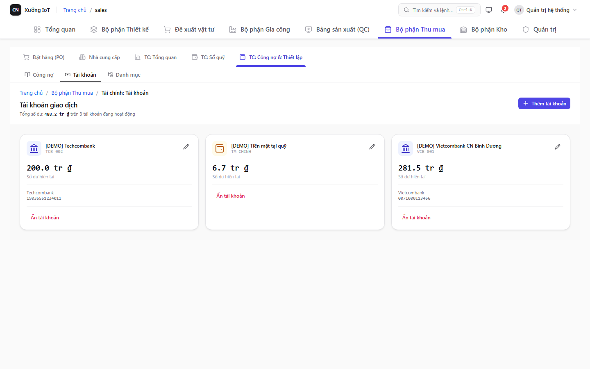

Các bước tạo mới:

1. Bấm nút **"Thêm tài khoản"** ở góc trên bên phải.
2. Điền **Mã tài khoản** (ví dụ `TK-VCB`), **Tên tài khoản** (ví dụ "Vietcombank chính").
3. Chọn **Loại tài khoản**: Ngân hàng hoặc Tiền mặt.
4. Nếu là ngân hàng, điền thêm Tên ngân hàng + Số tài khoản (không bắt buộc).
5. Điền **Số dư ban đầu** — đây là số tiền đang có trong tài khoản đó tại thời điểm bắt đầu dùng hệ thống.
6. Bấm **Lưu**.

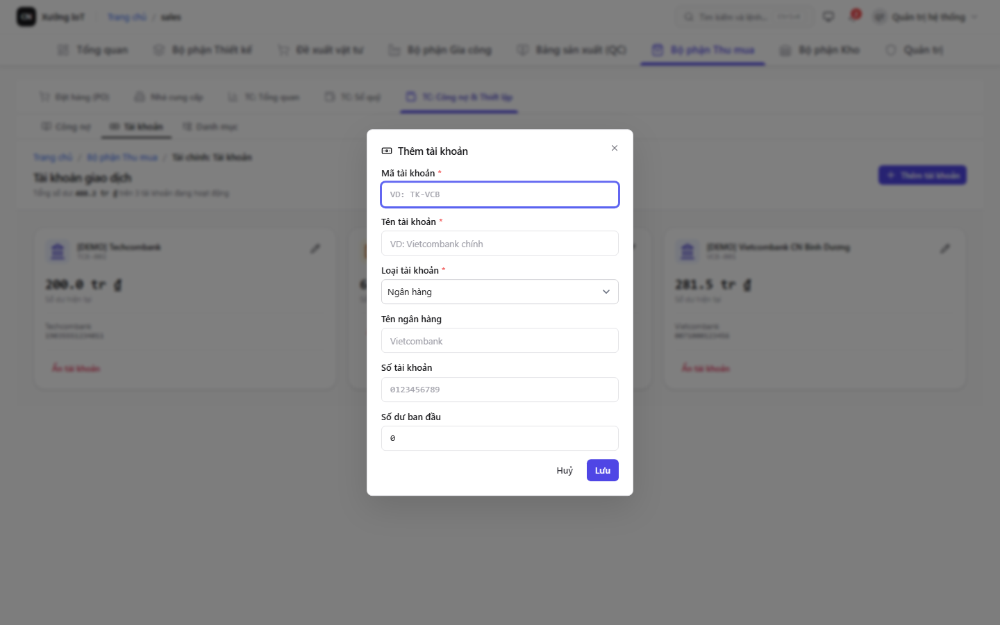

> Lưu ý: Số dư ban đầu chỉ nhập được lúc **tạo mới**. Sau khi tạo, số dư sẽ tự tăng/giảm theo các khoản thu chi bạn ghi sổ — không sửa tay được.

Muốn sửa tên/thông tin ngân hàng: bấm biểu tượng bút chì trên thẻ tài khoản. Muốn ẩn một tài khoản không dùng nữa: bấm **"Ẩn tài khoản"** ở cuối thẻ (không xoá hẳn).

### 2.2 Xem / thêm danh mục thu chi

Vào mục con **"Danh mục"**. Danh mục dùng để phân loại khoản thu/chi khi ghi sổ, giúp lọc và xem báo cáo theo từng loại.

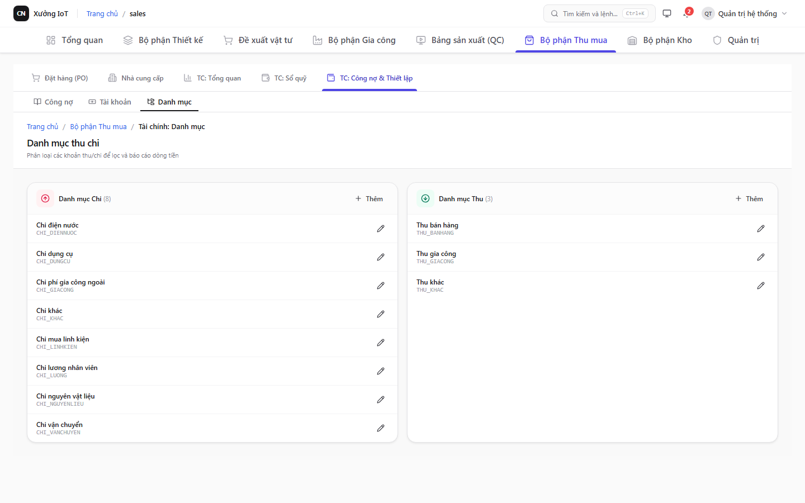

Hệ thống đã có sẵn **11 danh mục mặc định**, chia 2 cột:

**Danh mục Chi** (8 mục): Chi nguyên vật liệu, Chi linh kiện, Chi gia công ngoài, Chi lương nhân viên, Chi điện nước, Chi vận chuyển, Chi dụng cụ, Chi khác.

**Danh mục Thu** (3 mục): Thu bán hàng, Thu gia công, Thu khác.

Đa số trường hợp bạn **không cần tạo thêm** — 11 mục này đã đủ dùng cho xưởng cơ khí. Nếu cần thêm mục riêng, bấm nút **"+"** ở đầu cột tương ứng (Thu hoặc Chi), điền tên rồi lưu.

---

## Phần 3 — Việc hằng ngày

Đây là phần bạn dùng **thường xuyên nhất**, nằm trong tab **"TC: Sổ quỹ"**.

### 3.1 Ghi khoản chi KHÔNG có hoá đơn (nhanh nhất)

Dùng cho: tiền lương, tiền điện nước, tiếp khách, mua vặt văn phòng phẩm... — những khoản không có hoá đơn giấy đi kèm, chỉ cần ghi lại là đã chi bao nhiêu, cho việc gì.

1. Vào mục con **"Thu chi"**.
2. Bấm nút **"Phiếu chi"** (nếu là khoản thu thì bấm **"Phiếu thu"**) ở góc trên bên phải.

   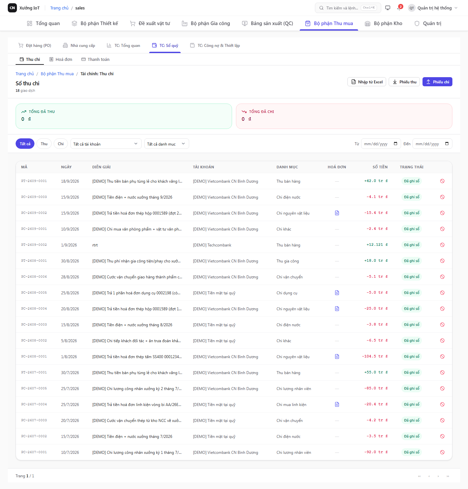

3. Điền vào form hiện ra: chọn **Tài khoản** tiền ra, chọn **Danh mục** (ví dụ "Chi điện nước"), nhập **Số tiền**, **Ngày giao dịch**, và **Diễn giải** (ví dụ "Tiền điện xưởng tháng 9").
4. Bấm **"Tạo giao dịch"**. Xong — chỉ 1 bước, không cần qua bước hoá đơn.

   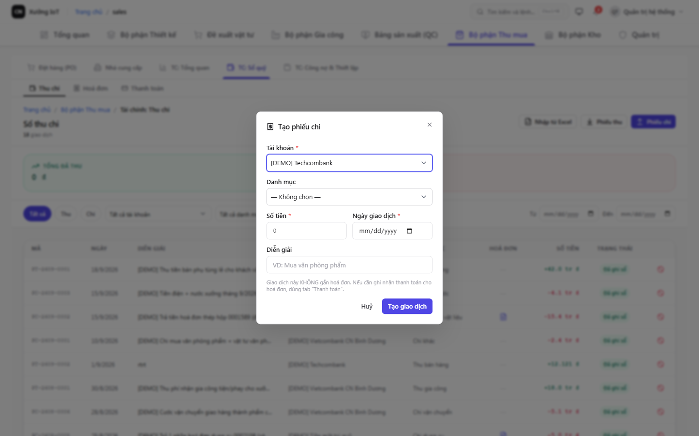

> Khoản này sẽ **không** xuất hiện ở mục "Hoá đơn" hay "Công nợ" — vì bản chất nó không phải là một khoản nợ, tiền đã chi/thu ngay tại chỗ.

### 3.2 Ghi khoản chi CÓ hoá đơn (mua nguyên liệu, linh kiện...)

Dùng cho các khoản có phát sinh công nợ — ví dụ mua nguyên vật liệu từ nhà cung cấp, có hoá đơn, có hạn thanh toán, có thể trả sau hoặc trả dần.

Quy trình gồm 3 bước: **Tạo hoá đơn → theo dõi nợ → thanh toán**.

**Bước 1 — Tạo hoá đơn:**

1. Vào mục con **"Hoá đơn"**.
2. Bấm **"HĐ đầu vào"** (hàng mua — từ nhà cung cấp) hoặc **"HĐ đầu ra"** (hàng bán — cho khách hàng).

   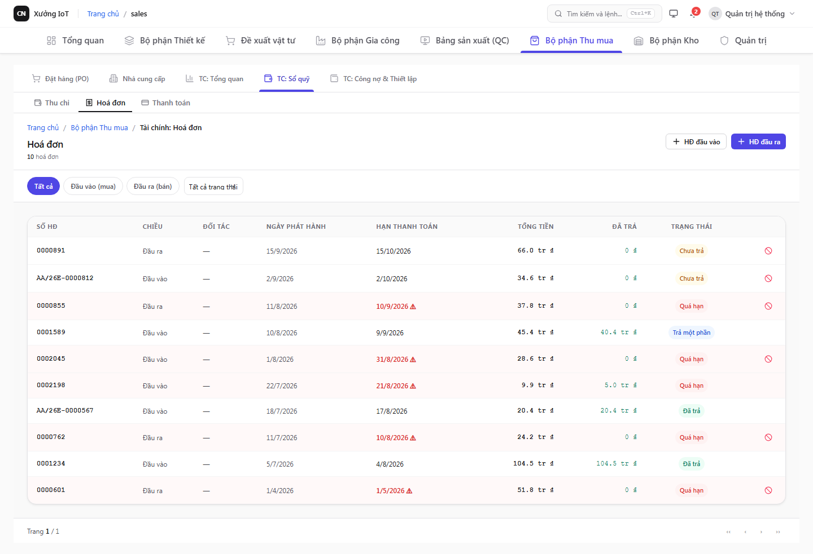

3. Điền **Số hoá đơn**, chọn **Nhà cung cấp/Khách hàng**, **Ngày phát hành**, **Hạn thanh toán**, **Tiền hàng** và **VAT (%)** — hệ thống tự tính tiền VAT và tổng cộng.
4. Bấm **"Tạo hoá đơn"**.

   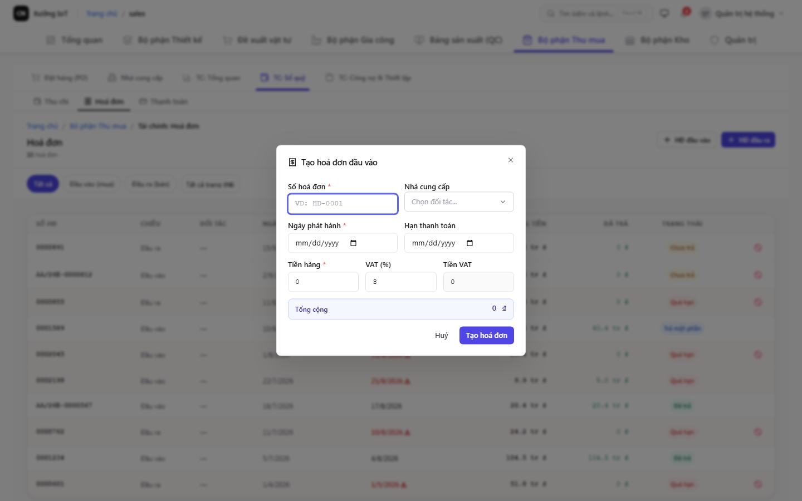

Sau khi tạo, hoá đơn ở trạng thái **"Chưa trả"**. Bạn sẽ thấy nó xuất hiện trong bảng, và cũng tính vào mục Công nợ (xem Phần 4).

**Bước 2 — Theo dõi nợ:** hoá đơn tự chuyển trạng thái theo tiến độ trả tiền — xem cột **Trạng thái** trong bảng: Chưa trả (vàng) → Trả một phần (xanh dương) → Đã trả (xanh lá). Nếu quá hạn mà chưa trả xong, tự chuyển thành **Quá hạn** (đỏ, có dấu ⚠).

**Bước 3 — Thanh toán:** xem mục 3.3 bên dưới.

### 3.3 Thanh toán cho hoá đơn

Vào mục con **"Thanh toán"**, bấm **"Ghi nhận thanh toán"**.

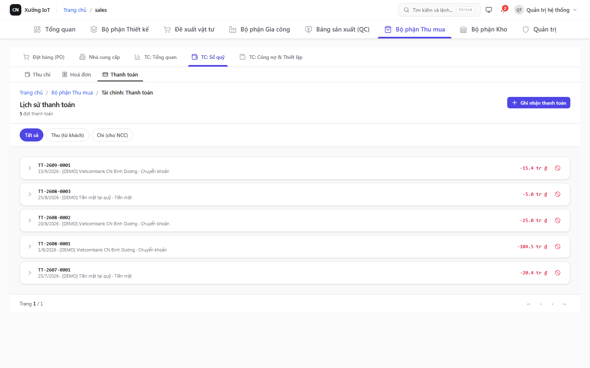

Form ghi nhận thanh toán xử lý được **cả 2 tình huống khác nhau** — đây là điểm nhiều người hay nhầm nên đọc kỹ:

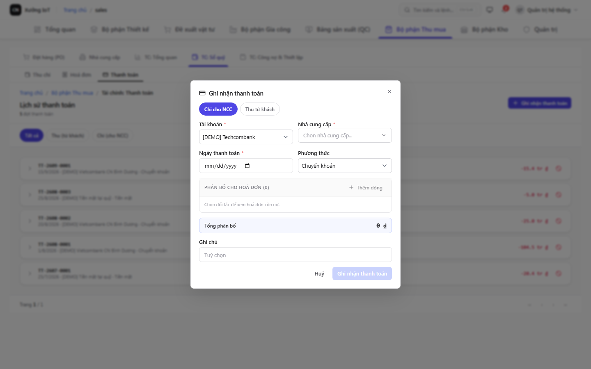

**Tình huống A — Trả nhiều đợt cho 1 hoá đơn** (ví dụ hoá đơn 45 triệu, đợt 1 trả 20 triệu, đợt 2 trả 25 triệu):
1. Chọn chiều "Chi cho NCC" (hoặc "Thu từ khách"), chọn **Tài khoản** trả tiền, chọn **Nhà cung cấp/Khách hàng**.
2. Bấm **"Thêm dòng"** trong mục "Phân bổ cho hoá đơn" — chỉ thêm **1 dòng**, chọn đúng hoá đơn đó, nhập số tiền đợt này (ví dụ 20 triệu — không cần nhập đủ 45 triệu).
3. Bấm **"Ghi nhận thanh toán"**. Hoá đơn chuyển sang "Trả một phần", còn nợ 25 triệu.
4. Lần sau lặp lại thao tác này với số tiền đợt 2 — hệ thống tự cộng dồn, khi đủ 45 triệu thì hoá đơn tự chuyển "Đã trả".

**Tình huống B — 1 lần trả gộp nhiều hoá đơn** (ví dụ trả 1 lần cho nhà cung cấp gồm 3 hoá đơn khác nhau):
1. Chọn cùng 1 nhà cung cấp, cùng 1 tài khoản trả tiền.
2. Bấm **"Thêm dòng"** nhiều lần — mỗi dòng chọn 1 hoá đơn khác nhau, nhập đúng số tiền phân bổ cho hoá đơn đó.
3. Hệ thống tự cộng "Tổng phân bổ" — số này phải **khớp đúng** với tổng số tiền bạn thực trả (chuyển khoản/tiền mặt), hệ thống sẽ cảnh báo nếu không khớp.
4. Bấm **"Ghi nhận thanh toán"** — cả 3 hoá đơn đều được cập nhật số đã trả cùng lúc.

Sau khi ghi, bấm vào 1 dòng thanh toán trong danh sách để mở rộng xem **đã phân bổ cho hoá đơn nào, bao nhiêu tiền**.

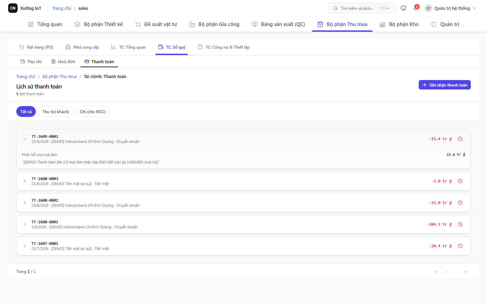

### 3.4 Xem chi tiết 1 khoản thu chi / hoá đơn

Bấm (click) vào bất kỳ dòng nào trong bảng — cả bảng "Thu chi" và "Hoá đơn" — một khung chi tiết (drawer) sẽ trượt ra từ bên phải màn hình.

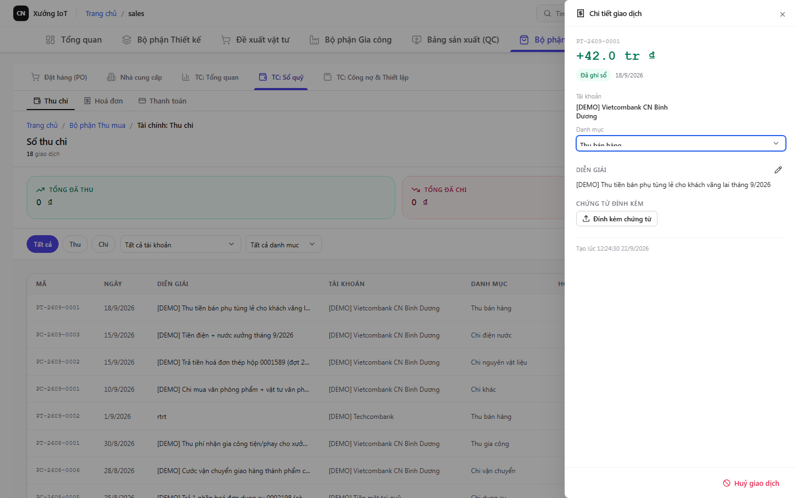

Trong khung chi tiết này bạn có thể:
- Xem đầy đủ thông tin: số tiền, ngày, tài khoản, danh mục, đối tác liên quan.
- **Đính kèm ảnh/PDF hoá đơn**: bấm nút "Đính kèm chứng từ" để tải ảnh chụp hoá đơn giấy hoặc file PDF lên, lưu lại làm bằng chứng.
- **Sửa danh mục**: chọn lại trong ô "Danh mục" ngay tại chỗ.
- **Sửa diễn giải**: bấm biểu tượng bút chì cạnh "Diễn giải" để đổi nội dung mô tả.
- **Huỷ chứng từ**: bấm nút đỏ **"Huỷ giao dịch"** (hoặc "Huỷ hoá đơn") ở cuối khung — xem thêm lưu ý ở Phần 6 vì sao không có nút Xoá.

Riêng hoá đơn, khi bấm vào dòng cũng mở khung chi tiết tương tự, có thêm thông tin số đã trả/còn nợ:

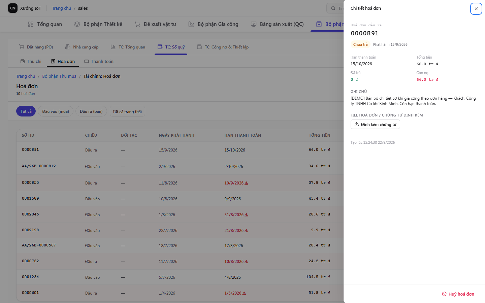

### 3.5 Nhập hàng loạt từ Excel

Nếu có nhiều khoản thu chi cần ghi cùng lúc (ví dụ nhập lại dữ liệu tháng trước), dùng chức năng nhập Excel thay vì gõ tay từng dòng.

1. Vào mục con **"Thu chi"**, bấm nút **"Nhập từ Excel"**.
2. Bấm **"Tải mẫu"** để lấy file Excel mẫu đúng định dạng cột.
3. Điền dữ liệu vào file mẫu (ngày, số tiền, tài khoản, danh mục, diễn giải...).
4. Kéo thả file đã điền vào khung upload, hệ thống hiện **bảng xem trước** để bạn kiểm tra lại trước khi ghi thật.
5. Kiểm tra xong, bấm **xác nhận** để ghi vào hệ thống.

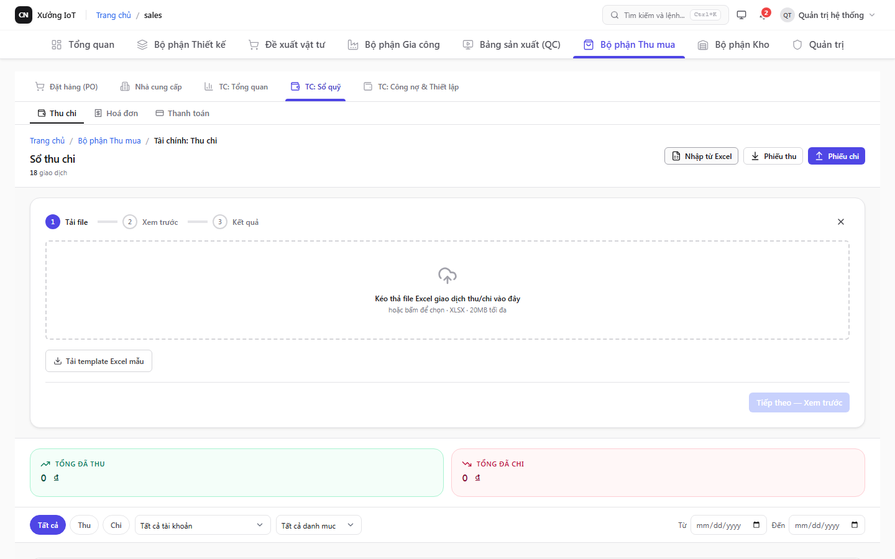

> Hệ thống **tự động bỏ qua các dòng bị trùng** (đã tồn tại từ trước) khi nhập lại — không lo bị ghi đôi nếu chạy import 2 lần cùng 1 file.

---

## Phần 4 — Theo dõi & báo cáo

### 4.1 Tổng quan tài chính

Vào tab **"TC: Tổng quan"**. Đây là màn hình tổng hợp nhanh tình hình tài chính:

- 6 ô số ở trên: **Tổng thu, Tổng chi, Chênh lệch, Công nợ phải thu, Công nợ phải trả, Số dư tài khoản** — trong khoảng thời gian bạn chọn (7/30/90 ngày, hoặc tự chọn khoảng ngày).
- Phần trăm bên cạnh Tổng thu/Tổng chi (ví dụ "↗ 9.1%") là **so sánh tăng trưởng** với kỳ trước liền kề — giúp biết tháng này thu/chi tăng hay giảm so với tháng trước.
- Biểu đồ **"Dòng tiền theo ngày"**: cột xanh là ngày có thu, cột đỏ là ngày có chi, đường màu tím là số **luỹ kế ròng** (thu trừ chi cộng dồn) — nhìn đường này biết xu hướng tiền đang tăng hay giảm dần theo thời gian.

### 4.2 Công nợ phải trả và phải thu

Vào tab **"TC: Công nợ & Thiết lập"** → mục con **"Công nợ"**.

Có 2 chiều công nợ, chuyển đổi bằng nút bấm ở góc trên bên phải:

- **Phải trả**: hoá đơn mua hàng (đầu vào) mình chưa trả hết cho nhà cung cấp — tức là **mình đang nợ ai**.
- **Phải thu**: hoá đơn bán hàng (đầu ra) khách chưa trả hết — tức là **ai đang nợ mình**.

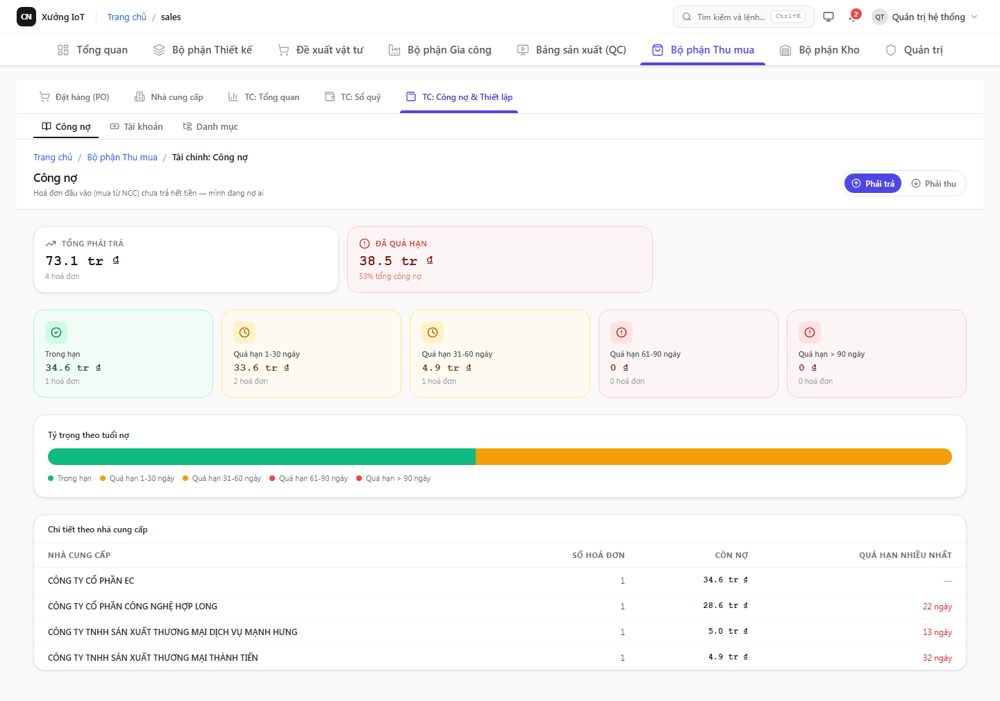

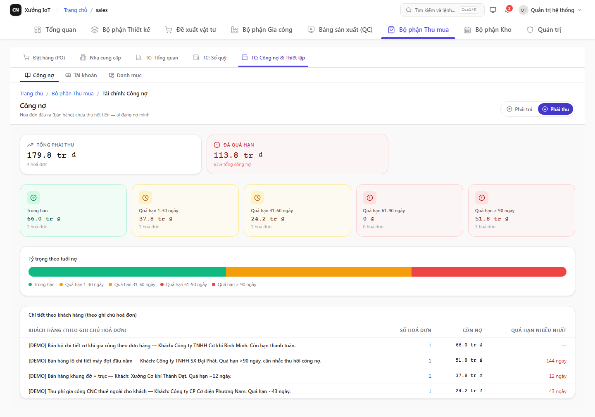

**Cách đọc bảng tuổi nợ** (5 ô màu ở giữa màn hình):
- **Trong hạn** (xanh lá): chưa tới ngày phải trả/thu, chưa cần lo.
- **Quá hạn 1-30 ngày** (vàng): mới quá hạn, cần nhắc sớm.
- **Quá hạn 31-60 ngày, 61-90 ngày** (cam): cần ưu tiên xử lý.
- **Quá hạn > 90 ngày** (đỏ): nợ xấu, cần xử lý gấp.

Thanh màu ngang "Tỷ trọng theo tuổi nợ" cho thấy trực quan tỷ lệ nợ đang nằm ở nhóm nào.

Bảng phía dưới liệt kê **từng nhà cung cấp/khách hàng**, số hoá đơn, tổng còn nợ, và số ngày quá hạn nhiều nhất. Với **công nợ phải trả**, bấm vào tên nhà cung cấp để xem chi tiết các hoá đơn chưa trả của họ.

> Công nợ **phải thu** hiện **chưa bấm vào xem chi tiết được** — xem lý do ở Phần 6 (giới hạn hiện tại).

---

## Phần 5 — Thông báo tự động

Hệ thống tự động kiểm tra và gửi nhắc nhở **mỗi sáng lúc 7 giờ**, hiện dưới dạng chuông thông báo (biểu tượng 🔔 góc trên bên phải màn hình), gồm 3 loại:

| Loại nhắc | Khi nào gửi | Kênh |
|---|---|---|
| **Hoá đơn sắp đến hạn** | Còn ≤ 3 ngày nữa là tới hạn thanh toán | Thông báo trong hệ thống |
| **Hoá đơn quá hạn** | Đã qua hạn thanh toán mà chưa trả hết | Thông báo trong hệ thống **+ Email** |
| **Công nợ phải thu quá hạn** | Khách hàng quá hạn mà chưa trả | Thông báo trong hệ thống **+ Email** |

Riêng 2 loại **quá hạn** sẽ gửi thêm email để chắc chắn không bị bỏ sót — 2 loại còn lại (sắp đến hạn) chỉ hiện trong hệ thống.

---

## Phần 6 — Câu hỏi thường gặp / Lưu ý

**Tiền hiển thị dạng gì? Có tính VAT không?**
Số tiền hiển thị theo định dạng Việt Nam, đơn vị đồng (₫), các số lớn được rút gọn dạng "tr đ" (triệu đồng) cho dễ đọc trong bảng. Khi tạo hoá đơn, bạn nhập "Tiền hàng" (chưa VAT) và tỷ lệ VAT (%) — hệ thống **tự tính tiền VAT và tổng cộng**, bạn không phải tính tay.

**Vì sao kế toán không xoá được chứng từ, phải bấm "Huỷ"?**
Đây là chủ đích thiết kế, không phải lỗi. Trong kế toán, mọi chứng từ đã ghi sổ đều cần giữ lại dấu vết để phục vụ **kiểm toán, đối chiếu sau này** — xoá hẳn sẽ làm mất dấu vết đó. Vì vậy hệ thống chỉ cho **"Huỷ" (đổi trạng thái sang VOID)**: chứng từ vẫn còn trong hệ thống, đánh dấu rõ là đã huỷ, không còn tính vào số liệu, nhưng vẫn tra cứu lại được nếu cần.

**Cổ đông có sửa được gì không?**
Không. Tài khoản vai trò Cổ đông chỉ có quyền **xem** — không tạo, không sửa, không huỷ được bất kỳ khoản thu chi/hoá đơn/thanh toán nào. Mục đích để cổ đông theo dõi tình hình tài chính minh bạch mà không ảnh hưởng tới sổ sách.

**Vì sao công nợ phải thu không bấm vào xem chi tiết khách hàng được như công nợ phải trả?**
Đây là giới hạn hiện tại của hệ thống: đã có **danh mục Nhà cung cấp** riêng (quản lý đầy đủ thông tin), nhưng **chưa có danh mục Khách hàng riêng**. Vì vậy công nợ phải thu chỉ nhóm theo **đúng tên đã ghi trong ô "Đối tác" của hoá đơn** — nếu ghi tên không thống nhất giữa các hoá đơn (ví dụ lúc ghi "Công ty ABC", lúc ghi "Cty ABC"), hệ thống sẽ coi là 2 khách khác nhau. Để tránh nhầm lẫn, khi tạo hoá đơn đầu ra, hãy **ghi tên khách hàng thống nhất** mỗi lần.
