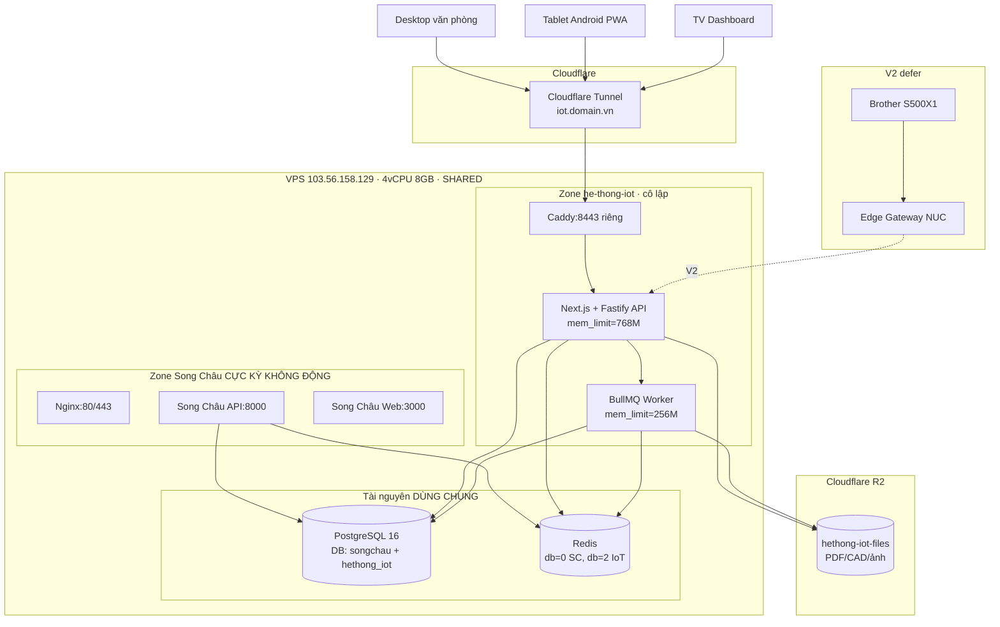
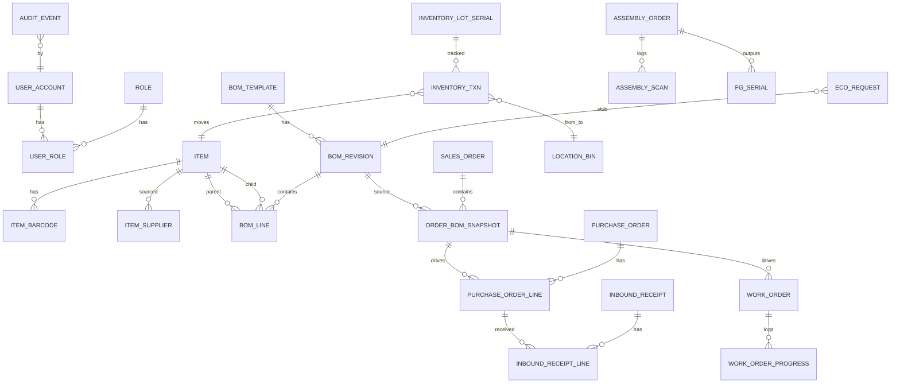

# V1 Implementation Plan — Hệ thống xưởng IoT

*Phiên bản:* 1.0 · *Ngày:* 2026-04-16 · *Persona:* Technical Planner · *YAGNI/KISS/DRY*
*Nguồn tổng hợp:* `docs/context-part-1.md`, `docs/context-part-2.md`, `plans/analysis/brainstorm.md`, `plans/analysis/research-v1-feature-fit.md`

---

## 1. Overview & Goals

### 1.1 Mục tiêu V1

Thay thế Excel/OneDrive cho 1 xưởng cơ khí Việt Nam (~12 máy CNC, ~10.000 mã vật tư, 20-50 user) bằng một web app **BOM-centric**, triển khai trên VPS dùng chung với Song Châu ERP, bằng đội **2 full-stack + 0.5 BA trong 10 tuần**. Hệ phải cho phép vận hành end-to-end: nhận đơn → snapshot BOM → mua hàng/WO → nhận kho → pick+scan lắp ráp → giao hàng → audit.

### 1.2 Success criteria (go/no-go cuối tuần 10)

| Chỉ số | Ngưỡng đạt |
|---|---|
| 1 đơn hàng pilot chạy end-to-end | Từ snapshot đến assembly completion, không dùng Excel phụ trợ |
| Item master nạp thật | ≥ 3.000 SKU active (sau cleansing Phase 0) |
| BOM snapshot tạo được cho sản phẩm thật | ≥ 5 sản phẩm đại diện, multi-level |
| Scan barcode/PWA offline | Tablet Android rẻ quét 50 lần không mất 1 event |
| P95 đọc BOM snapshot | < 1.000 ms trên VPS share |
| RAM steady-state (app+worker+db) | ≤ 2.5 GB trên VPS (còn headroom cho Song Châu) |
| Audit log đầy đủ | Mọi thay đổi item/BOM/inventory txn có actor + before/after |
| UAT pass rate | ≥ 90% test case business-critical |

### 1.3 Non-goals của V1 (ghi rõ để tránh scope creep)

- Không MRP engine đầy đủ (chỉ shortage calc đơn giản).
- Không costing/valuation (Moving Average, Standard Cost, variance).
- Không shipping/packing workflow chi tiết.
- Không QC plan đầy đủ (chỉ pass/fail flag trên receipt).
- Không ECO workflow đầy đủ (chỉ stub bảng `eco_request`).
- Không CNC telemetry, không Brother adapter (V2).
- Không multi-site, không multi-company.
- Không MFA cho mọi role (chỉ admin — V1.1 mới mở rộng).
- Không monitoring stack Prometheus/Grafana/Loki.

---

## 2. Final Scope Decision

### 2.1 IN scope V1 (10 feature modules)

| # | Feature | Lý do |
|---|---|---|
| 1 | **Auth + RBAC app-layer** (4 role cơ bản) | Không hệ thống nào chạy được mà thiếu login |
| 2 | **Item master + barcode** | Nền tảng dữ liệu, phải import Excel từ tuần 3 |
| 3 | **BOM Template + Revision + lock-on-release** | Giá trị cốt lõi — pain point lớn nhất hiện tại |
| 4 | **Sales Order + BOM Snapshot bất biến** | Core value, snapshot là bài học không có workaround |
| 5 | **Shortage report** (explode × qty − on-hand) | Tạo value ngay cho planning, không cần MRP đầy đủ |
| 6 | **Purchase Order + Receipt (pass/fail flag)** | Đóng vòng mua hàng |
| 7 | **Inventory txn + lot/serial + reservation** | Transaction-first, FIFO cơ bản, no-negative-stock |
| 8 | **Work Order manual progress** | Chỉ status + % completed, chưa routing operations chi tiết |
| 9 | **PWA pick + assembly scan (offline queue)** | Giá trị cao nhất cho xưởng, khác biệt lớn nhất với Excel |
| 10 | **Audit log + Dashboard readiness** | Minh bạch + 1 trang tổng xem đơn hàng |

### 2.2 OUT scope V1 (defer V1.5 hoặc V2)

| # | Feature | Lý do defer |
|---|---|---|
| 1 | MRP engine đầy đủ (time-phased, pegging) | Cần 2 quý dữ liệu thật; YAGNI |
| 2 | Costing rollup (MA + standard + variance) | Cần accounting SME + test kế toán → 4-6 tuần riêng |
| 3 | QC plan/nonconformance/CAPA đầy đủ | V1 chỉ flag pass/fail — đủ cho 80% use case |
| 4 | Shipping/packing workflow chi tiết | Xưởng giao B2B đơn giản, chưa cần packing station |
| 5 | ECO workflow đầy đủ (approval chain) | Chỉ tạo bảng `eco_request` stub để DB sau không vỡ schema |
| 6 | CNC telemetry / Brother adapter | Đã có `Lathejockey81/BrotherAdapter` open-source — fork sau khi core ổn |
| 7 | Substitute parts + phantom BOM | Advanced; chưa đủ bằng chứng xưởng cần ngay |
| 8 | Supplier scorecard + ETA learning ML | Cần lịch sử PO ≥ 6 tháng mới có ý nghĩa |
| 9 | Multi-warehouse (chỉ 1 WH V1) | Xưởng 1 site, 1 kho chính + 1 WIP zone là đủ |
| 10 | Monitoring stack (Prometheus/Grafana/Loki) | Gold-plating; log file + UptimeRobot free là đủ V1 |

---

## 3. Tech Stack Finalized

| Lớp | Công nghệ | Lý do chọn |
|---|---|---|
| Backend runtime | **Node.js 20 LTS + TypeScript** | Team 2 full-stack thường quen JS/TS; share type với frontend |
| Backend framework | **Fastify 4** (hoặc NestJS nếu team quen) | Nhẹ hơn Express, plugin system sạch, tốc độ |
| ORM | **Drizzle ORM** | Type-safe, SQL-close, migration tốt, nhẹ hơn Prisma về RAM |
| Database | **PostgreSQL 16** (chung instance với Song Châu, DB riêng `hethong_iot`) | Recursive CTE cho BOM explode; jsonb; RLS cho 2 bảng nhạy cảm |
| Migration | **drizzle-kit** | Đi cùng Drizzle |
| Queue/cache | **BullMQ + Redis** (chung Redis Song Châu, DB index riêng `db=2`) | Background Sync scan, import Excel, retry PO |
| Frontend | **Next.js 14 App Router + React 18 + TypeScript** | PWA native, SSR cho dashboard, team quen |
| UI kit | **shadcn/ui + TailwindCSS** | Không license, custom dễ, nhẹ |
| PWA | **next-pwa** (Workbox under-the-hood) | Service worker + Background Sync + offline cache |
| Barcode scan | **html5-qrcode** (wrap trong `BarcodeScanner` abstraction) | Free, đủ cho tem mới; hot-swap sang STRICH/BarcodeDetector sau |
| Offline storage | **IndexedDB via Dexie.js** | Wrapper quen thuộc, query dễ |
| State mgmt | **TanStack Query v5 + Zustand** | Query cache + light global state |
| File storage | **Cloudflare R2** (S3-compatible, 10GB free) | Không chạy MinIO trên VPS để tránh OOM |
| Reverse proxy | **Caddy 2 container riêng, port 8443** + Cloudflare Tunnel (khuyến nghị) HOẶC thêm vhost file include vào Nginx Song Châu | Không động file Nginx Song Châu |
| Deploy | **Docker Compose v2** | Single-host, community standard 2025 |
| Monitoring V1 | **pino JSON logs + logrotate + UptimeRobot free + pg_stat_statements** | Đủ cho 1 xưởng, ~0 MB RAM overhead |
| Testing | **Vitest (unit) + Playwright (E2E critical paths) + Supertest (API)** | Team TS quen, nhanh |
| CI | **GitHub Actions** (nếu dùng GitHub) | Build + test + lint + migration check |

**Ngôn ngữ UI:** Tiếng Việt 100%. Date format `dd/MM/yyyy`. Số thập phân dấu `,`.

---

## 4. Architecture Diagram



**Nguyên tắc cô lập:**
- Caddy của IoT bind cổng **8443 nội bộ** (không 80/443), tiếp nhận traffic từ Cloudflare Tunnel.
- Không sửa bất kỳ file Nginx nào của Song Châu.
- Container IoT có `mem_limit` cứng: `app=768M`, `worker=256M`, tổng ≤ 1.5GB RSS ổn định.
- PostgreSQL instance **dùng chung** — tuning `shared_buffers=1536MB`, `max_connections=50` (đủ cho cả 2).

---

## 5. Data Model V1

### 5.1 Schema simplification

Từ 11 schema trong `context-part-2.md` → **1 schema `app` duy nhất** với prefix bảng (theo khuyến nghị brainstorm Phương án B). Lý do:

- 20-50 user × 1 xưởng không cần 11 namespace.
- Giảm overhead GRANT/USAGE, giảm lỗi cross-schema JOIN.
- Dễ migration, dễ onboard dev mới.
- Vẫn có thể split schema sau này bằng `ALTER TABLE SET SCHEMA` nếu thực sự cần.

### 5.2 Bảng V1 (17 bảng core + 2 bảng stub)



### 5.3 Danh sách bảng V1

| # | Bảng | Mục đích | Ghi chú vs context-part-2 |
|---|---|---|---|
| 1 | `user_account` | User | + `mfa_enabled` flag (chỉ bật cho admin V1) |
| 2 | `role` | Role cứng V1: admin, planner, warehouse, operator | Giảm từ 11 → 4 |
| 3 | `user_role` | N:M user-role | — |
| 4 | `item` | Master vật tư | Giữ nguyên cốt lõi |
| 5 | `item_barcode` | Map item ↔ barcode value | — |
| 6 | `item_supplier` | Lead time, giá tham khảo | Bỏ `lead_time_days_p90` (chưa có data) |
| 7 | `location_bin` | Kho + bin (1 warehouse V1) | Bỏ bảng `warehouse` riêng |
| 8 | `bom_template` | Template | — |
| 9 | `bom_revision` | Version BOM, lock-on-release | — |
| 10 | `bom_line` | Component line | Bỏ `substitute_group_code`, `is_phantom` V1 |
| 11 | `sales_order` | Đơn hàng | — |
| 12 | `order_bom_snapshot` | **Bất biến per order** | Core value |
| 13 | `purchase_order` + `purchase_order_line` | PR bỏ V1, gộp vào PO | Đơn giản hóa |
| 14 | `inbound_receipt` + `inbound_receipt_line` | Nhận hàng + `qc_flag` PASS/FAIL | Bỏ `qc_plan`, `qc_nonconformance` |
| 15 | `work_order` + `work_order_progress` | WO manual, % completed | Bỏ `work_order_operation`, `routing` V1 |
| 16 | `inventory_txn` | **Transaction-first**, không partition V1 | Bỏ partition (YAGNI < 5M rows) |
| 17 | `inventory_lot_serial` + `stock_balance_view` (materialized) | Lot/serial + tồn hiện tại | balance là view, không lưu bảng |
| 18 | `assembly_order` + `assembly_scan` + `fg_serial` | Pick + scan + FG | Bỏ `pick_task` riêng — gộp vào scan log |
| 19 | `audit_event` | Who/what/when/before/after | Lưu jsonb |
| 20 | `eco_request` **(STUB)** | Bảng rỗng có DDL, chưa có UI | Giữ để sau schema không vỡ |

### 5.4 Bỏ khỏi V1 (so với context-part-2)

- `qc_plan`, `qc_inspection`, `qc_result`, `qc_nonconformance`
- `purchase_request` (gộp vào PO)
- `work_order_operation`, `routing`, `routing_operation`
- `item_standard_cost`, `purchase_cost`, `order_cost_rollup` (toàn bộ schema `costing`)
- `shipment`, `shipment_line` (toàn bộ schema `shipping`)
- `stock_reservation` riêng (gộp thành cột `reserved_qty` trong `order_bom_snapshot`)
- `stock_count`, `stock_transfer` (làm bằng `inventory_txn` với `tx_type` đủ dùng)
- `security_event`, `integration_event` (gộp vào `audit_event`)
- Partitioning toàn bộ bảng lớn

---

## 6. API Surface (enumerate, không full OpenAPI)

### Auth & User
- `POST /api/auth/login`
- `POST /api/auth/logout`
- `POST /api/auth/refresh`
- `GET /api/me`
- `GET /api/admin/users` + `POST /api/admin/users` + `PATCH /api/admin/users/:id`
- `GET /api/admin/roles` + `POST /api/admin/users/:id/roles`

### Master data
- `GET /api/items` (paginated, filter) + `POST /api/items` + `PATCH /api/items/:id`
- `POST /api/items/import` (multipart Excel, async job)
- `GET /api/items/:id/barcodes` + `POST /api/items/:id/barcodes`
- `GET /api/suppliers` + `POST /api/suppliers`
- `GET /api/locations`
- `GET /api/item-suppliers/:itemId`

### Engineering
- `GET /api/bom-templates` + `POST /api/bom-templates`
- `GET /api/bom-revisions/:id` (trả về cây BOM đã explode)
- `POST /api/bom-templates/:id/revisions` (clone from previous)
- `POST /api/bom-revisions/:id/release` (lock, không sửa được)
- `GET /api/bom-revisions/:id/explode?qty=N` (recursive CTE trả flat list)

### Sales & Snapshot
- `GET /api/orders` + `POST /api/orders` + `PATCH /api/orders/:id`
- `POST /api/orders/:id/snapshot` (tạo snapshot bất biến từ BOM revision)
- `GET /api/orders/:id/snapshot`
- `GET /api/orders/:id/shortage` (snapshot required − on-hand − reserved)
- `POST /api/orders/:id/close`

### Procurement
- `GET /api/purchase-orders` + `POST /api/purchase-orders`
- `POST /api/purchase-orders/:id/send` + `POST /api/purchase-orders/:id/cancel`
- `POST /api/receipts` (ghi nhận + tạo `inventory_txn` IN)
- `PATCH /api/receipts/:id/qc-flag` (PASS/FAIL)

### Inventory
- `GET /api/inventory/on-hand?item=xxx&location=yyy`
- `GET /api/inventory/txns?item=xxx` (paginated)
- `POST /api/inventory/adjust` (manual adjust, audit bắt buộc)
- `POST /api/inventory/transfer` (bin → bin)
- `POST /api/inventory/reserve` + `DELETE /api/inventory/reserve/:id`

### Production
- `GET /api/work-orders` + `POST /api/work-orders`
- `POST /api/work-orders/:id/release`
- `POST /api/work-orders/:id/progress` (body: `{good_qty, scrap_qty, note}`)
- `POST /api/work-orders/:id/complete`

### Assembly (PWA hot path)
- `GET /api/assembly-orders/:id/picklist` (cache-able, PWA prefetch)
- `POST /api/assembly/scans/batch` (body: array scan events với `offline_queue_id` để idempotent)
- `POST /api/assembly-orders/:id/complete` (tạo FG serial)

### Dashboard & Audit
- `GET /api/dashboard/orders-readiness`
- `GET /api/dashboard/shortages`
- `GET /api/dashboard/po-eta`
- `GET /api/dashboard/wo-progress`
- `GET /api/audit/events?object_type=xxx&object_id=yyy`

### System
- `GET /api/health` (public, liveness)
- `GET /api/ready` (readiness check DB+Redis+R2)

**Tổng:** ~45 endpoint. Vừa sức 2 dev × 10 tuần.

---

## 7. Module Breakdown

| # | Module | Mục tiêu | Bảng | API endpoint | UI screen | Effort (pd) |
|---|---|---|---|---|---|---|
| 1 | **Auth/RBAC** | Login JWT, 4 role, MFA admin | user_account, role, user_role | 6 | Login, Admin > Users | 5 |
| 2 | **Item Master** | CRUD + import Excel 10k rows + barcode | item, item_barcode, item_supplier | 8 | List, Edit, Import wizard | 10 |
| 3 | **BOM Template/Revision** | Editor cây, release-lock | bom_template, bom_revision, bom_line | 6 | Template list, Revision editor (tree), Diff viewer | 12 |
| 4 | **Order + Snapshot** | Tạo đơn, snapshot bất biến từ revision | sales_order, order_bom_snapshot | 6 | Order list, Order detail + snapshot board | 10 |
| 5 | **Shortage Report** | Explode × qty − on-hand | (view) | 2 | Shortage board (filter theo order/item) | 4 |
| 6 | **Purchase Order + Receipt** | PO, receipt, QC flag PASS/FAIL | purchase_order, purchase_order_line, inbound_receipt* | 7 | PO list, PO edit, Receiving console | 10 |
| 7 | **Inventory txn + lot/serial** | Transaction-first, on-hand view, reserve | inventory_txn, inventory_lot_serial | 8 | On-hand board, Txn history, Adjust form | 12 |
| 8 | **Work Order manual** | Release, % progress, complete | work_order, work_order_progress | 5 | WO board, Operator progress form | 7 |
| 9 | **PWA Pick + Scan** | Offline queue, abstraction scanner, idempotent | assembly_order, assembly_scan, fg_serial | 4 | Picklist screen, Scan station, Completion | 14 |
| 10 | **Audit + Dashboard** | Audit mọi write, 1 dashboard readiness | audit_event | 6 | Audit viewer, Dashboard tổng | 8 |

**Tổng effort:** ~92 person-days ≈ **46 ngày cho 2 dev** (tức ~9.2 tuần). **Buffer 0.8 tuần** cho DevOps setup + UAT. Khớp 10 tuần.

---

## 8. Work Breakdown Structure (10 tuần)

### Tuần 0 (Phase 0 — chạy **trước khi dev code**)
- **BA + user:** Cleansing Excel item master (de-dup, chuẩn UoM, chuẩn item_type). Output file `items_cleaned.xlsx` ≥ 3.000 dòng active.
- **BA:** Thu thập 5 BOM đại diện (1 đơn giản 2 cấp, 2 trung bình 3-4 cấp, 2 phức tạp 5+ cấp).
- **Acceptance:** ≥ 3.000 SKU đã cleansing, 5 BOM mẫu đã convert sang CSV chuẩn.

### Tuần 1 — Foundation + Infra
- Setup repo, TypeScript, lint, Husky.
- Docker Compose base, Caddy config, Cloudflare Tunnel.
- PostgreSQL schema `app` + Drizzle migration đầu tiên.
- Auth module + JWT + 4 role seed.
- **Acceptance:** Login chạy được qua tunnel, `GET /api/me` trả user. RAM steady ≤ 1.2GB.

### Tuần 2 — Item Master + Import
- CRUD item, barcode.
- Import Excel async job (BullMQ).
- Supplier + item_supplier.
- **Acceptance:** Import 3.000 SKU thành công, query P95 < 400ms.

### Tuần 3 — BOM Template + Revision
- Editor cây (shadcn Tree component).
- Release-lock (revision_status machine).
- Recursive CTE explode endpoint.
- **Acceptance:** Nhập 3/5 BOM mẫu, explode đúng qty ở mọi cấp.

### Tuần 4 — Order + Snapshot
- Sales order CRUD.
- Snapshot job: copy bom_line → order_bom_snapshot, flatten với `line_path`.
- **Acceptance:** Tạo 1 đơn thật, snapshot khóa, thử sửa BOM revision → snapshot không đổi.

### Tuần 5 — Shortage + Inventory Txn
- Shortage view (required − on-hand − reserved).
- Inventory txn: receive, issue, transfer, adjust, reserve.
- Lot/serial.
- **Acceptance:** Từ snapshot đơn pilot, shortage report đúng; test reserve race condition (2 user cùng reserve → no over-reserve).

### Tuần 6 — Purchase Order + Receipt
- PO CRUD + send + cancel.
- Receipt console + QC flag.
- Receipt tự động tạo `inventory_txn` IN.
- **Acceptance:** Nhập đơn mua từ shortage, nhận 2 đợt (partial), tồn kho tăng đúng.

### Tuần 7 — Work Order
- WO CRUD, release.
- Progress form (% completed, good/scrap qty).
- WO complete tạo `inventory_txn` PROD_IN.
- **Acceptance:** Tạo WO cho 1 sub-assembly, log progress 3 lần, complete → tồn WIP đúng.

### Tuần 8 — PWA Pick + Scan (ƯU TIÊN CAO)
- Next.js PWA setup (next-pwa).
- `BarcodeScanner` abstraction + html5-qrcode.
- Dexie.js offline queue + Background Sync.
- `assembly_scan` idempotent API.
- **Acceptance:** Offline 10 phút, scan 30 item, online lại → sync đủ không duplicate.

### Tuần 9 — Audit + Dashboard + UAT round 1
- Audit middleware (ghi mọi write với before/after jsonb).
- Dashboard readiness: 1 trang tổng (orders, shortages, PO ETA, WO progress).
- UAT với 2 BOM mẫu + 1 đơn pilot thật.
- **Acceptance:** Audit đủ; dashboard load < 1.5s; UAT pass ≥ 80%.

### Tuần 10 — Harden + UAT round 2 + Go-live pilot
- Bug fix từ UAT.
- RLS cho `audit_event` + (khi có cost sau) `cost_*`.
- Backup drill thực sự.
- Cloudflare Tunnel + HTTPS + MFA admin.
- Go-live 1 product family.
- **Acceptance:** Pilot 1 đơn hàng thật chạy end-to-end, không dùng Excel.

---

## 9. VPS Deployment Strategy

### 9.1 Nguyên tắc

1. **Không động Nginx/Postgres/Redis/container Song Châu.**
2. **Chung 1 PostgreSQL instance** (tiết kiệm ~500MB RAM) — DB `hethong_iot` riêng, role `hethong_app`, `pg_hba.conf` thêm 1 dòng (cần Song Châu OK).
3. **Chung 1 Redis** — DB index `db=2` (Song Châu dùng `db=0/1`).
4. **Caddy riêng** container bind `127.0.0.1:8443`, **Cloudflare Tunnel** expose ra `iot.<domain>.vn`. Không đụng cổng 80/443.
5. **Mọi container IoT có `mem_limit` cứng.**
6. **File/ảnh lưu Cloudflare R2**, không MinIO local.

### 9.2 File structure

```
/opt/hethong-iot/
├── docker-compose.yml          # stack riêng
├── .env                        # không commit
├── secrets/
│   ├── db_password.txt
│   ├── jwt_secret.txt
│   ├── r2_access_key.txt
│   └── r2_secret_key.txt
├── caddy/
│   └── Caddyfile               # :8443 → app:3000
├── scripts/
│   ├── backup.sh               # pg_dump 3AM → rsync off-site
│   ├── health-check.sh         # cron 5min, alert Telegram
│   └── migrate.sh
└── logs/
    └── app.log                 # pino + logrotate
```

### 9.3 docker-compose.yml (skeleton)

```yaml
services:
  caddy:
    image: caddy:2-alpine
    container_name: iot_caddy
    restart: unless-stopped
    ports:
      - "127.0.0.1:8443:8443"  # chỉ local, Cloudflare Tunnel pick up
    volumes:
      - ./caddy/Caddyfile:/etc/caddy/Caddyfile:ro
      - caddy_data:/data
    networks: [iot_net]
    mem_limit: 128m

  app:
    image: registry.local/hethong-iot:latest
    container_name: iot_app
    restart: unless-stopped
    environment:
      DATABASE_URL: postgres://hethong_app@host.docker.internal:5432/hethong_iot
      REDIS_URL: redis://host.docker.internal:6379/2
      R2_BUCKET: hethong-iot-files
    secrets:
      - db_password
      - jwt_secret
      - r2_access_key
      - r2_secret_key
    networks: [iot_net]
    mem_limit: 768m
    extra_hosts:
      - "host.docker.internal:host-gateway"

  worker:
    image: registry.local/hethong-iot:latest
    command: ["node", "dist/worker.js"]
    container_name: iot_worker
    restart: unless-stopped
    environment: (như app)
    secrets: (như app)
    networks: [iot_net]
    mem_limit: 256m
    extra_hosts:
      - "host.docker.internal:host-gateway"

networks:
  iot_net:
    driver: bridge

volumes:
  caddy_data:

secrets:
  db_password: { file: ./secrets/db_password.txt }
  jwt_secret: { file: ./secrets/jwt_secret.txt }
  r2_access_key: { file: ./secrets/r2_access_key.txt }
  r2_secret_key: { file: ./secrets/r2_secret_key.txt }
```

### 9.4 Port allocation

| Dịch vụ | Port | Expose | Ghi chú |
|---|---|---|---|
| Song Châu Nginx | 80, 443 | public | **KHÔNG ĐỘNG** |
| Song Châu API | 8000 | internal | **KHÔNG ĐỘNG** |
| Song Châu Web | 3000 | internal | **KHÔNG ĐỘNG** |
| PostgreSQL | 5432 | internal (shared) | Song Châu đang dùng, thêm DB `hethong_iot` |
| Redis | 6379 | internal (shared) | Dùng `db=2` |
| **IoT Caddy** | **8443** | **localhost only** | Cloudflare Tunnel pick up |
| IoT App Next.js | 3001 | internal bridge | Không publish |
| IoT Worker | — | internal | Không expose |

### 9.5 Reverse proxy: CHỌN 1 trong 2

**Khuyến nghị chính (A): Cloudflare Tunnel + Caddy riêng.**
- Ưu: Không động Nginx Song Châu → risk = 0. HTTPS tự động. DDoS protection free.
- Nhược: Phụ thuộc Cloudflare (uptime 99.99%, OK).
- Setup: `cloudflared tunnel create hethong-iot` → route `iot.<domain>.vn` → `http://localhost:8443`.

**Phương án dự phòng (B):** Thêm file `/etc/nginx/conf.d/hethong-iot.conf` (chỉ include, **không sửa file Song Châu**), `server_name iot.<domain>.vn` proxy_pass `http://127.0.0.1:8443`. Test `nginx -t` trước khi reload. Cần team Song Châu ký duyệt.

→ **Chọn A** nếu có domain đã Cloudflare DNS sẵn, **B** nếu không.

### 9.6 Shared Postgres tuning (cần Song Châu OK)

```conf
# postgresql.conf (1 lần duy nhất, cả 2 hệ chia)
shared_buffers = 1536MB         # 19% of 8GB
effective_cache_size = 4GB
work_mem = 16MB
maintenance_work_mem = 256MB
max_connections = 50            # 20 SC + 25 IoT + 5 buffer
wal_buffers = 16MB
checkpoint_timeout = 15min
```

**Connection pooling:** Dùng Drizzle pool `max=15` cho IoT app + `max=5` cho worker.

---

## 10. Testing Strategy

### 10.1 Pyramid (tối thiểu — không over-test)

| Loại | Coverage target | Công cụ | Khi chạy |
|---|---|---|---|
| **Unit** | BOM explode, snapshot immutability, shortage calc, reservation, audit diff | Vitest | Mỗi commit |
| **Integration API** | 10 happy path + 5 failure path cho mỗi module chính | Supertest + test DB | Mỗi PR |
| **E2E critical** | Login → tạo order → snapshot → PO → receipt → WO → pick → scan → complete | Playwright | Trước merge main |
| **UAT** | 2 BOM đại diện × 1 đơn pilot thật, checklist 30 mục | Manual + BA | Tuần 9, 10 |
| **Load test nhẹ** | 20 concurrent user, 30 rps, P95 < 1s | k6 | Tuần 10 |

### 10.2 Không làm V1

- Mutation testing, chaos testing, penetration test chuyên nghiệp (V1.1).
- Visual regression (shadcn ổn định).
- Test coverage > 80% (mục tiêu ~55-60%, tập trung logic nghiệp vụ).

### 10.3 Bắt buộc có

- **Race condition test** cho reserve (2 user song song).
- **Idempotency test** cho scan batch (gửi lại cùng `offline_queue_id` không tạo double).
- **Restore drill** từ backup mỗi tuần 10.

---

## 11. Security Checklist

| # | Hạng mục | Yêu cầu V1 |
|---|---|---|
| 1 | **HTTPS bắt buộc** | Via Cloudflare Tunnel (auto TLS) hoặc Caddy ACME |
| 2 | **HSTS** | Header `Strict-Transport-Security: max-age=31536000` |
| 3 | **MFA** | Bắt buộc cho role `admin` (TOTP, `otpauth://`). Defer cho role khác. |
| 4 | **Secrets** | Docker Compose secrets mount `/run/secrets/*`. Không commit `.env` chứa thật |
| 5 | **Password policy** | Argon2id hash, min 10 chars, lockout 5 lần sai |
| 6 | **Session** | JWT access 15min + refresh 7d (rotate), `httpOnly` + `SameSite=Lax` cookie |
| 7 | **RLS** | Chỉ bật cho `audit_event` (chỉ chủ sở hữu read) và (khi có V2) `cost_*`. **Không bật RLS cho các bảng khác V1** — quá đắt debug |
| 8 | **Audit log** | Middleware ghi mọi write API với `actor_user_id`, `before_json`, `after_json`, `request_id` |
| 9 | **File upload** | Whitelist MIME (pdf, png, jpg, dwg), magic number check, size ≤ 20MB, rename to UUID, lưu R2 (ngoài web root) |
| 10 | **Rate limit** | Caddy layer: login 10 req/min/IP; scan API 100 req/min/user |
| 11 | **CORS** | Whitelist origin `iot.<domain>.vn` only |
| 12 | **SQL injection** | Drizzle parameterized query, review manual SQL recursive CTE |
| 13 | **XSS** | React escape default + Content-Security-Policy header |
| 14 | **Admin route isolation** | `/admin/*` extra check `role=admin` + MFA recent |
| 15 | **Backup encryption** | `pg_dump | gpg` trước rsync off-site |

---

## 12. Risks & Mitigations (top 7 cho dự án này)

| # | Rủi ro | Xác suất | Ảnh hưởng | Mitigation |
|---|---|---|---|---|
| 1 | **OOM trên VPS 8GB khi thêm stack IoT** | Cao | Kill Postgres → down cả Song Châu và IoT | `mem_limit` cứng mọi container IoT; chung Postgres/Redis; không chạy MinIO/Prometheus; monitor RAM 5 phút/lần alert Telegram |
| 2 | **Scope creep từ user pilot** | Cao | Trễ 4-6 tuần | Lock scope cuối tuần 0; backlog V2 rõ ràng; BA gate mọi request mới |
| 3 | **Data cleansing Excel kéo dài** | Trung | Không có master sạch → dev block | Phase 0 = 2 tuần riêng **trước** tuần 1; BA full-time; acceptance criteria ≥ 3k SKU clean |
| 4 | **Race condition reservation gây over-reserve** | Trung | Bug nghiêm trọng khi xưởng đông | Pessimistic lock `SELECT ... FOR UPDATE` trên `order_bom_snapshot` row + test 2 user song song ở tuần 5 |
| 5 | **PWA scan offline mất event** | Trung | Lô hàng lắp ráp sai | Idempotent API với `offline_queue_id`; Dexie persist trước khi nhả camera; sync test offline 10 phút đủ |
| 6 | **Team Song Châu từ chối share Postgres** | Trung | Phải chạy Postgres thứ 2 → RAM pressure | Đàm phán sớm tuần 0; backup plan: Postgres thứ 2 với `shared_buffers=256MB` + PgBouncer pool |
| 7 | **MTConnect/Brother V2 hiểu sai timing** | Thấp | Over-promise user | Ghi rõ V2 trong doc; không demo CNC trong V1 pilot |

---

## 13. Immediate Next Steps (tuần 1 — 5 việc đầu)

1. **[BA + user] Phase 0 data cleansing** — bắt đầu ngay, output `items_cleaned.xlsx` ≥ 3.000 SKU, 5 BOM mẫu CSV. Deadline: cuối tuần 0.
2. **[Tech lead] Đàm phán với team Song Châu** — xin OK share Postgres 16 (tạo DB `hethong_iot`, role `hethong_app`, thêm `pg_hba.conf`). Đồng thời check có domain Cloudflare để dùng Tunnel không. Deadline: thứ 3 tuần 1.
3. **[Dev 1] Repo setup** — Next.js 14 + Fastify + Drizzle + TypeScript + lint/Husky + Docker Compose skeleton + Caddy config. Deadline: thứ 5 tuần 1.
4. **[Dev 2] Auth module** — `user_account`, `role`, JWT login, middleware, seed 4 role + 1 admin. Deadline: cuối tuần 1.
5. **[DevOps/Tech lead] VPS preparation** — `/opt/hethong-iot/`, Cloudflare Tunnel, secrets file, backup script skeleton, health-check cron Telegram. Deadline: cuối tuần 1.

---

## 14. TODO Checklist (copy vào PROGRESS.md)

### Phase 0 — Data Cleansing (tuần 0)
- [ ] Export Excel item master hiện tại
- [ ] De-dup mã vật tư (fuzzy match)
- [ ] Chuẩn hóa UoM về enum cố định
- [ ] Phân loại `item_type` (RAW/PURCHASED/FABRICATED/SUB_ASSEMBLY/FG/CONSUMABLE)
- [ ] Confirm ≥ 3.000 SKU active 12 tháng gần
- [ ] 5 BOM đại diện convert CSV chuẩn

### Tuần 1 — Foundation
- [ ] Repo + TS + ESLint + Husky
- [ ] Docker Compose skeleton
- [ ] Caddy + Cloudflare Tunnel
- [ ] Đàm phán Postgres share Song Châu
- [ ] Drizzle schema `app` + migration đầu
- [ ] Auth module + JWT + 4 role seed
- [ ] Health check + Telegram alert

### Tuần 2 — Item Master
- [ ] CRUD item + barcode
- [ ] Import Excel async BullMQ
- [ ] Supplier + item_supplier
- [ ] UAT import 3.000 SKU thật

### Tuần 3 — BOM
- [ ] bom_template + bom_revision + bom_line DDL
- [ ] Tree editor (shadcn)
- [ ] Release-lock state machine
- [ ] Recursive CTE explode endpoint
- [ ] Nhập 3/5 BOM mẫu

### Tuần 4 — Order + Snapshot
- [ ] sales_order CRUD
- [ ] order_bom_snapshot immutability job
- [ ] Snapshot board UI
- [ ] Test: sửa revision không đổi snapshot

### Tuần 5 — Shortage + Inventory
- [ ] Shortage view
- [ ] inventory_txn + lot/serial
- [ ] Reservation (pessimistic lock)
- [ ] Race condition test

### Tuần 6 — Procurement
- [ ] PO CRUD
- [ ] Receipt console + QC flag
- [ ] Auto txn IN khi receipt
- [ ] UAT partial receipt

### Tuần 7 — Work Order
- [ ] WO CRUD + release
- [ ] Progress form
- [ ] Complete → txn PROD_IN

### Tuần 8 — PWA Scan
- [ ] next-pwa setup
- [ ] BarcodeScanner abstraction (html5-qrcode)
- [ ] Dexie offline queue
- [ ] Background Sync
- [ ] Idempotent scan batch API
- [ ] Offline test 10 phút

### Tuần 9 — Audit + Dashboard + UAT1
- [ ] Audit middleware
- [ ] Dashboard readiness
- [ ] UAT round 1 (30 test case)

### Tuần 10 — Harden + Go-live
- [ ] RLS audit_event
- [ ] MFA admin (TOTP)
- [ ] Backup drill thật
- [ ] UAT round 2
- [ ] Go-live pilot 1 product family
- [ ] Postmortem review
