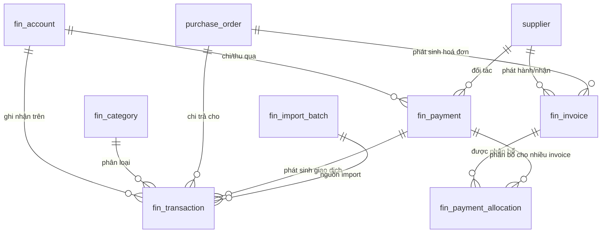

# Research Report: Phân hệ Tài chính (sổ thu chi + công nợ) cho MES/ERP xưởng cơ khí

**Ngày nghiên cứu:** 2026-09-22
**Người thực hiện:** Claude (researcher agent)
**Phạm vi:** Đánh giá tái sử dụng OSS vs tự xây phân hệ Tài chính (transaction, invoice, payment allocation, công nợ, chart of accounts, import Excel, dashboard dòng tiền) cho hệ thống Next.js 14 + Drizzle + Postgres hiện có tại `he-thong-iot`.

---

## Mục lục
1. [Tóm tắt điều hành](#tóm-tắt-điều-hành)
2. [Đánh giá từng ứng viên OSS](#2-đánh-giá-từng-ứng-viên-oss)
3. [Kết luận: tích hợp / port schema / tự xây](#3-kết-luận-tích-hợp--port-schema--tự-xây)
4. [Thiết kế schema đề xuất (tự xây trên Drizzle)](#4-thiết-kế-schema-đề-xuất-tự-xây-trên-drizzle)
5. [Thư viện biểu đồ cho dashboard dòng tiền](#5-thư-viện-biểu-đồ-cho-dashboard-dòng-tiền)
6. [Import Excel: validate + dedupe](#6-import-excel-validate--dedupe)
7. [Khuyến nghị triển khai & bước tiếp theo](#7-khuyến-nghị-triển-khai--bước-tiếp-theo)
8. [Nguồn tham khảo](#8-nguồn-tham-khảo)

---

## Tóm tắt điều hành

Sau khi khảo sát 5 dự án OSS (Akaunting, Firefly III, Bigcapital, Midday.ai, InvoicePlane) và đối chiếu với schema thực tế của `he-thong-iot` (bảng `purchase_order`, `purchase_request`, `supplier`, `userAccount`/RBAC riêng trong `packages/db/src/schema/`), **kết luận dứt khoát là (c) TỰ XÂY trên Drizzle**, không tích hợp nguyên app và không fork code của bất kỳ ứng viên nào.

Lý do cốt lõi:
- **License là rào cản cứng**: Firefly III, Bigcapital, Midday.ai đều AGPL-3.0 — nếu embed code (không chỉ chạy như service tách biệt mà link/import vào cùng process hoặc phân phối bản sửa đổi) thì toàn bộ phần liên quan phải open-source theo AGPL, không chấp nhận được với dự án private. Akaunting dùng BSL (Business Source License) — cũng có giới hạn thương mại, không phải MIT/Apache tự do.
- **Stack lệch hoàn toàn**: Akaunting (Laravel/PHP/Vue), Firefly III (Laravel/PHP), Bigcapital (Node.js/TS nhưng kiến trúc riêng, ORM Objection.js/Knex, đóng gói thành app độc lập với server Express riêng, không phải Next.js App Router), Midday.ai (Next.js + Hono/Bun + Supabase — gần nhất về stack nhưng vẫn AGPL và kiến trúc multi-app khác biệt), InvoicePlane (PHP, MIT nhưng đã cũ, tính năng chỉ dừng ở invoicing đơn giản).
- **Yêu cầu nghiệp vụ là "sổ thu chi + công nợ" đơn giản** (single-entry, không bút toán kép), trong khi Firefly III và Bigcapital đều thiết kế double-entry bookkeeping đầy đủ — over-engineering so với YAGNI/KISS của dự án.
- **Cần join trực tiếp với `purchase_order`, `purchase_request`, `supplier`, RBAC/notification/Excel export sẵn có** — muốn làm được sạch sẽ bằng Drizzle relations & transaction chung 1 Postgres instance, không thể làm nếu Tài chính là app riêng (SSO + đồng bộ dữ liệu qua API sẽ tốn thêm phức tạp không đáng, VPS chỉ 8GB không nên chạy thêm 1 stack PHP/Laravel song song Next.js).
- Vẫn có giá trị tham khảo: **rút ra pattern schema** (transaction/journal tách biệt, payment allocation nhiều-nhiều, aging bucket, precision tiền tệ) để tự thiết kế bảng Drizzle — chi tiết ở mục 4.

Về biểu đồ: chọn **Recharts** (không phải visx/Tremor) — lý do bundle size hợp lý, hệ sinh thái shadcn/ui đã có sẵn wrapper "chart" component (dự án đang dùng Radix/shadcn-ish), maintain tốt (v3.10.1, release tháng 7/2026), tương thích Next 14 miễn tuân thủ `"use client"` cho các component chart (Recharts không hỗ trợ RSC thuần nhưng có thể bọc trong client component boundary — đây là pattern chuẩn của mọi lib chart React).

---

## 2. Đánh giá từng ứng viên OSS

### 2.1 Akaunting
- **Stack**: Laravel (PHP) + Vue.js + Tailwind, RESTful API, kiến trúc module.
- **License**: **BSL (Business Source License)** cho core — không phải mã nguồn mở tự do hoàn toàn; một số package con (laravel-module, laravel-setting) dùng MIT/GPL riêng lẻ. BSL giới hạn việc host Akaunting như dịch vụ cạnh tranh; không phù hợp để lấy code nhúng vào sản phẩm thương mại khác mà không xem lại điều khoản.
- **Nhúng vào Next.js+Drizzle?** Không khả thi — khác ngôn ngữ, khác ORM, khác toàn bộ tầng backend. Chỉ có thể chạy như **app riêng biệt + SSO**, tăng thêm 1 stack PHP/MySQL phải vận hành trên VPS vốn đã hạn chế (8GB RAM cho toàn bộ Next.js+Postgres+Redis+BullMQ).
- **Kết luận**: loại — license phức tạp + stack không tương thích.
- Nguồn: [akaunting/akaunting](https://github.com/akaunting/akaunting), [akaunting/laravel-setting LICENSE](https://github.com/akaunting/laravel-setting/blob/master/LICENSE.md)

### 2.2 Firefly III
- **Stack**: PHP/Laravel, MySQL/PostgreSQL/SQLite, kiến trúc **double-entry bookkeeping** đầy đủ.
- **License**: **AGPLv3** — bản quyền mạnh nhất trong nhóm copyleft. Bất kỳ phần nào derive từ code này và triển khai qua network (kể cả không phân phối binary) đều phải công bố mã nguồn theo AGPL §13. Không thể port nguyên migration/model rồi giữ kín.
- **Thiết kế schema đáng học** (dùng làm tham khảo ý tưởng, không copy code):
  - `transaction_groups` (nhóm) → `transaction_journals` (1 "sự kiện tài chính", có currency, description, date) → `transactions` (mỗi journal có ít nhất 2 dòng transaction: nợ 1 tài khoản, có 1 tài khoản — chuẩn double-entry).
  - Mọi bảng chính đều có `user_id` FK để cô lập dữ liệu multi-tenant.
  - `piggy_bank_events` làm audit log liên kết ngược `journal_id`.
- **Nhúng được không?** Không — kiến trúc double-entry là quá mức cần thiết cho yêu cầu "sổ thu chi không bút toán kép" của dự án này, và PHP/Laravel không tương thích Next.js/Drizzle.
- **Kết luận**: loại vì license AGPL + over-engineered so với scope; nhưng **rất đáng tham khảo mô hình "journal tách khỏi transaction line"** khi tự thiết kế (xem mục 4).
- Nguồn: [firefly-iii/firefly-iii](https://github.com/firefly-iii/firefly-iii), [Kiến trúc Firefly III](https://docs.firefly-iii.org/explanation/more-information/architecture/), [Transactions & Journals — DeepWiki](https://deepwiki.com/firefly-iii/firefly-iii/2.2-transactions-and-journals)

### 2.3 Bigcapital
- **Stack**: Node.js + TypeScript (server dùng Objection.js/Knex trên Postgres), frontend React riêng (không phải Next.js). Kiến trúc app độc lập, không phải thư viện có thể `npm install`.
- **License**: **AGPL-3.0** — free để tự host nhưng mọi sửa đổi phải công bố; nhúng vào codebase private là vi phạm nếu phân phối/chạy dịch vụ công khai có sửa đổi.
- **Đánh giá kỹ thuật**: gần với "kế toán đầy đủ" (double-entry, invoice, bill, payment_receives, credit_notes, inventory) — điểm cộng là cùng hệ Node/TS/Postgres nên *về lý thuyết* dễ đọc hiểu code hơn Laravel, nhưng vẫn là **ứng dụng độc lập với ORM khác (Knex, không phải Drizzle)**, không có gói thư viện tách rời để import trực tiếp.
- **Nhúng vào Next.js+Drizzle?** Không thực tế — sẽ phải viết lại toàn bộ tầng data access sang Drizzle, tức là "tự xây" chứ không còn là "tái sử dụng". Chạy như service riêng (Docker container thứ 2) khả thi về mặt kỹ thuật nhưng: (a) vi phạm AGPL nếu customize theo nghiệp vụ VN rồi không public code, (b) tốn thêm RAM/CPU trên VPS 4vCPU/8GB vốn đã chạy Caddy+app+worker+Postgres+Redis, (c) không join thẳng được với `purchase_order`/`purchase_request` bằng SQL/Drizzle relations — phải qua API + đồng bộ, tăng độ trễ và độ phức tạp không cần thiết cho một tính năng nội bộ.
- **Kết luận**: loại. Giá trị tham khảo: models `Invoice`, `Bill`, `PaymentReceive`, `PaymentMade`, `Account` (chart of accounts) — nhưng mã nguồn cụ thể (migrations) không truy cập được công khai qua thư mục để trích xuất chi tiết cột trong phiên nghiên cứu này (repo cấu trúc theo domain `packages/server/src/services/...`, không có 1 file migration tổng); pattern chung suy ra từ tài liệu/issue tracker phù hợp với chuẩn ngành (xem mục 4).
- Nguồn: [bigcapitalhq/bigcapital](https://github.com/bigcapitalhq/bigcapital), [Issue #464 — credit notes & payment overpayment](https://github.com/bigcapitalhq/bigcapital/issues/464)

### 2.4 Midday.ai
- **Stack**: **Gần nhất về công nghệ** — Next.js (dashboard app), Hono + Bun (API), Supabase/Postgres, monorepo (Turborepo). Có module Invoicing, Time tracking, Vault, "Magic Inbox" khớp hoá đơn tự động.
- **License**: **AGPL-3.0 cho non-commercial**; dùng thương mại phải mua license riêng (liên hệ engineer@midday.ai). Đây là mô hình "open-core" — không phải tự do hoàn toàn.
- **Đánh giá**: Dù stack gần giống nhất (Next.js), kiến trúc là **multi-app monorepo với API server Hono/Bun riêng biệt**, không phải App Router API routes + Drizzle như `he-thong-iot`. Muốn nhúng phải bóc tách sâu, và vướng license thương mại (dự án nội bộ xưởng cơ khí không phải non-commercial theo định nghĩa AGPL — công ty vẫn "sử dụng" phần mềm để vận hành kinh doanh, rủi ro pháp lý nếu bị xem là "thương mại" cần mua license).
- **Kết luận**: loại vì rào cản license thương mại + kiến trúc multi-app không khớp; nhưng **đáng tham khảo UX pattern** "Magic Inbox" (tự động khớp hoá đơn/biên lai với giao dịch ngân hàng) cho roadmap sau V1 nếu có nhu cầu OCR/matching tự động.
- Nguồn: [midday-ai/midday](https://github.com/midday-ai/midday)

### 2.5 InvoicePlane
- **Stack**: PHP thuần (CodeIgniter cũ) cho v1; v2 đang viết lại bằng Laravel + Filament + Livewire.
- **License**: **MIT** — duy nhất trong nhóm có license tự do hoàn toàn, không rủi ro nhiễm mã.
- **Đánh giá**: License tốt nhưng (a) chỉ giải quyết invoicing đơn giản, không có sổ thu chi/công nợ/payment allocation phức tạp như yêu cầu; (b) PHP/CodeIgniter là stack cũ, v2 (Laravel) vẫn không tương thích Next.js/Drizzle; (c) do dự án ít được biết đến rộng rãi và v1/v2 đang trong giai đoạn chuyển đổi, rủi ro về độ ổn định lâu dài.
- **Kết luận**: loại vì stack không tương thích và tính năng không đủ, dù license không phải vấn đề.
- Nguồn: [InvoicePlane/InvoicePlane](https://github.com/InvoicePlane/InvoicePlane), [invoiceplane.com/about](https://invoiceplane.com/about)

### 2.6 Hyperswitch (đối chiếu thêm — payment orchestration)
- **Stack**: Rust, kiến trúc payment switch/router kết nối 100+ cổng thanh toán (Stripe, PayPal...).
- **License**: **Apache 2.0** — license tốt nhất trong danh sách, không rủi ro nhiễm mã.
- **Đánh giá**: Hyperswitch giải quyết bài toán khác hẳn — **định tuyến giao dịch thanh toán online qua nhiều PSP** (dùng cho e-commerce/fintech nhận thanh toán thẻ), không phải "sổ thu chi + công nợ nội bộ". Xưởng cơ khí VN thanh toán qua chuyển khoản ngân hàng/tiền mặt là chính, không cần payment gateway orchestration. Overkill và sai bài toán.
- **Kết luận**: không liên quan đến nhu cầu hiện tại, loại khỏi cân nhắc.
- Nguồn: [hyperswitch (Juspay)](https://github.com/juspay/hyperswitch), [hyperswitch.io](https://hyperswitch.io/)

### Bảng tổng hợp

| Dự án | Stack | License | Nhúng vào Next.js+Drizzle? | Kết luận |
|---|---|---|---|---|
| Akaunting | Laravel/PHP/Vue | BSL | Không | Loại |
| Firefly III | PHP/Laravel | AGPL-3.0 | Không | Loại (tham khảo schema journal) |
| Bigcapital | Node/TS (Knex), React riêng | AGPL-3.0 | Không (app riêng) | Loại (tham khảo model) |
| Midday.ai | Next.js + Hono/Bun + Supabase | AGPL-3.0 (non-commercial)/thương mại trả phí | Kiến trúc lệch, license thương mại | Loại |
| InvoicePlane | PHP (CI/Laravel v2) | MIT | Không | Loại (thiếu tính năng) |
| Hyperswitch | Rust | Apache 2.0 | Sai bài toán | Loại |

---

## 3. Kết luận: tích hợp / port schema / tự xây

**Quyết định: (c) Tự xây từ đầu trên Drizzle**, có tham khảo ý tưởng thiết kế (không copy code) từ Firefly III (tách journal/transaction) và chuẩn kế toán phổ thông (payment allocation, aging).

**Lý do quyết định:**

1. **License**: 4/5 ứng viên chính (Akaunting, Firefly III, Bigcapital, Midday.ai) đều có copyleft mạnh (AGPL) hoặc BSL giới hạn thương mại. Với sản phẩm private của khách hàng (xưởng cơ khí), rủi ro pháp lý khi port code là không chấp nhận được — kể cả "port rồi viết lại" cũng dễ bị coi là derivative work nếu giữ cấu trúc/logic đặc trưng.
2. **Không có ứng viên nào cùng stack** (Next.js App Router + Drizzle ORM). Midday.ai gần nhất về ngôn ngữ nhưng khác kiến trúc (Hono/Bun API tách biệt) và vướng license thương mại.
3. **Yêu cầu nghiệp vụ nhỏ hơn nhiều** so với các app kế toán đầy đủ: không cần double-entry, không cần đa tiền tệ phức tạp, không cần payment gateway — chỉ cần sổ thu/chi, hoá đơn, thanh toán từng phần, công nợ. Tự xây ~6-10 bảng Drizzle là đủ, nhanh hơn việc "gỡ" một hệ thống kế toán đầy đủ xuống còn phần cần dùng.
4. **Cần join trực tiếp** `purchase_order`, `purchase_request`, `supplier`, `userAccount`/RBAC, notification, Excel export đã có sẵn trong cùng schema Postgres (`appSchema` namespace, xem `packages/db/src/schema/procurement.ts`, `order.ts`, `master.ts`, `auth.ts`). Tự xây cho phép dùng thẳng Drizzle relations, cùng transaction DB, cùng RBAC/permission check pattern, cùng Excel export util (exceljs) đã dùng cho PO/PR — không phải xây cầu nối (API sync, webhook, SSO) giữa 2 hệ thống tách biệt.
5. **VPS 4vCPU/8GB**: chạy thêm 1 stack PHP-FPM/MySQL (Akaunting/Firefly) hoặc Node service thứ 2 (Bigcapital) sẽ cạnh tranh tài nguyên với Postgres+Redis+BullMQ+Next.js hiện tại (RAM hiện dùng ~340MB/8GB — còn dư nhưng thêm 1 full-stack app kế toán là lãng phí so với thêm vài bảng vào Postgres hiện có).
6. **Nhất quán trải nghiệm**: giữ UI/UX, RBAC, notification, Excel trong 1 hệ thống — tránh 2 login, 2 giao diện, 2 nguồn dữ liệu công nợ (một bên ERP một bên kế toán) gây sai lệch số liệu.

**Không chọn (a) tích hợp nguyên app + SSO** vì: license, chi phí vận hành thêm 1 stack, độ phức tạp SSO không tương xứng với lợi ích, dữ liệu công nợ cần real-time join với PO không hợp lý khi tách 2 DB.

**Không chọn (b) port/copy schema thiết kế rồi tự code** theo nghĩa đen (copy DDL/migration) vì rủi ro bản quyền không cần thiết — thay vào đó **học pattern kiến trúc** (transaction/journal, payment allocation, aging bucket) là kiến thức phổ thông ngành kế toán, không phải tài sản trí tuệ độc quyền của riêng dự án nào, nên hoàn toàn an toàn để áp dụng dưới dạng thiết kế mới bằng Drizzle.

---

## 4. Thiết kế schema đề xuất (tự xây trên Drizzle)

Thiết kế dưới đây là **nguyên bản**, rút ra từ pattern chung của ngành kế toán/OSS đã khảo sát (khái niệm phổ thông: journal, payment allocation, aging — không copy tên bảng/cột nguyên văn của bất kỳ dự án nào), điều chỉnh cho:
- Single-entry (sổ thu/chi), KHÔNG double-entry.
- Join trực tiếp `purchase_order` (đầu vào — tiền chi trả NCC) và `sales_order` (đầu ra — tiền thu từ khách, nếu có bán hàng) đã có sẵn.
- Namespace `appSchema` giống các bảng hiện tại, đặt trong file mới `packages/db/src/schema/finance.ts`.

### 4.1 Danh sách bảng

**1) `fin_account` — Tài khoản giao dịch (ngân hàng/tiền mặt)**
```
id                uuid pk
code              varchar(32) unique      -- VD "TK-VCB-001", "TIENMAT"
name              varchar(255)            -- "Vietcombank - Chi nhánh X"
type              enum('BANK','CASH')
bankName           varchar(255) nullable
accountNumber      varchar(64) nullable
openingBalance     numeric(18,2) default 0
openingBalanceDate date
currentBalance     numeric(18,2) default 0   -- cache, update qua trigger/service khi post transaction
isActive           boolean default true
createdAt/updatedAt/createdBy
```
*Ghi chú*: `currentBalance` là cache denormalized để dashboard nhanh — nguồn sự thật vẫn là SUM(fin_transaction) theo account; refresh bằng trigger Postgres hoặc job định kỳ (KISS: trigger AFTER INSERT/UPDATE/DELETE đơn giản, giống cách `purchase_order.totalAmount` được cache hiện tại).

**2) `fin_category` — Danh mục thu/chi (chart of accounts đơn giản, KHÔNG phải double-entry COA đầy đủ)**
```
id          uuid pk
code        varchar(32) unique     -- "CHI_NGUYENLIEU", "THU_BANHANG", "CHI_LUONG"
name        varchar(255)
direction   enum('IN','OUT')       -- thu hay chi
parentId    uuid nullable fk self  -- cho phép phân nhóm (VD "Chi phí vận hành" > "Điện nước")
isActive    boolean default true
```

**3) `fin_transaction` — Giao dịch thu/chi hàng ngày (bảng trung tâm, single-entry)**
```
id              uuid pk
code            varchar(32) unique        -- auto-gen "PT-2026-0001" (Phiếu Thu) / "PC-2026-0001" (Phiếu Chi)
direction       enum('IN','OUT')
accountId       uuid fk -> fin_account
categoryId      uuid fk -> fin_category nullable
amount          numeric(18,2) not null    -- luôn dương; direction quyết định dấu khi tính balance
transactionDate date not null
description     text
counterpartyType enum('SUPPLIER','CUSTOMER','EMPLOYEE','OTHER') nullable
supplierId      uuid fk -> supplier nullable          -- join thẳng bảng supplier có sẵn
purchaseOrderId uuid fk -> purchase_order nullable     -- join thẳng PO có sẵn (chi trả NCC)
salesOrderId    uuid fk -> sales_order nullable        -- join thẳng SO có sẵn (thu từ khách, nếu áp dụng)
invoiceId       uuid fk -> fin_invoice nullable         -- xem bảng 4
paymentId       uuid fk -> fin_payment nullable         -- 1 transaction có thể là 1 phần của 1 payment gộp nhiều invoice
attachmentUrl   text nullable            -- ảnh/scan chứng từ
importBatchId   uuid fk -> fin_import_batch nullable    -- trace nguồn import Excel
externalRef     varchar(128) nullable    -- số chứng từ ngân hàng / mã tham chiếu, dùng cho dedupe
dedupeHash      varchar(64) unique nullable  -- hash(account+date+amount+externalRef) chống trùng khi import
status          enum('DRAFT','POSTED','VOID') default 'POSTED'
createdAt/createdBy/updatedAt
```
*Index*: `(accountId, transactionDate)`, `(purchaseOrderId)`, `(supplierId)`, `(dedupeHash)` unique.

**4) `fin_invoice` — Hoá đơn đầu vào/đầu ra**
```
id              uuid pk
invoiceNo       varchar(64)              -- số hoá đơn (có thể trùng giữa các NCC khác nhau → unique theo (direction, supplierId/customerRef, invoiceNo))
direction       enum('IN','OUT')          -- IN = hoá đơn mua (từ NCC), OUT = hoá đơn bán (cho khách)
supplierId      uuid fk -> supplier nullable
purchaseOrderId uuid fk -> purchase_order nullable
salesOrderId    uuid fk -> sales_order nullable
issueDate       date not null
dueDate         date nullable
subtotalAmount  numeric(18,2) not null default 0
vatRate         numeric(5,2) default 8      -- % VAT, đồng bộ mặc định với purchase_order_line.taxRate hiện có (8%)
vatAmount       numeric(18,2) not null default 0
totalAmount     numeric(18,2) not null default 0   -- subtotal + vat
paidAmount      numeric(18,2) not null default 0   -- cache, cập nhật khi có payment_allocation mới
status          enum('DRAFT','UNPAID','PARTIAL','PAID','OVERDUE','CANCELLED') default 'UNPAID'
notes           text
attachmentUrl   text nullable
createdAt/createdBy/updatedAt
```
*Index*: `(direction, status)`, `(supplierId)`, `(purchaseOrderId)`, unique `(direction, invoiceNo, supplierId)`.
*status* nên có job/trigger tự chuyển `UNPAID→OVERDUE` khi `dueDate < today AND paidAmount < totalAmount`.

**5) `fin_payment` — Đợt thanh toán (1 payment có thể trả nhiều invoice, hoặc 1 invoice trả nhiều đợt)**
```
id            uuid pk
code          varchar(32) unique         -- "TT-2026-0001"
direction     enum('IN','OUT')
accountId     uuid fk -> fin_account     -- tiền đi/vào từ tài khoản nào
supplierId    uuid fk -> supplier nullable
paymentDate   date not null
totalAmount   numeric(18,2) not null     -- tổng số tiền của đợt thanh toán này (= SUM(fin_payment_allocation.amount))
method        enum('BANK_TRANSFER','CASH','CHECK','OTHER')
referenceNo   varchar(128) nullable      -- số UNC/bút toán ngân hàng
notes         text
createdAt/createdBy
```

**6) `fin_payment_allocation` — Bảng nhiều-nhiều: 1 payment phân bổ cho N invoice, 1 invoice nhận từ N payment (partial payment)**
```
id            uuid pk
paymentId     uuid fk -> fin_payment (cascade delete)
invoiceId     uuid fk -> fin_invoice
amount        numeric(18,2) not null    -- số tiền phân bổ cho invoice này trong đợt payment này
createdAt
```
*Index*: `(paymentId)`, `(invoiceId)`, unique `(paymentId, invoiceId)`.
*Logic*: sau mỗi insert/delete allocation → recalculate `fin_invoice.paidAmount = SUM(allocations)` và cập nhật `status` (0 = UNPAID, 0<paid<total = PARTIAL, paid>=total = PAID). Đây chính là cơ chế **partial payment nhiều đợt** mà Firefly III/Bigcapital đều dùng dưới dạng "payment line items" — áp dụng nguyên lý tương tự, tự thiết kế cột.

**7) `fin_import_batch` — Theo dõi mỗi lần import Excel (audit trail + dedupe theo batch)**
```
id            uuid pk
fileName      varchar(255)
importedBy    uuid fk -> userAccount
importedAt    timestamp
totalRows     integer
successRows   integer
duplicateRows integer
errorRows     integer
status        enum('PROCESSING','DONE','FAILED')
errorLog      jsonb nullable    -- chi tiết lỗi từng dòng để hiển thị lại cho user
```

### 4.2 Xử lý các vấn đề nghiệp vụ cụ thể

- **Precision tiền tệ**: dùng `numeric(18,2)` cho VND (nhất quán với `purchase_order.totalAmount` đang dùng `numeric(18,2)` trong schema hiện tại — xem `packages/db/src/schema/procurement.ts` dòng 147-149). Không dùng `float`/`double` để tránh sai số làm tròn. Nếu tương lai cần multi-currency thực sự, thêm cột `currency varchar(8) default 'VND'` (đã có tiền lệ ở `purchase_order.currency`) + bảng `exchange_rate`, nhưng **V1 KISS: chỉ VND**, bỏ qua đa tiền tệ.
- **Partial payment**: giải quyết hoàn toàn qua bảng `fin_payment_allocation` (mục 4.1.6) — đây là pattern chuẩn "one payment, many invoices; one invoice, many payments" dùng trong hầu hết hệ kế toán (Bigcapital gọi là `payment_receive_entries`, QuickBooks gọi "Payment Line Items" — khái niệm phổ thông, tự đặt tên tiếng Việt/English theo convention hiện có của dự án).
- **VAT**: lưu `subtotalAmount`, `vatRate`, `vatAmount`, `totalAmount` tách riêng trên `fin_invoice` (không gộp vào 1 số) để: (a) xuất báo cáo thuế đầu vào/đầu ra rõ ràng, (b) đồng bộ với `purchase_order_line.taxRate` đã có (mặc định 8%) để auto-fill khi tạo invoice từ PO.
- **Trạng thái hoá đơn**: enum `DRAFT/UNPAID/PARTIAL/PAID/OVERDUE/CANCELLED` — derive `PARTIAL`/`PAID`/`OVERDUE` tự động từ `paidAmount` vs `totalAmount` vs `dueDate`, tránh để user tự chọn sai trạng thái (nguồn lỗi phổ biến trong các hệ tự phát triển).
- **Công nợ phải thu & Aging**: không cần bảng riêng — tính bằng **view/query động** trên `fin_invoice WHERE direction='OUT' AND status IN ('UNPAID','PARTIAL','OVERDUE')`, group theo bucket tuổi nợ (0-30/31-60/61-90/>90 ngày tính từ `dueDate`). Đây là cách các hệ nhẹ (kể cả Bigcapital) triển khai — aging luôn là **report/query**, không phải bảng lưu trữ, vì nó thay đổi theo ngày hiện tại.
- **Chart of accounts đơn giản**: KHÔNG làm COA phân cấp Asset/Liability/Equity/Revenue/Expense đầy đủ như GAAP (over-engineering cho "sổ thu chi"). Thay bằng `fin_category` phẳng có `parentId` tuỳ chọn để nhóm — đáp ứng đúng nhu cầu "danh mục tài khoản giao dịch" nêu trong yêu cầu, không phải kế toán tài chính chuẩn mực.
- **Join với PO/PR có sẵn**: `fin_transaction.purchaseOrderId` và `fin_invoice.purchaseOrderId` trỏ thẳng `purchase_order.id` (đã tồn tại, xem `packages/db/src/schema/procurement.ts`) → cho phép trang chi tiết PO hiển thị "đã thanh toán X/Y VNĐ" bằng 1 Drizzle join, không cần đồng bộ dữ liệu qua hệ khác.

### 4.3 Sơ đồ quan hệ (rút gọn)



---

## 5. Thư viện biểu đồ cho dashboard dòng tiền

| Tiêu chí | Recharts | visx | Chart.js | Tremor |
|---|---|---|---|---|
| Bundle size | ~120KB gzip | Nhỏ hơn nhưng phải tự ghép nhiều package con | ~60-80KB (canvas-based) | ~200KB (build trên Recharts, cộng dồn) |
| Dark mode | Đang cải thiện chủ động (nhiều PR 2026 về theming/dark mode) | Tự làm bằng tay (chỉ là primitives D3) | Cấu hình thủ công qua options | Kế thừa Tailwind theme, dễ dark mode nếu đã dùng Tailwind (dự án đã dùng Tailwind) |
| Next.js 14 RSC | Cần `"use client"` (không SSR thuần, như mọi lib chart SVG khác) | Tương tự — cần client boundary | Cần client boundary (canvas) | Cần `"use client"` (khai báo sẵn trong component) |
| Maintain | Rất tích cực — v3.10.1 (07/2026), ~290 release, là default của shadcn/ui charts | Airbnb, ổn định nhưng API học cao hơn, ít cập nhật hào hứng | Ổn định lâu năm, ít đổi API | Dựa trên Recharts nên thừa hưởng maintain, nhưng bản thân tremor-npm cập nhật chậm hơn |
| Độ phù hợp bar+line+so sánh kỳ | Tốt, API `ComposedChart` sẵn cho bar+line kết hợp | Phải tự dựng từ đầu (mất thời gian hơn nhiều so với lợi ích) | Tốt nhưng ít "React-native" hơn (wrapper qua canvas, khó style theo Tailwind token) | Tốt nhưng thêm 1 lớp trừu tượng không cần thiết vì bản chất vẫn là Recharts |

**Kết luận: chọn Recharts.**
Lý do quyết định:
1. Dự án đã dùng Tailwind + Radix/shadcn-ish — **shadcn/ui "chart" component chính thức build trên Recharts**, nghĩa là có thể copy pattern component (không phải cài thêm 1 design system như Tremor) và giữ token màu/dark-mode nhất quán với UI hiện tại thay vì học thêm 1 hệ thống style riêng của Tremor.
2. Bundle size chấp nhận được cho 1 trang dashboard (không phải load ở mọi route).
3. Đủ khả năng làm bar+line kết hợp (`ComposedChart`) để so sánh dòng tiền vào/ra theo kỳ + đường xu hướng tăng trưởng — đúng yêu cầu "biểu đồ dòng tiền + tăng trưởng theo ngày".
4. Maintain tích cực nhất trong nhóm (release gần nhất 07/2026, đang chủ động thêm dark mode native).
5. Không chọn visx vì chi phí phát triển cao hơn nhiều (phải tự ghép các primitive D3) — vi phạm YAGNI/KISS cho 1 dashboard nội bộ. Không chọn Tremor vì nó *là* Recharts cộng thêm 1 lớp component styling riêng — dùng thẳng Recharts + component chart tự viết theo token Tailwind hiện có sẽ nhẹ và nhất quán hơn. Không chọn Chart.js vì API kém "React" hơn (imperative, canvas-based), khó tuỳ biến theo Tailwind dark mode token bằng CSS variables như SVG-based Recharts.

**Lưu ý kỹ thuật khi triển khai**: mọi component chart phải nằm trong file có `"use client"` (Recharts dùng ResizeObserver + SVG render phía client) — bọc trong 1 Client Component wrapper, phần fetch dữ liệu (route handler/server action) vẫn chạy ở server như các trang khác trong dự án.

---

## 6. Import Excel: validate + dedupe

**Best practice tổng hợp** (áp dụng cho `fin_import_batch` + `fin_transaction`):

1. **Mapping cột động**: không hard-code thứ tự cột. Đọc header row, cho user map "cột Excel → field hệ thống" (giống UI mapping đã thấy ở các tool import ngân hàng phổ biến) — lưu mapping đã dùng lần trước vào `localStorage`/DB config để tái sử dụng cho lần import sau (giảm thao tác lặp lại).
2. **Validate trước khi ghi**:
   - Kiểu dữ liệu: `amount` phải parse được số dương, `transactionDate` phải parse được ngày hợp lệ (Excel serial date hoặc chuỗi dd/mm/yyyy — cả 2 dạng phổ biến ở file kế toán VN).
   - Bắt buộc: `direction` (thu/chi) hoặc suy ra từ cột riêng (Nợ/Có, hoặc số âm/dương).
   - FK: nếu có `supplierId`/`accountId` dạng text (tên NCC, tên tài khoản) → fuzzy-match với bảng `supplier`/`fin_account` sẵn có, báo lỗi dòng nào không khớp được để user sửa tay thay vì import sai.
3. **Dedupe — cách làm chuẩn ngành**:
   - Tạo **dedupe key/hash** = `hash(accountId + transactionDate + amount + normalizedExternalRef)`. Nếu file có số tham chiếu ngân hàng (UNC, mã giao dịch) thì ưu tiên `externalRef` làm khoá chính; nếu không có, fallback `hash(account + date + amount + description_normalized + row_index_trong_batch)` để 2 dòng cùng ngày cùng số tiền nhưng khác nội dung không bị coi là trùng nhau, còn 2 dòng thực sự giống hệt (import lại cùng file) thì bị chặn.
   - Lưu hash vào cột `fin_transaction.dedupeHash` với **unique index** — dùng `INSERT ... ON CONFLICT (dedupe_hash) DO NOTHING` (Postgres upsert) để đảm bảo import lại cùng file nhiều lần **không tạo giao dịch trùng** (idempotent), đồng thời vẫn atomic (transaction DB bao quanh cả batch, all-or-nothing theo từng chunk).
   - Báo cáo lại cho user: bao nhiêu dòng import thành công, bao nhiêu bị coi là trùng (link tới giao dịch gốc đã tồn tại để user tự xác nhận), bao nhiêu lỗi validate — lưu vào `fin_import_batch.errorLog` (jsonb) để hiển thị lại, không chỉ show ở toast rồi mất.
4. **Xử lý theo chunk**: với file lớn (hàng ngàn dòng sổ phụ ngân hàng), stream đọc bằng `exceljs` (đã có sẵn trong stack) theo streaming reader thay vì load hết vào memory, insert theo batch (500-1000 dòng/transaction) để tránh khoá bảng lâu và tránh OOM trên VPS 8GB.
5. **Preview trước khi commit**: hiển thị bảng preview (giống pattern "spreadsheet import preview, batch commit" phổ biến) cho user duyệt trước khi ghi thật vào DB — đặc biệt quan trọng với dữ liệu tài chính vì sai sót khó phát hiện sau khi đã trộn lẫn với giao dịch thật.

---

## 7. Khuyến nghị triển khai & bước tiếp theo

1. Tạo `packages/db/src/schema/finance.ts` với 7 bảng ở mục 4.1, theo đúng convention hiện có (`appSchema.table`, `uuid().defaultRandom()`, `numeric(18,2)`, index/uniqueIndex đặt tên theo pattern `<table>_<field>_idx`/`_uk`).
2. Viết migration Drizzle, chạy trên môi trường dev trước, kiểm tra cascade/FK với `purchase_order`, `supplier`, `userAccount` không phá vỡ dữ liệu hiện có.
3. Trigger/service tính lại `fin_invoice.paidAmount` + `status` mỗi khi `fin_payment_allocation` thay đổi — làm ở tầng application (Drizzle transaction trong route handler) đơn giản hơn viết trigger SQL, dễ debug, phù hợp KISS.
4. Trang dashboard dùng Recharts `ComposedChart` (bar = thu/chi theo ngày, line = luỹ kế/xu hướng), đặt trong Client Component, dữ liệu fetch qua Server Component cha hoặc route handler.
5. Import Excel: tái sử dụng `exceljs` + pattern parser đã có trong `packages/db/src/schema/import.ts` (đã tồn tại — nên tham khảo code cũ trong repo trước khi viết mới, tránh trùng lặp logic parse Excel).
6. Viết test vitest cho: tính `paidAmount`/`status` khi partial payment nhiều đợt, dedupe hash khi import trùng file, tính aging bucket.
7. Cập nhật `PROGRESS.md` và tạo plan chi tiết trong `plans/v4-finance/` (file plan riêng, tách khỏi report nghiên cứu này) trước khi implement.

---

## 8. Nguồn tham khảo

- [akaunting/akaunting](https://github.com/akaunting/akaunting)
- [akaunting/laravel-setting — LICENSE.md](https://github.com/akaunting/laravel-setting/blob/master/LICENSE.md)
- [firefly-iii/firefly-iii](https://github.com/firefly-iii/firefly-iii)
- [Firefly III — Kiến trúc](https://docs.firefly-iii.org/explanation/more-information/architecture/)
- [Firefly III — Transactions](https://docs.firefly-iii.org/explanation/financial-concepts/transactions/)
- [Transactions and Journals — DeepWiki firefly-iii](https://deepwiki.com/firefly-iii/firefly-iii/2.2-transactions-and-journals)
- [bigcapitalhq/bigcapital](https://github.com/bigcapitalhq/bigcapital)
- [Bigcapital Issue #464 — credit notes/overpayment](https://github.com/bigcapitalhq/bigcapital/issues/464)
- [midday-ai/midday](https://github.com/midday-ai/midday)
- [InvoicePlane/InvoicePlane](https://github.com/InvoicePlane/InvoicePlane)
- [InvoicePlane — About](https://invoiceplane.com/about)
- [juspay/hyperswitch](https://github.com/juspay/hyperswitch) / [hyperswitch.io](https://hyperswitch.io/)
- [Recharts — releases](https://github.com/recharts/recharts/releases)
- [Recharts status 2026 — Issue #7355](https://github.com/recharts/recharts/issues/7355)
- [Recharts v3 vs Tremor vs Nivo — PkgPulse](https://www.pkgpulse.com/guides/recharts-v3-vs-tremor-vs-nivo-react-charting-2026)
- [Best React chart libraries 2026 — LogRocket](https://blog.logrocket.com/best-react-chart-libraries-2026/)
- [tremorlabs/tremor-npm](https://github.com/tremorlabs/tremor-npm)
- [Chart of accounts cho SaaS — Kruze Consulting](https://kruzeconsulting.com/startup-chart-accounts/)
- [Idempotency keys trong payment API](https://martinuke0.github.io/posts/2026-05-23-implementing-idempotency-keys-in-payment-apis-designing-for-consistency-and-preventing-duplicate-transactions/)
- [Catch duplicates across bank files](https://www.aiaccountant.com/blog/detect-duplicates-across-bank-files)
- Schema thực tế dự án: `packages/db/src/schema/procurement.ts`, `packages/db/src/schema/order.ts`, `packages/db/src/schema/master.ts`, `packages/db/src/schema/auth.ts` (đọc trực tiếp từ repo `he-thong-iot`, không phải nguồn web)

---

*Báo cáo này chỉ tạo/ghi file `plans/v4-finance/research-finance-oss.md` theo đúng yêu cầu, không sửa file nào khác trong repo.*
