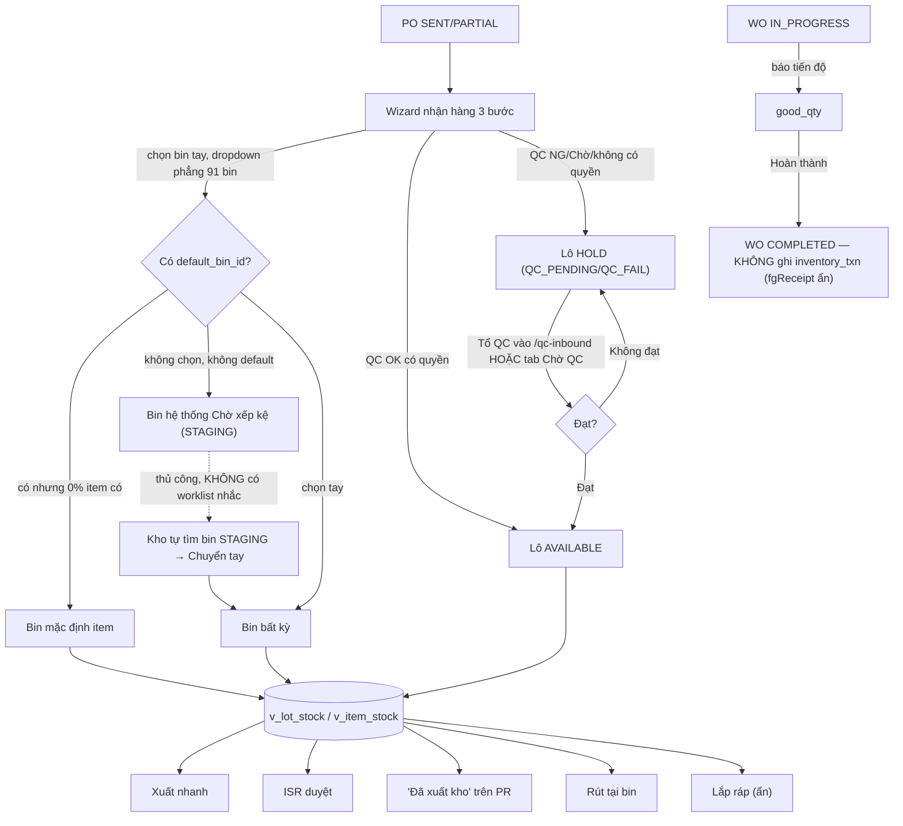

# Kho V4.3 — Audit WMS + đề xuất Putaway + Nhập kho thành phẩm (2026-09-30)

> Phạm vi: CHỈ đọc code + SELECT prod. Không sửa code ứng dụng, không commit, không ghi dữ liệu.
> Đối chiếu: `plans/v4.2-audit/FLOW_PROCUREMENT_WAREHOUSE.md`, `plans/v4.2-audit/FLOW_PRODUCTION.md`,
> `plans/v4.1-audit-hoan-thien/DOT1_PLAN.md`, `plans/v4-finance/wave-5-warehouse-redesign.md`.
> Dữ liệu prod tại thời điểm audit: 863 item active, 91 bin (90 zone A + 1 STAGING), 490 lô (100%
> AVAILABLE), 2 WO, 6 PO, **0 dòng** `material_request`/`warehouse_issue_request`/`goods_issue`/
> `delivery_note`/`reservation`/`warehouse_putaway` — hệ thống vẫn ở giai đoạn pilot, các luồng dưới
> đây phần lớn mới kiểm chứng bằng đọc code + vài giao dịch thật (5 `IN_RECEIPT`, 3 `ADJUST_MINUS`,
> 500 `ADJUST_PLUS` khởi tạo tồn).

## Tóm tắt cực ngắn (đọc trước)

1. **Hàng về nằm ở đâu?** Người nhận hàng (không phải "Kho" tách riêng) chọn bin ngay lúc nhập liệu ở Wizard bước 2, từ 1 dropdown phẳng liệt kê **cả 91 bin không lọc/không gợi ý**. Nếu để trống → rơi vào `item.default_bin_id` (hiện **0/863 item có** — luôn trống) → rơi tiếp vào bin hệ thống "Chờ xếp kệ". QC là bước tách riêng sau đó (Tổ QC hoặc người có quyền `approve:qcInspection`).
2. **Có thể thêm gợi ý vị trí không?** Có — schema đã đủ cột (`zone/area/rack/level/position/capacity`), có sẵn `app.bin_inventory` (view tồn theo bin) và bảng `app.warehouse_putaway` (log putaway) **nhưng bảng này đã viết code (`putawayToBin()`) từ V3.6 mà 0 nơi gọi, 0 dòng trên prod — dead code**. Thiếu duy nhất: `default_bin_id` chưa ai gán (0%). Thiết kế thuật toán + API + UI ở mục 4.1.
3. **Xuất kho có trừ tồn không?** CÓ, ở mọi 5 đường xuất hiện có (xuất nhanh, ISR, giao MR, "Đã xuất kho" trên PR V4.2, Rút/Chuyển tại bin) — tất cả đi qua `assertIssuable` + `postOutboundTxns`/`createGoodsIssueTx`, trừ 1 lối thoát hiểm tường minh (checkbox "không trừ tồn" trên PR, bắt buộc lý do ≥3 ký tự, có audit). Chi tiết mục 1.3.
4. **Thành phẩm nhập kho khi WO hoàn thành?** **KHÔNG.** `completeWO` chỉ đổi trạng thái, không ghi `inventory_txn`. Đây là **ẩn có chủ đích** (`HIDDEN_FEATURES.fgReceipt = true`), không phải bug bỏ sót — UI dialog hoàn thành LSX cũ đã có sẵn ô nhập SL FG/Lot FG nhưng bị ẩn với TODO rõ ràng. `work_order.product_item_id` **NOT NULL** — mọi WO đều trỏ đúng 1 item thành phẩm, `inv_tx_type` đã có `PROD_IN` sẵn trong enum, chưa dùng lần nào. Thiết kế bật lại ở mục 4.2.
5. **UI có gọn không?** Đã gọn hơn nhiều so với thời điểm viết `wave-5-warehouse-redesign.md` (PWA tablet + camera scan đã bị xoá hẳn ở V4.0, tab Nhận/Xuất đã gộp, sơ đồ kho đã có popover thao tác nhanh) — phần lớn khuyến nghị wave-5 đã triển khai. Vấn đề còn lại: 6 tab cấp 1 (`layout/items/movement/goods-issues/delivery-notes/report`) + 3 mode trong `movement` = **thực chất 8 màn hình**, và **3 cơ chế xuất kho nội bộ song song** (material_request — chết, warehouse_issue_request, PR "Đã xuất kho") gây rối khái niệm. Chi tiết đếm bước ở mục 5.

---

## 1. Trả lời 5 câu hỏi

### 1.1. Hàng về nằm ở đâu? Ai quyết định bin? Luồng nhận hàng → QC → xếp kệ

**Luồng hiện tại (code thật):**

1. PO ở trạng thái `SENT`/`PARTIAL` xuất hiện ở `/warehouse?tab=movement&mode=in` — `apps/web/src/components/warehouse/ReceivingMovementView.tsx:338-509` (bảng compact, filter theo trạng thái/tìm kiếm).
2. Click 1 dòng PO → `/receiving/[poId]/wizard` — `apps/web/src/app/(app)/receiving/[poId]/wizard/page.tsx`. Đây là **lối vào DUY NHẤT** để nhận hàng (dòng 41-55: PWA tablet + camera scan đã xoá hẳn ở V4.0 commit `bb3ad44`; route `/receiving/[poId]/page.tsx` cũ chỉ còn redirect vào wizard).
3. Wizard 3 bước (`STEP_KEYS = ["check","capture","qc"]`, dòng 59):
   - **Bước 1 "check"** (`StepCheck`, dòng 521-650): xem lại thông tin PO + SL còn phải nhận.
   - **Bước 2 "capture"** (`StepCapture`/`LineRow`, dòng 654-987): với **từng dòng PO**, nhập SL thực nhận + mã lô (tuỳ chọn) + **"Vị trí lưu"** — dòng 898-932: `<select>` liệt kê **toàn bộ bin** (`bins` prop, không lọc theo zone/nhóm vật tư/sức chứa còn trống), mặc định value = `input.binId || ln.defaultBinId`. Nếu để "— Chưa gán —" và item không có `default_bin_id`, UI tự hiện dòng chữ xanh "ⓘ Sẽ vào: Chờ xếp kệ" (dòng 927-931) — đây là **người nhận hàng tự chọn bin ngay lúc nhận**, không có bước "Kho duyệt vị trí" tách riêng.
     - Cột QC (dòng 934-967): OK/NG/Chờ — nút "OK" bị ẩn nếu người dùng không có quyền `approve:qcInspection` (canApproveQc).
   - **Bước 3 "qc"** (`StepQc`, dòng 993+): tổng kết rồi POST `/api/receiving/events`.
4. Server `postReceivingAtomic` — `apps/web/src/server/repos/receivingEvents.ts:289-602`:
   - Khoá PO + PO line `FOR UPDATE` (dòng 296-328), guard PO phải `SENT/PARTIAL/RECEIVED` (`RECEIVABLE_PO_STATUSES`, dòng 218).
   - **Resolve bin** (dòng 330-345): `input.locationBinId` (từ dropdown) → nếu rỗng, `item.defaultBinId` → nếu vẫn rỗng, `resolveStagingBinId()` (dòng 43-69) — bin hệ thống cố định `WH-01/STAGING/CHO-XEP-KE` tạo bởi migration `0058_staging_bin_fix_null_bin.sql`, **throw lỗi rõ ràng** nếu bin này bị xoá (không bao giờ để `to_bin_id = NULL` — tránh mất tồn âm thầm, đây là hotfix cũ).
   - **QC** (dòng 407-421): `resolveReceiveQc()` — OK mà không có quyền QC → tự hạ về `PENDING` (`qcDowngraded=true`, không báo lỗi). Lô mới **LUÔN được tạo mới** (D5, dòng 422-448) — không bao giờ cộng vào lô cũ (tránh lẫn hàng NG với hàng cũ đã AVAILABLE); mã lô trùng → tự tách `-2`, `-3`... (`nextSplitLotCode`, dòng 233-242).
   - Lô `PENDING`/`NG` → `status=HOLD`, `hold_code=QC_PENDING`/`QC_FAIL` (dòng 412-414) → **không xuất được** (chặn cả ở `assertIssuable` lẫn trigger DB `trg_inventory_txn_lot_guard`).
5. Nếu QC còn `PENDING` sau khi nhận → dòng xuất hiện ở tab "Chờ QC" — `apps/web/src/components/warehouse/QcPendingView.tsx` (truy cập qua `/warehouse?tab=movement&mode=qc`, chỉ role có `read:qcInspection`) **hoặc** trang riêng `/qc-inbound` (route riêng cho role `qc`, `apps/web/src/lib/nav-items.ts:165-171`) — **2 lối vào cùng 1 chức năng** (xem mục 5). Tổ QC bấm Đạt/Không đạt → `POST /api/receiving/receipt-lines/[id]/qc` → `AVAILABLE` hoặc giữ `HOLD/QC_FAIL`.
6. Nếu hàng rơi vào bin "Chờ xếp kệ": **không có worklist/badge nào nhắc "còn N lô chưa xếp kệ"** — người dùng phải tự vào `/warehouse?tab=layout`, tìm bin `CHO-XEP-KE` (zone STAGING), mở drawer, dùng nút "Chuyển" (`BinActionsBar`/`BinQuickActionsPopover`, `apps/web/src/components/warehouse/BinActions.tsx:57-183, 198-357`) → `POST /api/warehouse/bins/[id]/transfer` để chuyển sang bin thật. Bước này **hoàn toàn thủ công, không có UI liệt kê tập trung**.

**Bước thủ công / thiếu UI (tóm tắt):**
- Chọn bin lúc nhận hàng: thủ công 100%, dropdown phẳng 91 bin không gợi ý (không lọc theo cùng SKU/zone/sức chứa).
- Xếp kệ hàng đang ở "Chờ xếp kệ": thủ công, không có danh sách/inbox riêng — phải tự tìm trong sơ đồ kho.
- Bảng `app.warehouse_putaway` (log "ai đặt lô nào vào bin nào") đã có schema + hàm `putawayToBin()` (`apps/web/src/server/repos/warehouseLocation.ts:25-58, 437-453`) nhưng **0 nơi gọi hàm này trong toàn bộ `apps/web/src`** — dead code, khớp 0 dòng trên prod. Đây là hạ tầng có sẵn nên tái dùng khi làm tính năng gợi ý putaway (mục 4.1) thay vì thêm bảng mới.

### 1.2. Có thể thêm gợi ý vị trí putaway không? Dữ liệu hiện có gì / thiếu gì

**Có, khả thi — dữ liệu schema đủ, dữ liệu THỰC còn thiếu.**

Đã có (không cần migration mới cho MVP):
- `app.location_bin` (`packages/db/src/schema/master.ts:214-250`): `zone`, `area`, `rack`, `levelNo`, `position`, `fullCode`, `capacity`, `lowThreshold`, `coordX/Y/Z`, `isWip`. Đo prod: 91 bin active, **90/91 có `capacity`**, **90/91 có `lowThreshold`**, chỉ **2 zone** (`A`=90 bin, `STAGING`=1 bin) — chưa phân khu theo nhóm vật tư thật.
- `item.defaultBinId` (`master.ts:97`, V3.7): cột đã có, UI wizard đã đọc (`ln.defaultBinId`) — nhưng **đo prod: 0/863 item active có giá trị** → tính năng "mặc định theo item" tồn tại về code nhưng **chưa ai cấu hình dữ liệu**, nên hiện tại 100% hàng nhận không có sẵn bin sẽ hoặc do người nhận tự chọn tay, hoặc rơi vào "Chờ xếp kệ".
- `app.bin_inventory` (view có sẵn, dùng bởi `listBinsWithStock`/`getBinContent`/`suggestFifoPicks` — `apps/web/src/server/repos/warehouseLocation.ts:49-132, 304-371`): cho biết bin nào đang chứa SKU/lô nào, tồn bao nhiêu — đủ để tính tiêu chí (a) "bin đang chứa cùng SKU còn chỗ".
- `app.warehouse_putaway` (`packages/db/src/schema/warehouse-location.ts:25-57`): bảng log sẵn có (lotSerialId, itemId, binId, qty, putawayBy, receiptId) — dùng làm audit trail khi áp dụng gợi ý, hiện **orphaned (0 dòng, hàm viết sẵn không ai gọi)**.
- `hold_code`/`status` lô (đã có ở migration `0059_qc_hold.sql`): dùng để loại trừ lô đang HOLD khỏi gợi ý (gợi ý putaway chỉ áp dụng cho hàng **mới nhận**, chưa có trạng thái HOLD lúc này nên không cần lọc gì thêm — nhưng khi gợi ý "bin đang chứa cùng SKU", phải loại các bin mà toàn bộ nội dung đang HOLD/QC_FAIL để không dồn hàng tốt cạnh hàng lỗi chờ xử lý — xem thuật toán mục 4.1).

Thiếu (cần bổ sung dữ liệu, KHÔNG cần migration mới):
- `default_bin_id` chưa gán cho item nào — cần chiến dịch nhập liệu (hoặc suy ra tự động từ putaway lịch sử sau khi tính năng chạy một thời gian — xem mục 4.1.4).
- Chưa phân `zone`/`area` theo **nhóm vật tư** một cách có ý nghĩa (hiện chỉ 2 zone: kho chính "A" và khu chờ xếp kệ) → tiêu chí "(c) bin trống cùng khu/zone theo nhóm vật tư" tạm thời sẽ suy biến thành "bin trống bất kỳ trong zone A" cho tới khi xưởng phân khu theo `item.category`/`itemType`.
- Không có cột kích thước vật lý/tải trọng riêng ở `location_bin` (đã ghi nhận từ wave-5 §7.5) — tiêu chí "(d) sức chứa/khối lượng" chỉ dùng được `capacity` (số lượng, không phải kg/m³) — đủ dùng cho V1 vì 90/91 bin đã có `capacity`.

→ Thiết kế thuật toán đầy đủ + API + UI: mục **4.1**.

### 1.3. Xuất kho — liệt kê MỌI đường, đường nào trừ tồn thật

| # | Đường xuất | File chính | Cơ chế trừ tồn | Trừ tồn thật? |
|---|---|---|---|---|
| 1 | Xuất nhanh (Kho tự xuất, FIFO tự động) | `IssueMovementView.tsx:118-208` → `POST /api/warehouse/issue` → `createGoodsIssueTx` | `assertIssuable` + `postOutboundTxns` trong 1 transaction, sinh `goods_issue` (`sourceType=QUICK_ISSUE`) | **CÓ** |
| 2 | Yêu cầu xuất kho (ISR — `warehouse_issue_request`) do bộ phận khác tạo, Kho/Giám đốc duyệt | `IssueMovementView.tsx:511-813` (`CreateIssueRequestPanel`) tạo `PENDING` → `PendingRequestsPanel:989-1281` duyệt → `POST /api/warehouse/issue-request/[id]/approve` | `assertIssuable` + `postOutboundTxns`, `sourceType=ISSUE_REQUEST`, 1 ISR ↔ tối đa 1 `goods_issue` (unique index) | **CÓ** |
| 3 | Giao phiếu "Yêu cầu vật tư" (`material_request`) | `server/repos/goodsIssues.ts:332+` (`issueMaterialRequest`) | `createGoodsIssueTx`, `sourceType=MATERIAL_REQUEST` | **CÓ** về code — nhưng **0 dòng dữ liệu trên prod**, và menu tạo mới đã bị gỡ (`nav-items.ts:142-144`, comment "đã BỎ menu Yêu cầu vật tư" 27/09) → module còn sống về kỹ thuật nhưng không ai tạo được `material_request` mới nữa (chỉ còn xem MR cũ nếu có link cũ) |
| 4 | "Đã xuất kho" trên phiếu Đề xuất vật tư (PR/YCVT/DNVT) — tính năng mới V4.2 | `MarkPrIssuedDialog.tsx` → `useMarkPRIssued` → `POST /api/purchase-requests/[id]/mark-issued` → `purchaseRequests.ts` (gọi `createGoodsIssueTx`, `sourceType` liên kết `purchaseRequestId`, migration `0067_pr_goods_issue_link.sql`) | `assertIssuable` + `createGoodsIssueTx` giống các đường trên | **CÓ**, trừ khi người dùng tick "Ghi nhận đã xuất — KHÔNG trừ tồn" (lối thoát hiểm tường minh, bắt buộc lý do ≥3 ký tự, dùng cho hàng mua ngoài giao thẳng không qua kho — audit rõ, không lặng lẽ bỏ qua) |
| 5 | Rút hàng tại bin (Sơ đồ kho) | `BinActions.tsx` `RemoveStockDialog` → `POST /api/warehouse/bins/[id]/adjust {type:"MINUS"}` | Cùng `assertIssuable` (guard chung `stockGuard.ts`, ghi `ADJUST_MINUS`) | **CÓ** |
| 6 | Chuyển bin (Sơ đồ kho) | `BinActions.tsx` `TransferDialog` → `POST /api/warehouse/bins/[id]/transfer` | Không phải "xuất" khỏi hệ thống (chỉ đổi bin, `tx_type=TRANSFER`), tồn tổng theo item không đổi | N/A (nội bộ) |
| 7 | Lắp ráp tiêu hao (`ASSEMBLY_CONSUME`) | `server/repos/assemblies.ts` `recordAssemblyScanAtomic` | `assertIssuable(…, {ownReservations})` + `postOutboundTxns` | **CÓ**, nhưng route UI (`/assembly/[woId]`) đang **ẩn** (`HIDDEN_FEATURES.legacyAssembly=true`) — chỉ còn sống qua backend nếu bật lại |

**Kết luận:** mọi đường xuất còn sống về mặt UI (1, 2, 4, 5) đều đi qua guard chung `stockGuard.ts` (`assertIssuable`/`postOutboundTxns`) — thiết kế nhất quán, không có đường nào "xuất tay" bỏ qua `inventory_txn`. Đường số 3 (material_request) tồn tại về code nhưng không có lối vào tạo mới trên UI hiện tại nên coi như không hoạt động trên prod. Đây chính là điểm **trùng lặp khái niệm** cần dọn (mục 5.3): 2 cơ chế xuất "nội bộ cần duyệt" song song (ISR sống, material_request chết) + 1 cơ chế xuất gắn PR (mới, sống) — 3 khái niệm cho cùng nhu cầu "xuất có kiểm soát".

### 1.4. Thành phẩm — WO hoàn thành có nhập kho không? Thiết kế bật lại

**Xác nhận: KHÔNG.** `completeWO` (`apps/web/src/server/repos/workOrders.ts:750-796`) chỉ chuyển trạng thái `IN_PROGRESS → COMPLETED`, không insert bất kỳ `inventory_txn` nào. Đây là **quyết định chủ động** ghi trong `apps/web/src/lib/hidden-features.ts:4,24` (`fgReceipt: true` = đang ẩn) — TODO tường minh tại `workOrders.ts:746-748`: *"điểm móc nhập kho thành phẩm — ghi inventory_txn PROD_IN... khi anh Thang bật lại"*. UI dialog hoàn thành LSX kiểu cũ (`apps/web/src/app/(app)/assembly/[woId]/page.tsx:507-543`) **đã có sẵn form nhập SL FG/Lot FG** nhưng bị bọc trong `{!HIDDEN_FEATURES.fgReceipt && (...)}`  — tức là code UI cũ tồn tại làm tài liệu tham khảo, chỉ cần hoàn thiện + nối vào backend.

Dữ liệu xác nhận thêm:
- `work_order.productItemId` — **NOT NULL, có FK tới `item`** (`packages/db/src/schema/production.ts:41-43`) → **mọi WO đều trỏ đúng 1 item thành phẩm**, không có WO nào thiếu item đích. Đo prod: 2/2 WO có `product_item_id` hợp lệ.
- `inv_tx_type` enum **đã có `PROD_IN`** từ đầu (`packages/db/src/schema/inventory.ts:36`) — 0 dòng dùng trên prod (khớp báo cáo audit `FLOW_PRODUCTION.md` PROD-03).
- Ghi chú dữ liệu: 2 WO thật trên prod có `product_item_id` trỏ tới item `item_type = PURCHASED` (không phải `FG`/`FABRICATED`) — dữ liệu demo/pilot chưa chuẩn hoá loại vật tư, cần lưu ý khi viết kịch bản demo (mục 6) dùng item `item_type='FG'` cho đúng ngữ nghĩa.

Thiết kế bật lại: mục **4.2**.

### 1.5. UI Kho có gọn, dễ dùng chưa?

Xem mục **5** (kiến trúc thông tin + đếm bước) — kết luận ngắn: khung đã gọn (1 nav item "Bộ phận Kho" → `/warehouse` với 6 tab), nhưng 6 tab + 3 mode = 8 màn hình thực tế, 2 lối vào trùng cho QC (`/qc-inbound` vs tab "Chờ QC"), và 3 cơ chế "xuất nội bộ" chồng chéo khái niệm.

---

## 2. Sơ đồ luồng hàng hoá

### 2.1 Hiện tại



### 2.2 Đề xuất

```mermaid
flowchart TD
  PO[PO SENT/PARTIAL] --> WZ[Wizard nhận hàng]
  WZ --> SUGGEST["API gợi ý putaway: cùng SKU còn chỗ → default_bin_id → cùng zone/nhóm còn trống → Chờ xếp kệ"]
  SUGGEST -->|hiện lý do, Kho xác nhận/đổi| BINCHOSEN[Bin đã chọn]
  BINCHOSEN --> QCSTEP{QC}
  QCSTEP -->|Đạt| AVAILABLE[Lô AVAILABLE]
  QCSTEP -->|Chờ/Không đạt| HOLD[Lô HOLD]
  HOLD -->|1 màn "Chờ QC" duy nhất| QCSTEP
  BINCHOSEN -->|nếu = Chờ xếp kệ| INBOX["Việc cần làm hôm nay: N lô chờ xếp kệ"]
  INBOX -->|Kho bấm 'Xếp kệ' → dùng lại API gợi ý| BINCHOSEN
  AVAILABLE --> STOCK[(v_lot_stock/v_item_stock)]
  STOCK --> OUTALL["Xuất (1 khái niệm: Phiếu xuất kho — nguồn QUICK/ISR/PR/MR đều ra 1 sổ)"]
  WO[WO IN_PROGRESS] -->|good_qty > 0, hoàn thành| FGCREATE["Tạo lô FG mới (item = wo.product_item_id) + inventory_txn PROD_IN"]
  FGCREATE --> FGSTAGING["Bin 'Khu thành phẩm chờ xếp kệ' (giống STAGING)"]
  FGSTAGING -->|dùng lại API gợi ý putaway| BINCHOSEN
  BINCHOSEN --> DELIVER["Xuất bán / BBGH"]
```

---

## 3. Kiến trúc thông tin đề xuất (gọn lại)

Giữ nguyên khung điều hướng hiện có (1 nav item "Bộ phận Kho", KHÔNG tách thêm route cấp 1 — đã đúng KISS), chỉ gọn lại **bên trong** `/warehouse`:

| Tab (giữ) | Nội dung |
|---|---|
| **Việc cần làm hôm nay** (MỚI, đặt đầu tiên thay vì "Sơ đồ kho") | Inbox thủ kho 1 màn: (a) N lô đang ở "Chờ xếp kệ" cần xếp — 1-click mở gợi ý bin; (b) N yêu cầu xuất đang chờ duyệt (gộp ISR + PR "chưa xuất"); (c) PO sắp về trong 3 ngày tới/quá hạn ETA; (d) N dòng đang Chờ QC. Mỗi mục có nút hành động thẳng, không cần chuyển tab trước. |
| Sơ đồ kho | Giữ nguyên (đã tốt: Bin2DPro mặc định, popover thao tác nhanh) |
| Vật tư | Giữ nguyên |
| Nhập / Xuất kho | Giữ nguyên khung `MovementTab` (Nhập/Xuất/Chờ QC), nhưng **bỏ hẳn nút/khái niệm "Chờ QC" trùng với `/qc-inbound`** — chọn 1 trong 2 (khuyến nghị: giữ trong `MovementTab` vì đã có badge đếm, xoá route `/qc-inbound` + đổi nav item role `qc` trỏ thẳng `/warehouse?tab=movement&mode=qc`) |
| Phiếu xuất kho | Giữ nguyên — nhưng đổ chung cả 4 nguồn (QUICK/ISR/MR/PR) vào đúng 1 sổ như hiện tại (đã đúng) |
| Phiếu giao hàng (BBGH) | Giữ nguyên |
| Báo cáo kho | Giữ nguyên |

**Dọn khái niệm (không đổi UI nhiều, chỉ đổi 1 chỗ):** ẩn hẳn mọi tàn dư route `/material-requests*` khỏi mọi liên kết còn sống (đã ẩn khỏi nav, nhưng `ReconciliationSection.tsx:304`/`GoodsIssuesTab.tsx:356` vẫn còn link tới chi tiết MR cũ — giữ để không 404 nhưng ghi rõ "tính năng đã ngừng, dùng Yêu cầu xuất kho (ISR) hoặc Đề xuất vật tư thay thế" nếu còn ai vào nhầm).

---

## 4. Spec kỹ thuật

### 4.1 Putaway suggestion

**4.1.1 Thuật toán (thuần, test được không cần DB — theo mẫu `stockGuard.ts`/`warehouseLocation.ts`)**

Input: `{ itemId, qty, excludeBinIds?: string[] }`. Output: danh sách gợi ý xếp hạng, mỗi gợi ý có `{ binId, binFullCode, reason, reasonCode, score, remainingCapacity }`.

Thứ tự ưu tiên (đúng yêu cầu, cài trong 1 SQL + 1 hàm thuần chấm điểm):

1. **(a) Bin đang chứa cùng item còn chỗ** — SELECT từ `app.bin_inventory` JOIN `location_bin` WHERE `item_id = :itemId` AND `capacity IS NULL OR (capacity - tổng qty đang có) >= qty` AND bin không phải toàn bộ nội dung đang `HOLD` (JOIN `inventory_lot_serial.status`) — sắp theo còn nhiều chỗ trống hơn trước (giảm số lần chia nhỏ 1 SKU ra nhiều bin).
2. **(b) `item.default_bin_id`** nếu có và còn đủ chỗ (`capacity`).
3. **(c) Bin trống (0 tồn) cùng `zone`/`area` với các bin đang chứa item khác cùng `item.category`** — vì hiện chỉ có 2 zone thật (`A`, `STAGING`), V1 suy biến còn "bin trống bất kỳ trong zone `A`, ưu tiên cùng `rack` với bin gần nhất của item cùng category nếu tìm được" — code vẫn viết đúng tiêu chí (c) đầy đủ để tự nâng cấp khi xưởng phân thêm zone, không cần sửa lại thuật toán sau này.
4. **(d) Sức chứa còn lại lớn nhất** — dùng làm tie-break cuối cùng khi (a)(b)(c) đều hoà, dựa trên `capacity` (không có cột khối lượng/kích thước → không áp dụng phần "khối lượng", ghi rõ trong response `reason` là "theo số lượng, chưa có dữ liệu khối lượng/kích thước bin").
5. Luôn loại trừ bin có nội dung 100% đang `HOLD`/`QC_FAIL` trừ khi đó là bin `isWip=false` bình thường và phần HOLD chỉ là 1 phần nhỏ (không chặn nhập thêm hàng tốt cạnh hàng lỗi, chỉ tránh đề xuất bin ĐANG CÁCH LY QC — check bằng cờ `is_wip`/zone riêng nếu xưởng có khu cách ly; V1 đơn giản: không loại trừ theo HOLD ở mức bin vì HOLD gắn theo LÔ, không theo BIN — chỉ cần đảm bảo hàm gợi ý không tự tính gộp nhầm "chỗ trống" bằng cách trừ đúng tồn thật kể cả lô HOLD (dùng `bin_inventory` gốc, không dùng `v_lot_stock` đã lọc AVAILABLE, để không đề xuất vượt sức chứa vật lý thật)).
6. Nếu không tiêu chí nào ra kết quả → trả về bin "Chờ xếp kệ" làm gợi ý cuối cùng với `reasonCode="STAGING_FALLBACK"`.

```ts
// apps/web/src/server/repos/putawaySuggestion.ts (MỚI)
export interface PutawaySuggestion {
  binId: string;
  binFullCode: string;
  reasonCode: "SAME_ITEM" | "DEFAULT_BIN" | "SAME_ZONE_CATEGORY" | "MOST_CAPACITY" | "STAGING_FALLBACK";
  reason: string; // tiếng Việt, hiện trực tiếp lên UI
  remainingCapacity: number | null; // null = bin không khai capacity
}
export async function suggestPutawayBins(
  itemId: string,
  qty: number,
  opts?: { excludeBinIds?: string[] },
): Promise<PutawaySuggestion[]>; // luôn trả >=1 phần tử (fallback STAGING)
```

**4.1.2 API**

`GET /api/warehouse/putaway-suggestion?itemId=...&qty=...` — RBAC: `read:inventory` (mọi role có quyền nhận hàng: admin/warehouse/qc theo `approve:qcInspection` hiện tại). Trả `{ data: PutawaySuggestion[] }`. Không cần POST riêng — kết quả dùng luôn giá trị `binId` gửi kèm `POST /api/receiving/events` hiện có (`locationBinId`), KHÔNG đổi API nhận hàng.

**4.1.3 UI**

- Wizard bước "capture" (`LineRow`, `wizard/page.tsx:897-932`): thay `<select>` phẳng bằng combobox có nhóm — mục đầu tiên luôn là **gợi ý #1** kèm badge lý do (`"Cùng SKU, còn 40/100"`, `"Mặc định vật tư"`, `"Cùng khu A, đang trống"`...), các bin còn lại xếp dưới "Chọn khác". Giữ nguyên hành vi fallback "Chờ xếp kệ" khi không chọn.
- "Việc cần làm hôm nay" (mục 3): với mỗi lô đang ở "Chờ xếp kệ", nút "Xếp kệ" mở đúng `BinQuickActionsPopover`/`TransferDialog` đã có, nhưng **prefill `toBinId` = gợi ý #1** từ API trên (tái dùng dialog, chỉ thêm 1 lần gọi API để prefill — không viết dialog mới).

**4.1.4 Dữ liệu / vận hành**

- Không cần migration (mọi cột đã có). Việc cần làm là **thao tác dữ liệu**: chạy 1 script gán `default_bin_id` cho các item đã có tồn ổn định (suy từ `bin_inventory` hiện tại — item nào đang nằm cố định ở 1 bin thì gán luôn bin đó làm default) — có thể làm ở lần triển khai đầu tiên, không phải code.
- Bật ghi `app.warehouse_putaway` (gọi `putawayToBin()` đã có sẵn — hiện đang chết) mỗi khi nhận hàng ghi `resolvedBinId` VÀ mỗi khi "Xếp kệ" từ Chờ xếp kệ — để sau này có dữ liệu thật phân tích/tối ưu gợi ý (không bắt buộc cho MVP nhưng rẻ, nên làm cùng đợt vì hàm đã viết sẵn, chỉ thiếu lời gọi).

**4.1.5 File cần sửa/thêm**

| File | Việc | Rủi ro |
|---|---|---|
| `apps/web/src/server/repos/putawaySuggestion.ts` (MỚI) | Thuật toán + hàm thuần chấm điểm (test vitest không cần DB) | Thấp |
| `apps/web/src/app/api/warehouse/putaway-suggestion/route.ts` (MỚI) | GET wrapper, RBAC `read:inventory` | Thấp |
| `apps/web/src/app/(app)/receiving/[poId]/wizard/page.tsx` (`LineRow`, dòng 897-932) | Đổi `<select>` → combobox gợi ý (giữ `binId` state y nguyên, chỉ đổi UI chọn) | Trung bình (UI quan trọng, cần giữ hành vi cũ khi API lỗi — fallback về select phẳng cũ) |
| `apps/web/src/server/repos/receivingEvents.ts:330-345` | KHÔNG đổi logic resolve — vẫn nhận `locationBinId` từ client y như cũ | Không đổi |
| `apps/web/src/server/repos/warehouseLocation.ts:437-453` | Gọi `putawayToBin()` sau khi `postReceivingAtomic` thành công + sau khi "Xếp kệ" transfer thành công | Thấp (thêm ghi log, không đổi transaction chính vì putaway log không cần atomic với inventory_txn — mất 1 dòng log không mất tồn) |

### 4.2 Nhập kho thành phẩm (bật `fgReceipt`)

**4.2.1 Trigger nghiệp vụ:** khi `completeWO` chuyển `IN_PROGRESS → COMPLETED` với `goodQty > 0`.

**4.2.2 Schema tối thiểu — KHÔNG cần bảng mới:**
- Tái dùng `inventory_lot_serial` (tạo lô mới, `itemId = workOrder.productItemId`), `inventory_txn` (`txType = "PROD_IN"`, đã có sẵn trong enum — 0 dùng), `refTable='work_order'`, `refId=woId`.
- Bin đích: tái dùng khái niệm "Chờ xếp kệ" hiện có (`STAGING/CHO-XEP-KE`) — KHÔNG cần bin riêng "khu thành phẩm" cho V1 (YAGNI, xưởng nhỏ, 1 khu chờ xếp kệ dùng chung cho cả "hàng nhận" và "hàng SX xong" là đủ; phân biệt qua `inventory_txn.tx_type` PROD_IN vs IN_RECEIPT khi cần báo cáo, không cần tách bin vật lý). Nếu sau này xưởng muốn tách khu, chỉ cần thêm 1 bin mới cùng cơ chế `resolveStagingBinId`-style, không đổi kiến trúc.
- Cột `work_order` đã đủ (`goodQty`, `productItemId`) — không cần thêm cột.
- 1 cột optional nên thêm (migration nhỏ, không bắt buộc V1): `work_order.fg_lot_serial_id UUID REFERENCES inventory_lot_serial(id)` để tra cứu nhanh "lô FG của WO này" mà không phải join `inventory_txn.ref_id`. Có thể hoãn — join qua `ref_table='work_order' AND ref_id=wo.id AND tx_type='PROD_IN'` vẫn ra đúng, chỉ chậm hơn 1 query.

**4.2.3 API/Repo:**
- `completeWO()` (`workOrders.ts:750-796`) — trong CÙNG transaction, sau khi `transitionStatusTx` thành công:
  1. Tạo lô mới `inventory_lot_serial` (item = `productItemId`, `lotCode` = tự sinh `FG-<woNo>` hoặc cho nhập tay tuỳ chọn, `status='AVAILABLE'` — thành phẩm hoàn thành không cần QC HOLD như hàng mua ngoài, **trừ khi** xưởng muốn QC thành phẩm trước xuất — nếu có, dùng lại cơ chế `hold_code` sẵn có, để tuỳ chọn qua flag khi hoàn thành).
  2. Insert `inventory_txn` `PROD_IN`, `qty=goodQty`, `toBinId=` bin "Chờ xếp kệ" (hoặc bin do người hoàn thành chọn qua gợi ý putaway — tái dùng `suggestPutawayBins` với `itemId=productItemId`).
  3. Dùng lại `assertIssuable`-style guard KHÔNG cần vì đây là nhập chứ không xuất; chỉ cần transaction đơn giản.
- UI: bỏ dấu ẩn `{!HIDDEN_FEATURES.fgReceipt && (...)}` ở `apps/web/src/components/work-orders/WorkOrderActions.tsx` (dialog hoàn thành hiện tại) — thêm lại ô "SL thành phẩm" (mặc định = `goodQty`, cho sửa nếu phế phẩm phát sinh lúc nhập kho khác báo cáo tiến độ), ô "Vị trí lưu" (dùng gợi ý putaway mục 4.1), gửi kèm `POST /api/work-orders/[id]/complete`.
- Đổi `HIDDEN_FEATURES.fgReceipt` → `false` sau khi code xong (`apps/web/src/lib/hidden-features.ts:24`) + cập nhật `hidden-features.test.ts:10`.

**4.2.4 Bẫy cần tránh (đã thấy dấu hiệu trong code hiện tại):**
- **Hoàn thành 2 lần:** không xảy ra được vì `WO_ALLOWED_TRANSITIONS.COMPLETED = []` (`wo-guards.ts:32`) — WO COMPLETED không transition đi đâu nữa, không gọi lại `completeWO` được (route sẽ báo lỗi transition trước khi chạm insert txn).
- **Huỷ sau khi hoàn thành:** cũng chặn bởi cùng lý do (`COMPLETED` không có transition `CANCELLED`) — không cần thêm guard.
- **Item thành phẩm không tồn tại / bị xoá:** `productItemId` là FK NOT NULL — không thể NULL, nhưng item có thể bị đổi `isActive=false` giữa lúc RELEASED và COMPLETED — cần thêm check `item.isActive` trước khi tạo lô PROD_IN, trả lỗi rõ "Item thành phẩm đã ngừng hoạt động, liên hệ admin" thay vì tạo lô cho item inactive.
- **`good_qty` sửa sau khi đã PROD_IN:** hiện tại `goodQty` chỉ tăng qua báo tiến độ trước khi COMPLETED (`progressAffectsHeader`, `wo-guards.ts:186-191`); sau `COMPLETED` không còn route nào sửa `goodQty` (WO đã khoá transition) — an toàn, không có đường sửa ngược `goodQty` mà không đồng bộ lại `inventory_txn`.
- **Hoàn thành thiếu sản lượng (PROD-01 đã vá V4.2):** `checkWoCompletable` đã bắt nhập lý do khi `good_qty < planned_qty` (`wo-guards.ts:131-145`) — PROD_IN chỉ cần lấy đúng `good_qty` tại thời điểm hoàn thành (đã đúng, không có gì thêm phải làm).
- **WO kiểu cũ có `work_order_line` (lắp ráp)**: nếu bật lại `legacyAssembly`, cần đảm bảo PROD_IN không chạy trùng với cơ chế cũ `assembly_scan`/`ASSEMBLY_CONSUME` (2 khái niệm khác nhau — PROD_IN là "nhập thành phẩm", ASSEMBLY_CONSUME là "xuất linh kiện để lắp" — không xung đột nhưng cần review khi bật lại legacyAssembly).

### 4.3 Gộp màn (mức độ nhỏ, không kiến trúc lại)

| Thay đổi | File | Mức độ | Rủi ro |
|---|---|---|---|
| Thêm tab "Việc cần làm hôm nay" làm mặc định | `WarehouseTabsNav.tsx` (thêm entry đầu danh sách), `warehouse/page.tsx` (`resolveTab` default), component mới `TodayInboxTab.tsx` | Trung bình (nhiều API tổng hợp: PO sắp về, lô chờ xếp kệ, ISR/PR chờ duyệt, Chờ QC — nhưng mỗi API đã có sẵn, chỉ cần 1 trang gộp lời gọi) | Thấp — thuần đọc, không sửa luồng ghi |
| Bỏ trùng `/qc-inbound` vs tab "Chờ QC" | `nav-items.ts:165-171`, `QcPendingView.tsx` | Nhỏ | Thấp |
| Ẩn/dọn cảnh báo "Yêu cầu vật tư" đã chết | `ReconciliationSection.tsx:304`, `GoodsIssuesTab.tsx:356` | Nhỏ | Thấp |
| Combobox gợi ý bin trong wizard | Xem 4.1.5 | Trung bình | Trung bình (form quan trọng nhất của Kho) |
| Bỏ ẩn `fgReceipt` | Xem 4.2.3 | Lớn (nghiệp vụ mới) | Trung bình — cần chốt với anh Thang: thành phẩm có cần QC trước khi AVAILABLE không (giống hàng mua ngoài) hay mặc định AVAILABLE luôn |

---

## 5. Đếm bước — UI có gọn không

**Màn/tab hiện có trong `/warehouse`:** `layout` (Sơ đồ kho, 2D/3D + popover), `items` (Vật tư), `movement` (Nhập/Xuất/Chờ QC — 3 mode), `goods-issues` (Phiếu xuất kho — sổ), `delivery-notes` (BBGH), `report` (Báo cáo). Cộng thêm bên ngoài `/warehouse`: `/receiving/[poId]/wizard` (nhận hàng, 3 bước), `/qc-inbound` (trùng chức năng với mode `qc`). **Tổng: 6 tab × không đều nhau + 1 wizard 3 bước + 1 route trùng = 8 "màn" thực chất cho phân hệ Kho.**

**Số bước cho tác vụ hằng ngày (đường vui, không tính lỗi):**

| Tác vụ | Số bước hiện tại | Chi tiết |
|---|---|---|
| Nhận 1 PO đầy đủ, không lỗi | Vào Kho (1) → tab Nhập/Xuất mặc định mode=in (0, đã default) → click PO (1) → bước "check" bấm Tiếp (1) → điền N dòng × (SL + lô + bin + QC) (1 nhóm thao tác/dòng) → bấm Tiếp sang "qc" (1) → "Gửi nhận hàng" (1) → (nếu ≥95%) hộp thoại hỏi Duyệt PO ngay (1) = **~7 bước cố định + N dòng** |
| Xếp kệ 1 lô từ "Chờ xếp kệ" | Vào Kho (1) → tab Sơ đồ kho (1) → tìm bin STAGING bằng mắt hoặc search (1) → mở drawer (1) → cuộn tới `BinActionsBar` (vị trí đã lên đầu — Phase E đã làm) → chọn "Chuyển" (1) → chọn lô + bin đích + SL (1) → Xác nhận (1) = **~7 bước, KHÔNG có lối tắt** (đề xuất mục 3/4.1 rút còn ~3: Inbox → click "Xếp kệ" → xác nhận gợi ý) |
| Xuất theo yêu cầu (ISR đã có sẵn) | Vào Kho (1) → tab Nhập/Xuất → mode Xuất (1) → panel "Yêu cầu xuất kho" tự hiện đầu trang (0) → "Duyệt + xuất" (1) → xác nhận hộp thoại (1) = **4 bước** — đã khá gọn |
| Tra tồn 1 vật tư | Vào Kho (1) → tab Vật tư (1) → tìm SKU (1) → xem "Khả dụng" (0, hiện luôn trong bảng) = **3 bước** — gọn |
| Kiểm kê / điều chỉnh 1 bin | Vào Kho (1) → Sơ đồ kho (1) → tìm bin (1) → mở drawer/popover (1) → Thêm/Rút (1) → điền form (1) → Xác nhận (1) = **7 bước** |

**Chỗ trùng/rối/thừa/thuật ngữ khó hiểu:**
1. **`/qc-inbound` vs tab "Chờ QC" trong `movement`** — 2 URL, 1 chức năng, RBAC gần giống nhau (`qc`, và `warehouse`/`admin` qua tab) → dễ nhầm "vào đâu mới đúng" (mục 4.3).
2. **3 khái niệm xuất nội bộ**: "Yêu cầu vật tư" (`material_request`, chết trên UI), "Yêu cầu xuất kho" (`warehouse_issue_request`/ISR, sống), "Đã xuất kho" trên phiếu Đề xuất vật tư (PR, mới V4.2, sống) — 3 tên gọi tiếng Việt rất giống nhau (Yêu cầu vật tư / Yêu cầu xuất kho / Đề xuất vật tư) cho người dùng cuối, dễ nhầm lẫn thuật ngữ dù kỹ thuật đã tách đúng luồng.
3. **Dropdown chọn bin phẳng 91 dòng** trong wizard nhận hàng — không nhóm theo zone/rack, không gợi ý, không hiển thị tồn hiện tại của bin ngay trong dropdown (phải nhớ hoặc mở tab khác để tra) — đây là điểm masing thao tác nhiều nhất mỗi ngày (mọi PO, mọi dòng).
4. **Không có "Việc cần làm hôm nay"** — thủ kho phải tự nhớ vào lần lượt từng tab (Sơ đồ kho tìm hàng chờ xếp kệ, Nhập/Xuất xem có ISR chờ duyệt không, Chờ QC xem có gì mới) thay vì 1 màn tổng hợp.
5. Thuật ngữ "Chờ xếp kệ" (bin hệ thống) vs "Sơ đồ kho" (tab) vs "Vị trí lưu" (nhãn cột trong wizard) — cùng nói về 1 khái niệm bin/vị trí nhưng 3 cách gọi khác nhau tại 3 nơi, nên thống nhất còn 1 thuật ngữ "Vị trí (bin)" xuyên suốt.

---

## 6. Kịch bản dữ liệu demo (test trọn vòng)

Để kiểm chứng toàn bộ luồng PO → nhận → QC → putaway (gợi ý) → tồn → xuất → WO tiêu hao → thành phẩm → xếp kệ → giao, cần tối thiểu các bản ghi sau (không tạo trên prod — dùng môi trường test/staging hoặc DB nhân bản):

1. **2 item**: 1 nguyên liệu mua ngoài `RAW1` (`itemType='RAW'`, chưa gán `default_bin_id`) và 1 thành phẩm `FG1` (`itemType='FG'`, để đúng ngữ nghĩa — tránh lặp lại tình trạng demo hiện tại dùng `PURCHASED` cho sản phẩm WO).
2. **3 bin**: `A-01-1-01` (đã có tồn sẵn `RAW1` 50 cái, còn chỗ) để test gợi ý "(a) cùng SKU"; `A-02-1-01` (trống, cùng zone) để test "(c) cùng zone"; giữ nguyên bin hệ thống `STAGING/CHO-XEP-KE` có sẵn để test fallback.
3. **1 supplier** + **1 PO** trạng thái `SENT` cho `RAW1`, số lượng 100.
4. **Nhận hàng qua wizard**: nhận 60/100, không chọn bin (để trống) → kỳ vọng gợi ý ưu tiên `A-01-1-01` (cùng SKU còn chỗ) thay vì rơi thẳng vào STAGING; QC chọn "Chờ" → lô vào `HOLD/QC_PENDING`.
5. **QC duyệt Đạt** ở tab "Chờ QC" → lô chuyển `AVAILABLE` tại `A-01-1-01`.
6. **1 WO** trạng thái `RELEASED`, `productItemId=FG1`, `plannedQty=10`, dùng `RAW1` làm nguyên liệu (không bắt buộc có `work_order_line` — WO kiểu LSX mới 0 dòng vẫn hợp lệ theo audit).
7. **Xuất 20 `RAW1`** cho WO qua "Xuất nhanh" (`reason=production`, `reference=<woNo>`) → xác nhận `inventory_txn OUT_ISSUE` + `goods_issue.sourceType=QUICK_ISSUE` + tồn `A-01-1-01` giảm đúng 20.
8. **Báo tiến độ WO** `goodQty=10` → **Hoàn thành WO** (sau khi bật `fgReceipt`) → xác nhận tạo lô mới `FG1` tại bin gợi ý (mặc định STAGING vì `FG1` chưa từng có ở bin nào) + `inventory_txn PROD_IN qty=10`.
9. **Xếp kệ lô FG1** từ STAGING sang 1 bin thật (dùng gợi ý putaway, kỳ vọng vì chưa có bin nào chứa `FG1` nên rơi vào tiêu chí (b)/(c) hoặc fallback) → xác nhận `warehouse_putaway` có dòng mới (nếu đã nối lại lời gọi `putawayToBin`).
10. **Xuất bán `FG1`** qua ISR (reason=`sales`, cần Giám đốc duyệt) → duyệt → lập BBGH ở tab "Phiếu giao hàng" → xác nhận tồn `FG1` về 0 và có `delivery_note`.

Kịch bản này chạm đủ: gợi ý putaway 3 nhánh (a/c/fallback), QC HOLD→AVAILABLE, xuất nhanh trừ tồn, PROD_IN mới, xếp kệ thành phẩm dùng lại gợi ý, và đường xuất bán cần duyệt + BBGH — đúng yêu cầu "test trọn vòng".

---

## Trả lời cuối (≤30 dòng)

1. **Hàng về nằm ở đâu / ai quyết định bin?** Người nhận hàng tự chọn bin ngay ở Wizard bước 2 (`wizard/page.tsx:897-932`) từ dropdown phẳng 91 bin không gợi ý; nếu bỏ trống → `item.default_bin_id` (0/863 item có) → bin hệ thống "Chờ xếp kệ" (`receivingEvents.ts:330-345`). QC là bước tách riêng sau đó (tab "Chờ QC" hoặc `/qc-inbound`). Xếp kệ từ "Chờ xếp kệ" hoàn toàn thủ công, không có worklist.
2. **Gợi ý putaway khả thi không?** Có — schema đủ (`location_bin.zone/area/rack/capacity`, `item.defaultBinId`, view `bin_inventory`), thậm chí có sẵn bảng log `warehouse_putaway` + hàm `putawayToBin()` từ V3.6 nhưng **0 nơi gọi (dead code)**. Thiếu duy nhất là dữ liệu `default_bin_id` (0% item có). Thuật toán 4 tiêu chí (a→d) + fallback STAGING thiết kế ở mục 4.1, không cần migration.
3. **Xuất kho có trừ tồn?** Có, ở cả 5 đường còn sống (xuất nhanh, ISR, "Đã xuất kho" trên PR, rút tại bin, lắp ráp-ẩn) — đều qua `assertIssuable`/`postOutboundTxns`/`createGoodsIssueTx`. Đường `material_request` còn code nhưng không còn lối tạo mới trên UI (coi như chết). 1 lối thoát hiểm tường minh có audit (checkbox "không trừ tồn" trên PR).
4. **Thành phẩm nhập kho khi hoàn thành WO?** Không — cố ý ẩn (`HIDDEN_FEATURES.fgReceipt=true`), `completeWO` chỉ đổi trạng thái. `work_order.productItemId` NOT NULL (luôn có item đích), enum đã có `PROD_IN` sẵn. Thiết kế bật lại không cần bảng mới, tái dùng bin "Chờ xếp kệ" — mục 4.2, kèm 5 bẫy đã rà (hoàn thành 2 lần/huỷ đều bị state machine chặn sẵn).
5. **UI có gọn chưa?** Khung đã khá gọn (đã dọn PWA/camera scan, gộp Nhập/Xuất, có popover thao tác nhanh ở sơ đồ kho — phần lớn wave-5 đã làm xong). Còn lại: 6 tab + 3 mode = 8 màn, 2 lối vào trùng cho QC, 3 khái niệm xuất nội bộ tên gọi na ná nhau, dropdown bin phẳng 91 dòng, thiếu 1 màn "Việc cần làm hôm nay".

File chi tiết: `plans/v4.3-warehouse/WAREHOUSE_UX_AND_FLOW.md` (tài liệu này).
